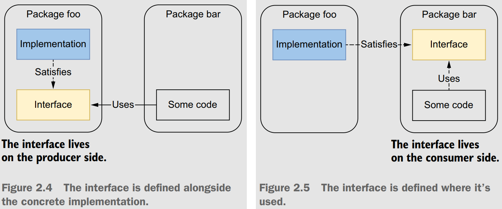
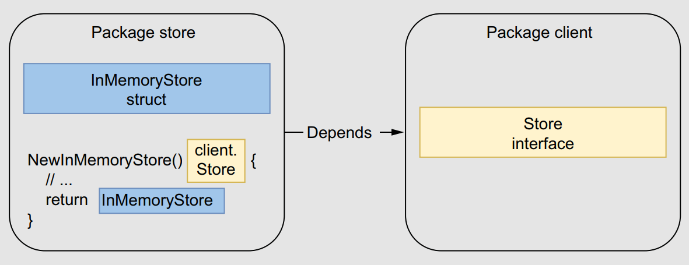
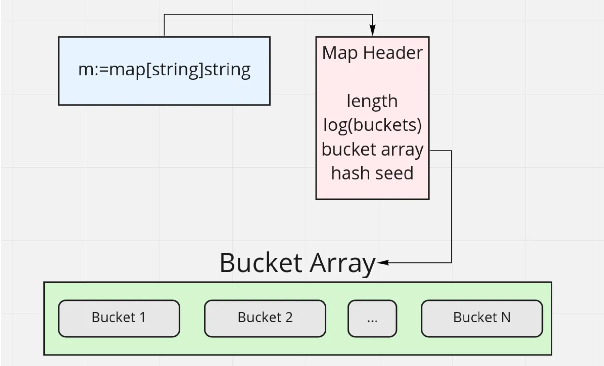
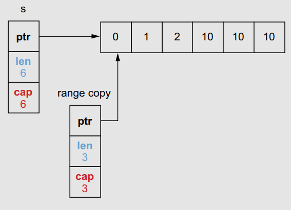
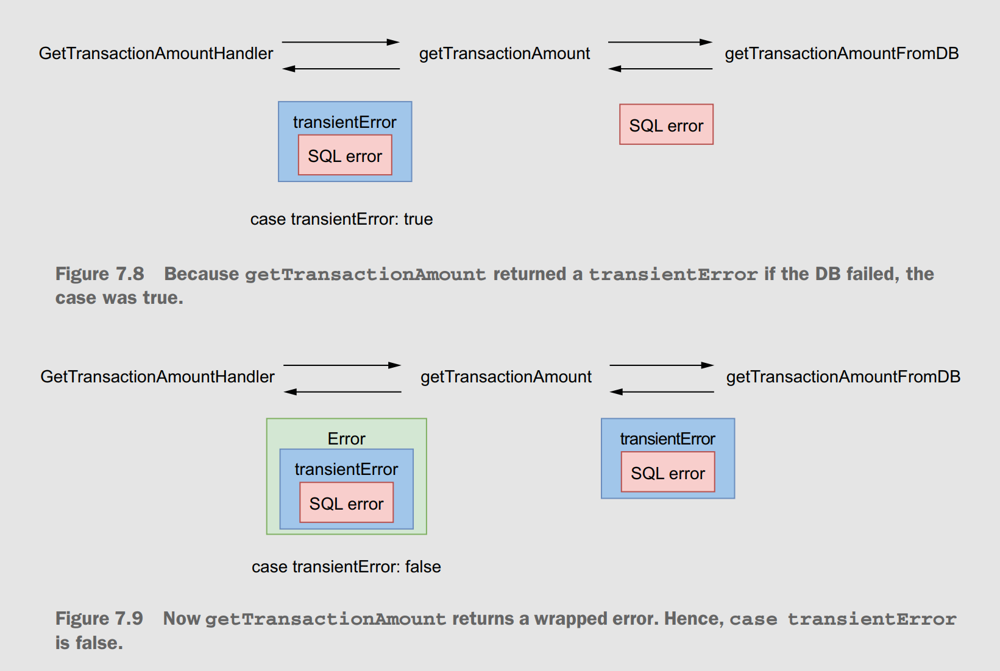

# 100 Go Mistakes and How to Avoid Them

Notes taken from reading the *100 Go Mistakes and How to Avoid Them* by Teiva Harsanyi.

## Chapter 1: Go: Simple to learn but hard to master.

- Google created the Go programming language in 2007 in response to these challenges:
  - Maximizing **agility** and reducing the time to **market** is critical for most organizations
  - Ensure that software engineers are as **productive** as possible when reading, writing, and maintaining code.
- Why does Go not have feature *X*?
  - Because it **doesn’t fit**, because it affects **compilation** speed or clarity of **design**, or because it would make the fundamental system model too **difficult**.
- Judging the quality of a programming language via its number of features is probably not an accurate metric 💯.
- Go's essential characteristics: **Stability**, **Expressivity**, **Compilation**, **Safety**.
- Go is simple but not easy:
  - Example:  Study shows that popular repos such as Docker, gRPC, and Kubernetes contain bugs are caused by inaccurate use of the message-passing paradigm via channels.
  - Although a concept such as channels and goroutines can be simple to learn, it isn’t an easy topic in practice.
- The cost of software bugs in the U.S. alone to be over $2 trillion 😢.

## Chapter 2: Code and project organization

### #1: Unintended variable shadowing

- In Go, a variable name declared in a block can be redeclared in an inner block.
- **Variable shadowing** occurs when a variable name is redeclared in an inner block, but we saw that this practice is prone to mistakes:
```go
var client *http.Client
if tracing {
    client, err := createClientWithTracing()
    if err != nil {
        return err
    }
    log.Println(client)
} else {
    client, err := createDefaultClient()
    if err != nil {
        return err
    }
    log.Println(client)
}
// Use client
```

### #2: Unnecessary nested code

- A critical aspect of **readability** is the number of **nested** levels.
- In general, the more nested levels a function requires, the more complex it is to read and understand:
    ```go
    func join(s1, s2 string, max int) (string, error) {
        if s1 == "" {
            return "", errors.New("s1 is empty")
        } else {
            if s2 == "" {
                return "", errors.New("s2 is empty")
            } else {
                concat, err := concatenate(s1, s2)
                if err != nil {
                    return "", err
                } else {
                    if len(concat) > max {
                        return concat[:max], nil
                    } else {
                        return concat, nil
                    }
                }
            }
        }
    }
    ```
- *Align the happy path to the left; you should quickly be able to scan down one column to see the expected execution flow*.
- When an `if` block returns, we should omit the `else` block in all cases.
- If we encounter a **non happy-path**, we should flip the condition like so:
    ```go
    if s == "" {
        return errors.New("empty string")
    }
    // ...
    ```

### #3: Misusing init functions

- Consider the example below:
    ```go
    var db *sql.DB
    func init() {
        dataSourceName := os.Getenv("MYSQL_DATA_SOURCE_NAME")
        d, err := sql.Open("mysql", dataSourceName)
        if err != nil {
            log.Panic(err)
        }
        err = d.Ping()
        if err != nil {
            log.Panic(err)
        }
        db = d
    }
    ```
-  Let’s describe three main downsides of the code above:
   - It shouldn’t necessarily be **up to the package** itself to decide whether to stop the application. Perhaps a caller might have preferred implementing a retry or using a fallback mechanism. In this case, opening the database within an `init` function prevents client packages from implementing their error-handling logic.
   - If we add tests to this file, the `init` function will be executed before running the test cases, which isn’t necessarily what we want (for example, if we add unit tests on a utility function that doesn’t require this connection to be created). Therefore, the `init` function in this example **complicates writing unit tests**.
   - The last downside is that the example requires assigning the database connection pool to a **global variable**. Global variables have some severe drawbacks; for example:
    - Any functions can alter global variables within the package.
    - Unit tests can be more complicated because a function that depends on a global variable won’t be **isolated anymore**.
- We should be cautious with `init` functions. They can be helpful in some situations, however, such as defining static configuration. Otherwise, and in most cases, we should handle initializations through ad-hoc functions.

### #4: Overusing getters and setters

- Using **getters** and **setters** presents some advantages, including these:
    - They **encapsulate** a behavior associated with getting or setting a field, allowing new functionality to be added later (for example, validating a field, returning a computed value, or wrapping the access to a field around a mutex).
    - They **hide** the **internal representation**, giving us more flexibility in what we expose.
    - They provide a **debugging** interception point for when the property changes at run time, making debugging easier.
- If we fall into these cases or foresee a possible use case while guaranteeing **forward compatibility**, using getters and setters can bring some value. For example, if we use them with a field called `balance`, we should follow these naming conventions:
    - The getter method should be named `Balance` (not `GetBalance`).
    - The setter method should be named `SetBalance`.
- We shouldn’t **overwhelm** our code with getters and setters on structs if they don’t bring any value. We should be pragmatic and strive to find the right balance between efficiency and following idioms that are sometimes considered indisputable in other programming paradigms.

### #5: Interface pollution

- Interface pollution is about **overwhelming** our code with **unnecessary abstractions**, making it harder to understand.
- What makes Go interfaces so different is that they are satisfied **implicitly**. There is no explicit keyword like *implements* to mark that an object `X` implements interface `Y`.
- While designing interfaces, the **granularity** (how many methods the interface contains) is also something to keep in mind:
  - 🌟 *The bigger the interface, the weaker the abstraction*.
  - Examples: `io.Reader`.
- When to use interfaces ?
  - When multiple types implement a **common** behavior. For example, This `Interface` has a strong potential for reusability because it encompasses the common behavior to **sort** any collection that is index-based:
  ```go
  type Interface interface {
    Len() int
    Less(i, j int) bool
    Swap(i, j int)
    }
  ```
  - **Decoupling** our code from an implementation:
    - **Liskov Substitution Principle** (the L in *Robert C. Martin’s* SOLID design principles).
    - If we rely on an **abstraction** instead of a **concrete** implementation, the implementation itself can be replaced with another without even having to change our code. Example:
    ```go
    type customerStorer interface {
        StoreCustomer(Customer) error
    }
    type CustomerService struct {
        storer customerStorer
    }
    func (cs CustomerService) CreateNewCustomer(id string) error {
        customer := Customer{id: id}
        return cs.storer.StoreCustomer(customer)
    }
    ```
    - This gives us more **flexibility** in how we want to test the method:
      - Use the concrete implementation via integration tests.
      - Use a mock (or any kind of test double) via unit tests.
  - **Restrict** a type to a specific behavior for various reasons, such as semantics enforcement:
    ```go
    type Foo struct {
        threshold intConfigGetter
    }
    func NewFoo(threshold intConfigGetter) Foo {
        return Foo{threshold: threshold}
    }
    func (f Foo) Bar() {
        threshold := f.threshold.Get()
        // ...
    }
    ```
    - The configuration getter is **injected** into the `NewFoo` factory method. It doesn’t impact a client of this function because it can still pass an `IntConfig` struct as
it implements `intConfigGetter`. Then, we can only read the configuration in the `Bar` method, not modify it.
- The main caveat when programming meets abstractions is remembering that abstractions should be **discovered**, not **created**.
  - 🌟 *Don’t design with interfaces, discover them*.

### #6: Interface on the producer side

- **Producer** side — An interface defined in the same package as the concrete implementation.
- **Consumer** side — An interface defined in an external package where it’s used. <p align="center"></p>
- It’s common to see developers creating interfaces on the producer side, alongside the concrete implementation. This design is perhaps a habit from developers having a *C#* or a *Java* background. But in Go, in most cases this is not what we should do 🤨.
- Let’s discuss the following example:
    ```go
    package store
    // CustomerStorage is a good way 🤷 to decouple the client code from the actual implementation.
    // Or, perhaps we can foresee that it will help clients in creating test doubles.
    type CustomerStorage interface {
        StoreCustomer(customer Customer) error
        GetCustomer(id string) (Customer, error)
        UpdateCustomer(customer Customer) error
        GetAllCustomers() ([]Customer, error)
        GetCustomersWithoutContract() ([]Customer, error)
        GetCustomersWithNegativeBalance() ([]Customer, error)
    }
    ```
- This isn’t a best practice in Go. Why ? It’s not up to the producer to **force a given abstraction** for all the clients. Instead, it’s up to the client to decide whether it needs some form of abstraction and then determine the best abstraction level for its needs. For example:
    ```go
    package client

    type customersGetter interface {
        GetAllCustomers() ([]store.Customer, error)
    }
    ```
- The main point is that the `client` package can now define the most **accurate** abstraction for its need (here, only one method). It relates to the concept of the *Interface Segregation Principle* (the `I` in *SOLID*) ▶️ No client should be forced to depend on methods it doesn’t use.
- An interface should live on the **consumer** side in most cases. However, in particular contexts (for example - in the standard library `encoding, encoding/json, encoding/binary`, when we know — not foresee—that an abstraction will be helpful for consumers), we may want to have it on the **producer** side. If we do, we should strive to keep it as **minimal** as possible, increasing its **reusability** potential and making it more easily **composable**.

### #7: Returning interfaces

- We will consider two packages: `client`, which contains a `Store` interface and `store`, which contains an implementation of `Store`. <p align="center"></p>
- The `client` package can’t call the `NewInMemoryStore` function anymore; otherwise, there would be a **cyclic dependency**.
- In general, returning an interface restricts **flexibility** because we force all the clients to use one particular type of abstraction.
- *Be conservative in what you do, be liberal in what you accept from others.* If we apply this idiom to Go, it means
    - 👍 Returning structs instead of interfaces.
    - 👍 Accepting interfaces if possible.
- We shouldn’t return interfaces but concrete implementations. Otherwise, it can make our design more complex due to package dependencies and can restrict flexibility because all the clients would have to rely on the same
abstraction.
- Also, we will only be able to use the methods **defined** in the interface, and not the methods defined in the **concrete type**.

### #8: any says nothing

- With Go 1.18, the predeclared type `any` became an alias for an **empty interface {}**.
- In assigning a value to an `any` type, we **lose** all **type information**, which requires a type assertion to get anything useful out of the `i` variable.
    ```go
    func main() {
        var i any
        i = 42
        i = "foo"
        i = struct {
            s string
        }{
            s: "bar",
        }
        i = f
        _ = i
    }
    func f() {}
    ```
- In methods, accepting or returning an `any` type doesn’t **convey meaningful information**:
  - Because there is no **safeguard** at compile time, nothing prevents a caller from calling these methods with whatever data type.
  - Also, the methods lack **expressiveness**. If future developers need to use the parameters of type `any`, they will probably have to dig into the documentation or read the code to understand how to use these methods.
- What are the cases when `any` is helpful?:
  - In the `encoding/json` package. Because we can marshal any type, the `Marshal` function accepts an `any` argument.
  - Another example is in the `database/sql` package. If the query is parameterized (for example, `SELECT * FROM FOO WHERE id = ?`), the parameters could be any kind.

### #9: Being confused about when to use generics

- Go 1.18 adds generics to the language 🥳.
-  👍 Few common uses where generics are recommended:
    - **Data structures** : We can use generics to **factor out** the element type if we implement a binary tree, a linked list, or a heap, for example.
    - **Functions working with slices, maps, and channels of any type** : A function to merge two channels would work with any `channel` type, for example
      - Hence, we could use type parameters to factor out the channel type:
        ```go
        func merge[T any](ch1, ch2 <-chan T) <-chan T {
        // ...
        }
        ```
    - **Factoring out behaviors instead of types**:  The `sort` package, for example, contains a `sort.Interface` interface with three methods:
        ```go
        type Interface interface {
            Len() int
            Less(i, j int) bool
            Swap(i, j int)
        }
        ```
      - This interface is used by different functions such as `sort.Ints` or `sort.Float64s`. Using type parameters, we could factor out the sorting behavior(for example, by defining a `struct` holding a slice and a comparison function):
        ```go
        type SliceFn[T any] struct {
            S []T
            Compare func(T, T) bool
        }
        func (s SliceFn[T]) Len() int { return len(s.S) }
        func (s SliceFn[T]) Less(i, j int) bool { return s.Compare(s.S[i], s.S[j]) }
        func (s SliceFn[T]) Swap(i, j int) { s.S[i], s.S[j] = s.S[j], s.S[i] }
        ```
      - Then, because the `SliceFn` struct implements `sort.Interface`, we can sort the provided slice using the `sort.Sort(sort.Interface)` function:
        ```go
        s := SliceFn[int]{
            S: []int{3, 2, 1},
            Compare: func(a, b int) bool {
                return a < b
            },
        }
        sort.Sort(s)
        fmt.Println(s.S)
        ```
- 👎 when is it recommended that we not use generics:
    - When **calling a method of the type argument**: Consider a function that receives an `io.Writer` and calls the `Write` method, for example:
        ```go
        func foo[T io.Writer](w T) {
            b := getBytes()
            _, _ = w.Write(b)
        }
        ```
        - In this case, using generics won’t bring any value to our code whatsoever. We should make the `w` argument an `io.Writer` directly.
    - When it makes our code **more complex**: Generics are never mandatory, and as Go developers, we have lived without them for more than a decade. If we’re writing generic functions or structures and we figure out that it doesn’t make our code clearer, we should probably reconsider our decision for that particular use case.

### #10: Not being aware of the possible problems with type embedding

- 👎 The wolloing example is a wrong usage of type embedding. Since `sync.Mutex` is an embedded type, the `Lock` and `Unlock` methods will be **promoted**. Therefore, both methods become **visible** to external clients using `InMem`:
    ```go
    type InMem struct {
        sync.Mutex
        m map[string]int
    }
- We want to write a custom logger that contains an `io.WriteCloser` and exposes two methods, `Write` and `Close`. If `io.WriteCloser` wasn’t **embedded**, we would need to write it like so:
    ```go
    type Logger struct {
        writeCloser io.WriteCloser
    }
    func (l Logger) Write(p []byte) (int, error) {
        return l.writeCloser.Write(p) // Forwards the call to writeCloser
    }
    func (l Logger) Close() error {
        return l.writeCloser.Close() // Forwards the call to writeCloser
    }
    func main() {
        l := Logger{writeCloser: os.Stdout}
        _, _ = l.Write([]byte("foo"))
        _ = l.Close()
    }
    ```
- 👍 Logger `would` have to provide both a `Write` and a `Close` method that would only **forward** the call to `io.WriteCloser`. However, if the field now becomes **embedded**, we can remove these forwarding methods:
    ```go
    type Logger struct {
        io.WriteCloser
    }
    func main() {
        l := Logger{WriteCloser: os.Stdout}
        _, _ = l.Write([]byte("foo"))
        _ = l.Close()
    }
    ```
- If we decide to use type embedding, we need to keep two main constraints in mind:
    - It shouldn’t be used solely as some **syntactic sugar** to simplify accessing a field (such as `Foo.Baz()` instead of `Foo.Bar.Baz()`). If this is the only rationale, let’s not embed the inner type and use a field instead.
    - It shouldn’t promote data (fields) or a behavior (methods) we want to **hide** from the outside: for example, if it allows clients to access a locking behavior (`sync.Mutex`) that should remain **private** to the struct.

### #11 Not using the functional options pattern

- How can we implement passing an configuration option to a function in an API-friendly way? Let’s look at the different options.
- **Config struct**:
  - The **mandatory** parameters could live as function parameters, whereas the **optional** parameters could be handled in the `Config` struct:
    ```go
    type Config struct {
        Port int
    }
    func NewServer(addr string, cfg Config) { }
    ```
    - 👍 This solution fixes the **compatibility** issue. Indeed, if we add new options, it will not break on the client side.
    - 👎 However, this approach does not distinguish between a field purposely set to 0 and a missing field:
        - 0 for an integer, 0.0 for a floating-point type
        - "" for a string
        - Nil for slices, maps, channels, pointers, interfaces.
        - ▶️ One option might be to handle all the parameters of the configuration struct as **pointers**, however, it’s not handy for clients to work with pointers as they have to create a variable and then pass a pointer 🤷, also client using our library with the default configuration will need to pass an **empty struct**.
- **Builder pattern**:
  - The construction of `Config` is separated from the struct itself. It requires an extra struct, `ConfigBuilder`, which receives methods to configure and build a `Config`:
    ```go
    type Config struct {
        Port int
    }
    type ConfigBuilder struct {
        port *int
    }
    func (b *ConfigBuilder) Port(
        port int) *ConfigBuilder {
        b.port = &port
        return b
    }
    func (b *ConfigBuilder) Build() (Config, error) {
        cfg := Config{}
        if b.port == nil {
            cfg.Port = defaultHTTPPort
        } else {
            if *b.port == 0 {
                cfg.Port = randomPort()
            } else if *b.port < 0 {
                return Config{}, errors.New("port should be positive")
            } else {
                cfg.Port = *b.port
            }
        }
        return cfg, nil
    }
    ```
  - The `ConfigBuilder` struct holds the client configuration. It exposes a `Port` method to set up the port. Usually, such a configuration method returns the **builder itself** so that we can use method **chaining** (for example, `builder.Foo("foo").Bar("bar")`). It also exposes a `Build` method that holds the logic on initializing the port value (whether the pointer was nil, etc.) and returns a `Config` struct once created.
    - 👍 This approach makes port management handier. It’s **not required** to pass an integer pointer, as the `Port` method accepts an integer. However, we still need to pass a config struct that can be empty if a client wants to use the default configuration 🤷.
    - 👎 In programming languages where exceptions are thrown, builder methods such as `Port` can raise **exceptions** if the input is invalid. If we want to keep the ability to **chain** the calls, the
function **can’t return an error**. Therefore, we have to delay the validation in the `Build()`.
- **Functional options pattern**:
- The main idea is as follows:
  - An **unexported** struct holds the configuration: options.
  - Each option is a function that returns the **same type**: `type Option func(options *options) error`. For example, `WithPort` accepts an `int` argument that represents the port and returns an `Option` type that represents how to update the options struct.
    ```go
    type options struct {
        port *int
    }
    type Option func(options *options) error

    func WithPort(port int) Option {
        return func(options *options) error {
            if port < 0 {
                return errors.New("port should be positive")
            }
            options.port = &port
            return nil
        }
    }
    ```
  - Each config field requires creating a public function (that starts with the `With` prefix by convention) containing similar logic: validating inputs if needed and updating the config struct.
    ```go
    func NewServer(addr string, opts ...Option) (*http.Server, error) {
        var options options
        for _, opt := range opts {
            err := opt(&options)
            if err != nil {
                return nil, err
            }
        }
        // At this stage, the options struct is built and contains the config
        // Therefore, we can implement our logic related to port configuration
        var port int
        if options.port == nil {
            port = defaultHTTPPort
        } else {
            if *options.port == 0 {
                port = randomPort()
            } else {
                port = *options.port
            }
        }
        // ...
    }
  - Because `NewServer` accepts **variadic** Op`tion arguments, a client can now call this API by passing multiple options following the mandatory address argument. For example:
    ```go
    server, err := httplib.NewServer("localhost",
        httplib.WithPort(8080),
        httplib.WithTimeout(time.Second)
    )
    ```
  - 👍 Provides a handy and API-friendly way to handle options and represent the most idiomatic way. If the client needs the default configuration, it doesn’t have to provide an argument.

### #12: Project misorganization

- **Project structure**:
  - Go language maintainer has no strong convention about structuring a project in Go. However, one layout has emerged over the years: [project-layout](https://github.com/golang-standards/project-layout).
  - There’s no **mandatory** convention. This layout may be helpful for you or not, but what’s important here is that **indecision** is the only **wrong decision**.
- **Package organization**:
  - In Go, there is no concept of subpackages. However, we can decide to organize packages within subdirectories.
  - The main benefit of subdirectories is to keep packages in a place where they live with **high cohesion**.
  - Avoid **premature packaging** because it might cause us to over-complicate a project. Sometimes, it’s better to use a simple organization and have our project evolve when we understand what it contains rather than **forcing** ourselves to make the perfect structure up front.
  - Avoid having **dozens** of **nano** packages containing only one or two files. Conversely, we should also avoid **huge** packages that dilute the meaning of a package name.
  - We should name our packages after what they **provide**, not what they **contain**. Also, naming should be **meaningful**. Therefore, a package name should be **short**, **concise**, **expressive**, and, by convention, a **single lowercase word**.
  - We should **minimize** what should be **exported** as much as possible to **reduce the coupling** between packages and keep unnecessary exported elements hidden. In doubt, default to not exporting it!

### #13: Creating utility packages

- As a rule of thumb, creating **shared** packages without meaningful names isn’t a good idea; this includes utility packages such as `utils`, `common`, or `base`. Also, bear in mind that naming a package after what it provides and not what it contains can be an efficient way to increase its **expressiveness**.
- Consider the following example:
    ```go
    package util

    func NewStringSet(...string) map[string]struct{} {
        // ...
    }
    func SortStringSet(map[string]struct{}) []string {
        // ...
    }

    // A client will use this package like this:
    set := util.NewStringSet("c", "a", "b")
    fmt.Println(util.SortStringSet(set))
    ```
- Instead of a utility package, we should create an expressive package name such as `stringset`. For example:
    ```go
    package stringset

    func New(...string) map[string]struct{} { ... }
    func Sort(map[string]struct{}) []string { ... }

    // In this example, we removed the suffixes for NewStringSet and SortStringSet,
    // which respectively became New and Sort. On the client side, it now looks like this:
    set := stringset.New("c", "a", "b")
    fmt.Println(stringset.Sort(set))
    ```
- We could even go a step further. Instead of exposing utility functions, we could create a specific type and expose `Sort` as a method this way:
    ```go
    type Set map[string]struct{}

    func New(...string) Set { ... }
    func (s Set) Sort() []string { ... }

    // This change makes the client even simpler. There would only be one reference to the
    set := stringset.New("c", "a", "b")
    fmt.Println(set.Sort())
    ```

### #14 Ignoring package name collisions

- Package collisions occur when a **variable name** collides with an existing **package name**, preventing the package from being reused:
    ```go
    redis := redis.NewClient() // Calls NewClient from the redis package
    v, err := redis.Get("foo") // Uses the redis variable
    ```
- Two solutions:
  - Change the variable name to `redisClient` for example.
  - Create an alias for the `redis` package: `import redisapi "mylib/redis"`
- One option could also be to use **dot imports** to access all the public elements of a package without the package qualifier ▶️ increase confusion !
- We should avoid naming collisions between a **variable** and a **built-in** function. For example, we could do something like this:
    ```go
    copy := copyFile(src, dst) // The copy variable collides with the copy built-in function.
    ```
- 👍 In summary, we should prevent variable name collisions to avoid **ambiguity**.

### #15: Missing code documentation

- First, every **exported** element must be **documented**.
- The convention is to add comments, starting with the **name** of the exported element.
- As a convention, each comment should be a **complete sentence** that ends with **punctuation**.
- When we document a function, we should highlight what the function **intends to do**, not how it does it ⚠️; this belongs to the **core** of a function and comments, not documentation.
- 💡 We should ideally provide enough information that the consumer does not have to look at our code to understand how to use an exported element.
- When it comes to documenting a **variable** or a **constant**, we might be interested in conveying two aspects: its **purpose** and its **content**.
  - The **former** should live as **code documentation** to be useful for external clients.
  - The latter, though, **shouldn’t** necessarily be **public**. For example:
    ```go
    // DefaultPermission is the default permission used by the store engine.
    const DefaultPermission = 0o644 // Need read and write accesses.
    ```
- This constant represents the default permission. The code documentation conveys its purpose, whereas the comment alongside the constant describes its actual content.
- To help clients and maintainers understand a package’s scope, we should also document each **package**. The convention is to start the comment with *// Package* followed by the package name:
    ```go
    // Package math provides basic constants and mathematical functions.
    //
    // This package does not guarantee bit-identical results
    // across architectures.
    package math
    ```
- The first line of a package comment should be **concise**. That’s because it will appear in the package. Then, we can provide all the information we need in the following lines.

### #16: Not using linters

- A linter is an automatic tool to analyze code and catch errors.
- `Golint` (deprecated now) is the linter that is developer by Google. There's no drop-in replacement for it, but tools such as `Staticcheck` and `go vet` should be used instead.
- `golangci-lint` integrate almost all community driven linters.

## Chapter 3: Data types

### #17: Creating confusion with octal literals

- In Go, an integer literal starting with `0` is considered an **octal integer** (base 8).
- Octal integers are useful in different scenarios. For instance, suppose we want to open a file using `os.OpenFile`. This function requires passing a permission as a `uint32`. If we want to match a Linux permission, we can pass an octal number for readability instead of a base 10 number:
    ```go
    file, err := os.OpenFile("foo", os.O_RDONLY, 0644)
    ```
- Using `0o` as a prefix instead of only `0` means the same thing. However, it can help make the code clearer.
- Finally, we can also use an underscore character (`_`) as a separator for **readability**. For
example, we can write 1 billion this way: `1_000_000_000`. We can also use the underscore character with other representations (for example, `0b00_00_01`).
- In summary, Go handles **binary**, **hexadecimal**, **imaginary**, and **octal** numbers.
  - Octal numbers start with a 0. However, to improve readability and **avoid potential mistakes** for future code readers, make octal numbers explicit using a `0o` prefix.

### #18: Neglecting integer overflows

- Suppose we want to initialize an `int32` to its maximum value and then increment it. What should be the behavior of this code?
    ```go
    var counter int32 = math.MaxInt32
    counter++
    fmt.Printf("counter=%d\n", counter)
    ```
- This code compiles and doesn’t panic at run time. However, the `counter++` statement generates an integer overflow: `counter=-2147483648` ‼️
- An **integer overflow** occurs when an arithmetic operation creates a value outside the range that can be represented with a given number of bytes.
- Because an `int32` is a **signed** integer, the bit on the left represents the integer’s sign: `0` for positive, `1` for negative. If we increment this integer, there is no space left to represent the new value. Hence, this leads to an integer overflow.
- In Go, an integer overflow that can be detected at **compile** time generates a compilation error. However, at **run time**, an integer **overflow** or **underflow** is **silent**; this does not lead to an application panic ⚠️.
- How can we detect an integer overflow during an **addition**? The answer is to reuse `math.MaxInt`:
    ```go
    func AddInt(a, b int) int {
        if a > math.MaxInt-b {
            panic("int overflow")
        }
        return a + b
    }
    ```
- **Multiplication** is a bit more complex to handle. We have to perform checks against the minimal integer, `math.MinInt`:
    ```go
    func MultiplyInt(a, b int) int {
        if a == 0 || b == 0 {
            return 0
        }
        result := a * b
        if a == 1 || b == 1 {
            return result
        }
        if a == math.MinInt || b == math.MinInt {
            panic("integer overflow")
        }
        if result/b != a {
            panic("integer overflow")
        }
        return result
    }
    ```

### #19: Not understanding floating points

- To avoid bad surprises, we need to know that floating-point arithmetic is an approximation of real arithmetic.
  - 💡 Let’s take the `float64` type as an example. Note that there’s an **infinite** number of real values between `math.SmallestNonzeroFloat64` (the `float64` minimum) and `math.MaxFloat64` (the `float64` maximum).
  - Conversely, the `float64` type has a **finite** number of bits: **64**.
  - Because making infinite values fit into a finite space isn’t possible, we have to work with **approximations**. Hence, we may lose **precision**. The same logic goes for the `float32` type.
- ⚠️ Using the `==` operator to **compare** two floating-point numbers can lead to **inaccuracies**:
  -  Instead, we should compare their difference to see if it is less than some small error value.
  -  For example, the [testify](https://github.com/stretchr/testify) library has an `InDelta` function to assert that two values are within a given delta of each other.
- ⚠️ The result of floating-point calculations depends on the actual **processor**.
  - Most processors have a *floating-point unit* (FPU) to deal with such calculations. There is no guarantee that the result executed on one machine will be the **same on another machine** with a **different FPU**.
  - Comparing two values using a delta can be a solution for implementing valid tests across different machines.
- ⚠️ Also note that the **error can accumulate** in a **sequence** of floating-point operations:
  - Keep in mind that the **order** of floating-point calculations can affect the **accuracy** of the result.
- ⚠️ When performing a **chain** of **additions** and **subtractions**, we should group the operations to add or subtract values with a **similar order of magnitude** before adding or subtracting those with magnitudes that aren’t close.
```go
func f1(n int) float64 {
    result := 10_000.
    for i := 0; i < n; i++ {
        result += 1.0001
    }
    return result
}
func f2(n int) float64 {
    result := 0.
    for i := 0; i < n; i++ {
        result += 1.0001
    }
    return result + 10_000. // Because f2 adds 10,000, in the end it produces more accurate results than f1.
}
```
- ⚠️ When performing floating-point calculations involving addition, subtraction, multiplication, or division, we have to complete the **multiplication** and **division** operations **first** to get better **accuracy**.

### #20: Not understanding slice length and capacity

- In Go, a **slice** is **backed** by an **array**. That means the slice’s data is stored **contiguously** in an array data structure.
- A slice also handles the logic of adding an element if the backing array is **full** or shrinking the backing array if it’s almost **empty**.
- The **length** is the number of elements the slice contains, whereas the **capacity** is the number of elements in the backing array.
- ⚠️ Accessing an element outside the length range is **forbidden**, even though it’s already allocated in memory.
- Adding an element to a full slice (length == capacity) leads to creating a new backing array with a **new capacity**, **copying** all the elements from the previous array, and updating the slice pointer to the new array.
- 💡 In Go, a slice grows by **doubling** its size until it contains *1,024* elements, after which it grows by *25%*.
- What happens with **slicing**? Slicing is an operation done on an array or a slice, providing a half-open range; the first index is included, whereas the second is excluded:
  ```go
    s1 := make([]int, 3, 6)
    s2 := s1[1:3]
    ```
  - When `s2` is created by slicing `s1`, both slices **reference** the s**ame backing array**. However, `s2` starts from a different index.
  - If we update `s1[1]` or `s2[0]`, the change is made to the same array, hence, visible in both slices.
  - If we append an element to `s2`, the shared backing array is modified, but only the length of `s2` changes.
  - if we keep appending elements to `s2` until the backing array is full, `s1` and `s2` will reference **two different arrays**. As `s1` is still a three-length, six-capacity slice, it still has some available buffer, so it keeps referencing the initial array. Also, the new backing array was made by copying the initial one from the first index of `s2`.

### #21: Inefficient slice initialization

- Consider the following example:
    ```go
    func convert(foos []Foo) []Bar {
        bars := make([]Bar, 0)
        for _, foo := range foos {
            bars = append(bars, fooToBar(foo))
        }
        return bars
    }
    ```
- This logic of creating another array because the current one is **full** is repeated multiple times when we add a third element, a fifth, a ninth, and so on.
  - Assuming the input slice has *1,000* elements, this algorithm requires allocating 10 backing arrays and copying more than 1,000 elements in total from one array to another.
  -  This leads to additional effort for the *GC* to clean all these temporary backing arrays.
- There are two different options for this:
  - The first option is to reuse the same code but allocate the slice with a **given capacity**:
    - Internally, Go preallocates an array of n elements. Therefore, adding up to n elements means reusing the **same backing array** and hence reducing the number of **allocations** drastically.
    ```go
    func convert(foos []Foo) []Bar {
        n := len(foos)
        bars := make([]Bar, 0, n)
        for _, foo := range foos {
            bars = append(bars, fooToBar(foo))
        }
        return bars
    }
    ```
  - The second option is to allocate bars with a given length:
    ```go
    func convert(foos []Foo) []Bar {
        n := len(foos)
        bars := make([]Bar, n)
        for i, foo := range foos {
            bars[i] = fooToBar(foo)
        }
        return bars
    }
    ```
    - Because we initialize the slice with a length, `n` elements are already allocated and initialized to the zero value of Bar. Hence, to set elements, we have to use, not `append` but `bars[i]`.
    - This approach is faster because we avoid **repeated calls** to the built-in `append` function, which has a small **overhead** compared to a **direct assignment**.

### #22: Being confused about nil vs. empty slices

```go
func main() {
    var s []string
    log(1, s)
    s = []string(nil)
    log(2, s)
    s = []string{}
    log(3, s)
    s = make([]string, 0)
    log(4, s)
}

func log(i int, s []string) {
    fmt.Printf("%d: empty=%t\tnil=%t\n", i, len(s) == 0, s == nil)
}
```
- This example prints the following:
    ```sh
    1: empty=true nil=true
    2: empty=true nil=true
    3: empty=true nil=false
    4: empty=true nil=false
    ```
- ▶️ All the slices are **empty**, meaning the length equals 0. Therefore, a `nil` slice is also an **empty** slice. However, only the first two are `nil` slices.
- 👍 If a function returns a slice, we **shouldn’t** do as in other languages and **return a non-nil** collection for **defensive** reasons.
  - Because a `nil` slice doesn’t require any **allocation**, we should favor returning a `nil` slice instead of an **empty** slice.
- A `nil` slice is (json) marshaled as a `null` element, whereas a **non-nil**, empty slice is marshaled as an **empty array**.
- `reflect.DeepEqual` returns false if we compare a nil and a non-nil empty slice
- All in all:
    - `var s []string` if we aren’t sure about the final length and the slice can be empty.
    - `[]string(nil)` as syntactic sugar to create a nil and empty slice.
    - `make([]string, length)` if the future length is known.
    - `[]string{}`, should be avoided if we initialize the slice without elements.

### #23: Not properly checking if a slice is empty

- We mentioned in the previous section that an empty slice has, by definition, a length of zero. Meanwhile, nil slices are always empty. Therefore, by checking the length of the slice, we cover all the scenarios:
    - If the slice is nil, `len(operations) != 0` is **false**.
    - If the slice isn’t nil but empty, `len(operations) != 0` is also **false**.
- Hence, checking the length is the best option to follow as we can’t always control the approach taken by the functions we call (by checking if the return != `nil`).
- 👍 When returning slices, it should make neither a semantic nor a technical **difference** if we return a `nil` or **empty** slice. Both **should mean the same thing** for the **callers**.
  - This principle is the same with **maps**. To check if a map is empty, check its length, not whether it’s `nil`.

### #24: Not making slice copies correctly

- To use `copy` effectively, it’s essential to understand that the number of elements copied to the destination slice corresponds to the **minimum** between:
    - The source slice’s length
    - The destination slice’s length
- If we want to perform a complete `copy`, the destination slice must have a length **greater** than or **equal** to the source slice’s length. Here, we set up a length based on the source slice:
    ```go
    src := []int{0, 1, 2}
    dst := make([]int, len(src))
    copy(dst, src)
    ```
- `copy` built-in function isn’t the only way to copy slice elements. There are different alternatives, the best known being probably the following, which uses `append`:
    ```go
    src := []int{0, 1, 2}               // using copy is more idiomatic and, therefore, easier to
    dst := append([]int(nil), src...)   // understand, even though it takes an extra line.

    ```

### #25: Unexpected side effects using slice append

- Consider the following example:
    ```go
    s1 := []int{1, 2, 3}
    s2 := s1[1:2]
    s3 := append(s2, 10)
    // All the slices are backed by the same array
    ```
<p align="center"></p>

- All the slices are backed by the same array 😮‍💨.
  - Because `s2` in not full, the `append` function adds the element by updating the backing array and returning a slice having a length incremented by 1.
- The `s1` slice’s content was **modified**, even though we did not update `s1[2]` or `s2[1]` **directly**. We should keep this in mind to avoid unintended consequences ⚠️.
- Therefore, if we print all the slices, we get this output: `s1=[1 2 10], s2=[2], s3=[2 10]`.
- If we want to protect against such side effects in function calls:
    - The first is to pass a **copy** of the slice and then construct the resulting slice.
      - 👎 Makes the code more complex to read and adds an extra copy.
    - The second option can be used to limit the range of potential side effects to the first two elements only. This option involves the so-called **full slice expression**: `s[low:high:max]`.
      - 👍 This statement creates a slice similar to the one created with `s[low:high]`, except that the resulting slice’s capacity is equal to `max - low`.
- ▶️ When using slicing, we must remember that we can face a situation leading to unintended side effects. If the resulting slice has a **length** **smaller** than its **capacity**, `append` can **mutate** the original slice.

### #26: Slices and memory leaks

#### Leaking capacity

- Consider the example below:
    ```go
    func consumeMessages() {
        for {
            msg := receiveMessage()
            // Do something with msg
            storeMessageType(getMessageType(msg))
            // After a new loop iteration, msg is no longer used.
            // However, its backing array will still be used by msg[:5]
        }
    }
    func getMessageType(msg []byte) []byte {
        return msg[:5]
    }
    ```
- The slicing operation on msg using `msg[:5]` creates a five-length slice. However, its capacity remains the same as the initial slice. The remaining elements are still allocated in memory, even if eventually msg is **not referenced**.
- What can we do to solve this issue? We can make a slice **copy** instead of slicing msg:
    ```go
    func getMessageType(msg []byte) []byte {
        msgType := make([]byte, 5)
        copy(msgType, msg)
        return msgType
    }
    ```
- Because we perform a copy, `msgType` is a **five-length**, **five-capacity** slice regardless of the size of the message received. Hence, we only store 5 bytes per message type.
- ⚠️ Using the **full slice expression** isn’t a valid option (unless a future update of Go tackles this). The whole backing array still lives in memory 😢.
- 👍 As a rule of thumb, remember that slicing a large slice or array can lead to potential **high memory consumption**. The remaining space won’t be reclaimed by the GC, and we can keep a large backing array despite using only a few elements. Using a slice **copy** is the solution to prevent such a case.

#### Slice and pointers

- Consider the example below:
    ```go
    type Foo struct {
        v []byte
    }

    func main() {
        foos := make([]Foo, 1_000)
        printAlloc()

        for i := 0; i < len(foos); i++ {
            foos[i] = Foo{ v: make([]byte, 1024*1024) }
        }
        printAlloc()

        two := keepFirstTwoElementsOnly(foos)
        runtime.GC()
        printAlloc()

        runtime.KeepAlive(two) // keep a ref to the two variable after the GC so that it won’t be collected
    }
    func keepFirstTwoElementsOnly(foos []Foo) []Foo {
        return foos[:2]
    }
    ```
- 🎯 It’s essential to keep this rule in mind when working with **slices**:
  - if the element is a **pointer** or a **struct** with pointer fields, the elements won’t be reclaimed by the GC.
- What can we do to solve this issue? We can create a **copy** of the slice. The second option if we want to keep the underlying capacity of 1,000 elements, which is to mark the slices of the remaining elements **explicitly** as `nil`.

### #27: Inefficient map initialization

- When a `map` grows, it doubles its number of **buckets**. What are the conditions for a map to grow?
    - The average number of items in the buckets (called the *load factor*) is greater than a constant value. This constant equals **6.5** (but it may change in future versions because it’s internal to Go).
    - Too many buckets have **overflowed** (containing more than **eight** elements).
<p align="center"></p>

- When a `map` **grows**, all the keys are dispatched again to all the buckets. This is why, in the worst-case scenario, inserting a key can be an *O(n)* operation, with `n` being the
total number of elements in the `map`.
- Like **slices**, we can use the make built-in function to provide an **initial size** when creating a `map`. For example, if we want to initialize a `map` that will contain 1 million elements, it can be done this way:
    ```go
    m := make(map[string]int, 1_000_000)` // ask Go runtime to allocate a map with room for at least 1m elements.
    ```
- By specifying a size, we provide a hint about the number of elements expected to go into the `map`. Internally, the map is created with an appropriate number of buckets to store 1 million elements. This saves a lot of **computation** time because the `map` won’t have to create buckets on the fly and handle **rebalancing buckets**.

### #28: Maps and memory leaks

- Consider the example below:
    ```go
    n := 1_000_000
    m := make(map[int][128]byte)
    printAlloc()

    for i := 0; i < n; i++ {
        m[i] = randBytes()
    }
    printAlloc()

    for i := 0; i < n; i++ {
        delete(m, i)
    }
    runtime.GC()
    printAlloc()

    runtime.KeepAlive(m)
    >>>>>>>>>
    0 MB
    461 MB
    293 MB
    ```
- At first, the heap size is minimal. Then it grows significantly after having added 1 million elements to the `map`. But if we expected the heap size to decrease after removing all the elements, this isn’t how maps work in Go.
- The reason is that the number of **buckets in a map cannot shrink**. Therefore, removing elements from a `map` doesn’t impact the number of existing buckets 😮‍💨; it just zeroes the slots in the buckets. 💡 A `map` can only grow and have more buckets; it never shrinks !
- One solution could be to **re-create a copy** of the current map at a regular pace. For example, every hour, we can build a new `map`, copy all the elements, and release the previous one. The main drawback of this option is that following the copy and until the next garbage collection, we may **consume twice** the current **memory** for a short period.
- Another solution would be to change the `map` type to store an array pointer: `map[int]*[128]byte`:
  - It doesn’t solve the fact that we will have a significant **number of buckets**; however, each bucket entry will reserve the **size of a pointer** for the value instead of 128 bytes.
  - Also as an optimization, if a key or a value is **over 128 bytes**, Go won’t store it directly in the `map` bucket. Instead, Go stores a pointer to reference the key or the value.

### #29: Comparing values incorrectly

- It’s essential to understand how to use `==` and `!=` to make comparisons effectively. We can use these operators on operands that are comparable:
    - **Booleans**: Compare whether two Booleans are equal.
    - **Numerics** (int, float, and complex types): Compare whether two numerics are equal.
    - **Strings**: Compare whether two strings are equal.
    - **Channels**: Compare whether two channels were created by the same call to make or if both are `nil`.
    - **Interfaces**: Compare whether two interfaces have identical dynamic types and equal dynamic values or if both are `nil`.
    - **Pointers**: Compare whether two pointers point to the same value in memory or if both are `nil`.
    - **Structs and arrays**: Compare whether they are composed of similar types.
- With these behaviors in mind, what are the options if we have to compare two **slices**, two **maps**, or two **structs** containing **non-comparable** types?
  - If we stick with the standard library, one option is to use run-time **reflection** with the `reflect` package.
  - `reflect.DeepEqual` reports whether two elements are deeply equal by **recursively** traversing two values.
- However, using `reflect.DeepEqual` has two catches ⚠️
  - It makes the distinction between an **empty** and a **nil** collection.
  - Because this function uses reflection, which introspects values at run time to discover how they are  formed, it has a **performance penalty** (is about 100 times slower than `==`).
- If performance is a crucial factor, another option might be to implement our **own comparison method**.
- In the context of unit tests, some other options are possible, such as using external libraries with [go-cmp](https://github.com/google/go-cmp) or [testify](https://github.com/stretchr/testify).
- The standard library has some existing comparison methods. For example, we can use the optimized `bytes.Compare` to compare two slices of bytes. Before implementing a custom method, we
need to make sure we don’t reinvent the wheel 🧠.

## Chapter 4: Control structures

### #30: Ignoring the fact that elements are copied in range loops

- In Go, everything we **assign** is a **copy**:
    - If we assign the result of a function returning a **struct**, it performs a **copy** of that struct.
    - If we assign the result of a function returning a **pointer**, it performs a **copy** of the memory address.
- It’s crucial ⚠️ to keep this in mind to avoid common mistakes, including those related to `range` loops. Indeed, when a `range` loop iterates over a data structure, it performs a
**copy** of each element to the value variable.
- So, what if we want to update the slice elements? There are two main options:
    ```go
    for i := range accounts {
        accounts[i].balance += 1000
    }
    for i := 0; i < len(accounts); i++ {
        accounts[i].balance += 1000
    }
    ```
- Another option is to keep using the `range` loop and access the value but modify the slice type to a slice of account **pointers**:
    ```go
    accounts := []*account{
        {balance: 100.},
        {balance: 200.},
        {balance: 300.},
    }
    for _, a := range accounts {
        a.balance += 1000
    }
    ```
    - 👎 Iterating over a slice of pointers may be **less efficient** for a CPU because of the lack of **predictability** (CPU caches).

### #31: Ignoring how arguments are evaluated in range loops

- Consider the example below:
    ```go
    s := []int{0, 1, 2}
    for range s {
        s = append(s, 10)
    }
    ```
- When using a `range` loop, the provided expression is evaluated only once, **before** the **beginning** of the loop.
- In this context, *evaluated* means the provided expression is copied to a **temporary** variable, and then `range` iterates over this variable. In this example, when the `s` expression is evaluated, the result is a **slice copy**:
<p align="center"></p>

- The behavior is **different** with a classic for `loop`.
- The same logic applies to **channels** regarding how the `range` expression is evaluated.
    ```go
    ch1 := make(chan int, 3)
    go func() {
        ch1 <- 0
        ch1 <- 1
        ch1 <- 2
        close(ch1)
    }()

    ch2 := make(chan int, 3)
    go func() {
        ch2 <- 10
        ch2 <- 11
        ch2 <- 12
        close(ch2)
    }()

    ch := ch1
    for v := range ch {
        fmt.Println(v)
        ch = ch2
    }
    ```
  - The expression provided to `range` is a `ch` channel pointing to `ch1`. Hence, `range` evaluates `ch`, performs a **copy to a temporary** variable, and iterates over elements from this channel. Despite the `ch = ch2` statement, range keeps iterating over `ch1`, **not** `ch2.`
- In **arrays**, the `range` expression is also evaluated **before** the **beginning** of the loop, what is assigned to the temporary loop variable is a **copy** of the array.
- Let’s see this principle in action with the following example that updates a specific array index during the iteration:
    ```go
    a := [3]int{0, 1, 2}
    for i, v := range a {
        a[2] = 10
        if i == 2 {
            fmt.Println(v)
        }
    }
    ```
    - This code updates the last index to `10`. However, if we run this code, it does not print `10`; it prints `2`, instead.
    - The loop doesn’t update the copy; it updates the **original** array ‼️
    - If we want to print the actual value of the last element, we can do so in two ways:
      - By accessing the element from its **index**: `fmt.Println(a[2])`.
      - Using an array pointer: `for i, v := range &a`.
        - We assign a copy of the array pointer to the temporary variable used by `range`. But because both pointers **reference** the **same array**.
        - Doesn’t lead to copying the whole array, which may be something to keep in mind in case the array is **significantly large** 💡.

### #32: Ignoring the impact of using pointer elements in range loops

- 💡 If we store **large** structs, and these structs are **frequently mutated**, we can use pointers instead to **avoid a copy** and an insertion for each mutation.
- We will consider the following two structs:
    ```go
    // A Store that holds a map of Customer pointers
    type Store struct {
        m map[string]*Customer
    }

    // A Customer struct representing a customer
    type Customer struct {
        ID string
        Balance float64
    }
    ```
- The following method iterates over a slice of `Customer` elements and stores them in the `m` map:
    ```go
    func (s *Store) storeCustomers(customers []Customer) {
        for _, customer := range customers {
            s.m[customer.ID] = &customer
        }
    }
    ```
- Iterating over the customers slice using the `range` loop, regardless of the number of elements, creates a **single** customer variable with a **fixed** address ⚠️. We can verify this by printing the pointer address during each iteration:
    ```go
    func (s *Store) storeCustomers(customers []Customer) {
        for _, customer := range customers {
            fmt.Printf("%p\n", &customer)
            s.m[customer.ID] = &customer
        }
    }
    >>>
    0xc000096020
    0xc000096020
    0xc000096020
    ```
- We can overcome this issue by: forcing the creation of a **local variable** in the loop’s scope (`current := customer`) or **creating a pointer** referencing a slice element via its **index** (`customer := &customers[i]`).
- Both solutions are fine. Also note that we took a slice data structure as an input, but the problem
would be similar with a map.

### #33: Making wrong assumptions during map iterations

### Ordering

- Regarding ordering, we need to understand a few fundamental behaviors of the map data structure:
    - It doesn’t keep the data **sorted by key** (a map isn’t based on a binary tree).
    - It doesn’t **preserve the order** in which the data was added.
- But can we at least expect the code to print the keys in the order in which they are currently stored in the map ? No, not even this 😮‍💨.
- However, let’s note that using packages from the **standard library** or **external libraries** can lead to different behaviors. For example, when the `encoding/json` package **marshals** a map into `JSON`, it reorders the data **alphabetically** by keys, regardless of the insertion order.

### Map insert during iteration

- Consider the following example:
    ```go
    m := map[int]bool{
        0: true,
        1: false,
        2: true,
    }
    for k, v := range m {
        if v {
            m[10+k] = true
        }
    }
    fmt.Println(m) // The result of this code is unpredictable
    ```
To understand the reason, we have to read what the Go specification says about a new map entry during an iteration:

> If a map entry is created during iteration, it may be produced during the iteration or skipped. The choice may vary for each entry created and from one iteration to the next.

Hence, when an element is added to a map during an iteration, it may be produced during a follow-up iteration, or it may not ⚠️.

👍 One solution is to create a copy of the map, like so: `m2 := copyMap(m)` and update `m2` instead.

### 34: Ignoring how the break statement works

- One essential rule to keep in mind is that a `break` statement terminates the execution of the **innermost** `for`, `switch`, or `select` statement.
- So how can we write code that breaks the loop instead of the `switch` statement? The most idiomatic way is to use a label:
    ```go
    loop:
        for i := 0; i < 5; i++ {
            fmt.Printf("%d ", i)
            switch i {
                default:
                case 2:
                    break loop // Not a fancy goto statement !
            }
        }
    ```
- 📔 We can also use `continue` with a label to go to the next iteration of the labeled loop.

### #35: Using defer inside a loop

- Consider the following example:
    ```go
    func readFiles(ch <-chan string) error {
        for path := range ch {
            file, err := os.Open(path)
            if err != nil {
                return err
            }
            defer file.Close()
            // Do something with file
        }
        return nil
    ```
- The `defer` calls are executed not during each loop iteration but when the `readFiles` function returns. If `readFiles` doesn’t return, the file descriptors will be kept open forever, causing **leaks**.
- So, what are the options if we want to keep using `defer`?
    1. We have to **create another surrounding function** around `defer` that is called during each iteration. For example, we can implement a `readFile` function holding the logic for each new file path received:
        ```go
        func readFile(path string) error {
            file, err := os.Open(path)
            if err != nil {
                return err
            }
            defer file.Close()
            // Do something with file
            return nil
        }
        ```
    2. Another approach could be to make the `readFile` function a **closure**:
        ```go
        func readFiles(ch <-chan string) error {
            for path := range ch {
                err := func() error {
                    // ...
                    defer file.Close()
                    // ...
                }()
                if err != nil {
                    return err
                }
            }
            return nil
        }
        ````
## Chapter 5: Strings

### #36: Not understanding the concept of a rune

- 🎗️ In Go, a `rune` is a **Unicode code point**.
- `UTF-8` encodes characters into 1 to 4 bytes, hence, up to 32 bits. This is why in Go, a `rune` is an **alias** of `int32`: `type rune = int32`.
- 📌 In Go, a source code is encoded in `UTF-8`. So, all string literals are encoded into a sequence of bytes using `UTF-8`. However, a string is a **sequence of arbitrary bytes**; it’s not necessarily based on UTF-8.
- A character isn’t always encoded into a **single byte**:
    ```go
    s := "汉"
    fmt.Println(len(s)) // 3 - len built-in function applied on a string doesn’t return the number of characters; it returns the number of bytes.
    ```
- Conversely, we can create a string from a list of bytes. We mentioned that the `汉` character was encoded using three bytes, `0xE6`,` 0xB1`, and `0x89`:
    ```go
    s := string([]byte{0xE6, 0xB1, 0x89})
    fmt.Printf("%s\n", s // 汉
    ```

### #37: Inaccurate string iteration

- Let’s look at a concrete example. Here, we want to print the different `runes` in a string and their corresponding positions:
    ```go
    s := "hêllo"
    for i := range s {
        fmt.Printf("position %d: %c\n", i, s[i])
    }
    fmt.Printf("len=%d\n", len(s))
    ```
- We have to recognize that in this example, we don’t iterate over each `rune`; instead, we iterate over each **starting index** of a `rune`.
- Printing `s[i]` doesn’t print the *ith* `rune`; it prints the `UTF-8` representation of the byte at index `i`. To fix this, we have to use the value element of the range operator:
    ```go
    s := "hêllo"
    for i, r := range s {
        fmt.Printf("position %d: %c\n", i, r)
    }
    ```
- The other approach is to convert the string into a slice of `runes` and iterate over it:
    ```go
    s := "hêllo"
    runes := []rune(s)
    for i, r := range runes {
        fmt.Printf("position %d: %c\n", i, r)
    }
    ```

### #38: Misusing trim functions

- One common mistake made by Go developers when using the `strings` package is to **mix** `TrimRight` and `TrimSuffix`.
- `TrimRight` iterates backward over each `rune`. If a rune is part of the provided set, the function removes it. If not, the function stops its iteration and returns the remaining string.
- On the other hand, `TrimSuffix` returns a string without a provided trailing suffix.
  - Also, removing the trailing suffix **isn’t a repeating** operation, so `TrimSuffix("123xoxo", "xo")` returns `123xo`.
  - The principle is the same for the left-hand side of a string with `TrimLeft` and `TrimPrefix`.


### #39: Under-optimized string concatenation

- Concatenating strings using `+=` does not perform well when we need to concatenate many strings. 🎯 Don't forget one of the core characteristics of a string: its **immutability**. Therefore, each iteration doesn’t update the string; it reallocates a new string in memory, which significantly impacts performance.
- Solution is to use `strings.Builder`. Using this struct, we can also append:
    - A byte slice using `Write`.
    - A single byte using `WriteByte`.
    - A single rune using `WriteRune`.
- **Internally**, `strings.Builder` holds a **byte slice**. Each call to `WriteString` results in a call to `append` on this slice.
- There are two impacts:
  - First, this struct shouldn’t be used **concurrently**, as the calls to `append` would lead to **race conditions**.
  - The second impact is something that we saw in mistake #21, “Inefficient slice initialization”: if the future length of a slice is already known, we should **preallocate** it. For that purpose, `strings.Builder` exposes a method `Grow(n int)` to guarantee space for another `n` bytes.
```go
func concat(values []string) string {
    total := 0
    for i := 0; i < len(values); i++ {
        total += len(values[i])
    }
    sb := strings.Builder{}
    sb.Grow(total)
    for _, value := range values {
        _, _ = sb.WriteString(value)
    }
    return sb.String()
}
```
- 👍 `strings.Builder` is the recommended solution to concatenate a list of strings. Usually, this solution should be used within a **loop**.

### #40: Useless string conversions

- When choosing to work with a `string` or a `[]byte`, most programmers tend to favor strings for convenience. But most I/O is actually done with `[]byte`.
- There is a price to pay when converting a `[]byte` into a `string` and then converting a `string` into a `[]byte`. Memory-wise, each of these conversions requires an extra **allocation**. Indeed, even though a string is backed by a `[]byte`, converting a `[]byte` into a `string` requires a **copy** of the byte slice. It means a new memory allocation and a copy of all the bytes.
- Indeed, all the **exported functions** of the `strings` package also have alternatives in the `bytes` package: `Split`, `Count`, `Contains`, `Index`, and so on. Hence, whether we’re doing I/O or not, we should first check whether we could implement a whole workflow using bytes instead of strings and avoid the price of additional conversions.

### #41: Substrings and memory leaks

- To extract a subset of a string, we can use the following syntax:
    ```go
    s1 := "Hello, World!"
    s2 := s1[:5] // Hello
    ```
- `s2` is constructed as a substring of `s1`. This example creates a string from the **first five bytes**, not the **first five runes**. Hence, we shouldn’t use this syntax in the case of runes encoded with multiple bytes. Instead, we should convert the input string into a `[]rune` type first:
    ```go
    s1 := "Hêllo, World!"
    s2 := string([]rune(s1)[:5]) // Hêllo
    ```
- When doing a substring operation, the Go specification doesn’t specify whether the resulting string and the one involved in the substring operation should share the
same data. However, the standard Go compiler does let them **share the same backing array**, which is probably the best solution **memory-wise** and **performance-wise** as it prevents a new allocation and a copy.
- We mentioned that log messages can be quite heavy. `log[:36] `will create a new string referencing the same backing array. Therefore, each uuid string that we store in
memory will contain not just 36 bytes but the number of bytes in the initial log string: potentially, thousands of bytes.
- How can we fix this? By making a **deep copy** of the substring so that the internal byte slice of uuid references a new backing array of only 36 bytes:
    ```go
    func (s store) handleLog(log string) error {
        if len(log) < 36 {
            return errors.New("log is not correctly formatted")
        }
        uuid := string([]byte(log[:36])) // The copy is performed by converting the substring into a []byte first and then into a string again.
        s.store(uuid)
        // Do something
    }
    ```
- As of Go 1.18, the standard library also includes a solution with `strings.Clone` that returns a fresh copy of a string: `uuid := strings.Clone(log[:36])`.

## Chapter 6: Functions and methods

### #42: Not knowing which type of receiver to use

- Choosing between value and pointer receivers isn’t always straightforward. Let’s discuss some of the conditions to help us choose.
- **A receiver must be a pointer:**
    - If the method needs to **mutate** the receiver. This rule is also valid if the receiver is a **slice** and a method needs to append elements:
        ```go
        type slice []int
        func (s *slice) add(element int) {
            *s = append(*s, element)
        }
        ```

    - If the method receiver contains a field that cannot be copied: for example, a type part of the `sync` package.
- **A receiver should be a pointer**:
    - If the receiver is a **large** object. Using a pointer can make the call more efficient, as doing so prevents making an **extensive copy**. When in doubt about how
large is large, benchmarking can be the solution; it’s pretty much impossible to state a specific size, because it depends on many factors.
- **A receiver must be a value**:
    - If we have to enforce a receiver’s **immutability**.
    - If the receiver is a `map`, `function`, or `channel`. Otherwise, a compilation error occurs.
- **A receiver should be a value**:
    - If the receiver is a slice that doesn’t have to be mutated.
    - If the receiver is a **small array** or **struct** that is naturally a value type without mutable fields, such as `time.Time`.
    - If the receiver is a basic type such as `int`, `float64`, or `string`.

> ⚠️ Mixing receiver types should be avoided in general but is not forbidden in 100% of cases.

### #43: Never using named result parameters

- What are the rules regarding named result parameters?
  - In most cases, using named result parameters in the context of an **interface definition** can increase **readability** without leading to any side effects. But there’s no strict rule in the context of a **method implementation**.
- In some cases, named result parameters can also increase readability: for example, if two parameters have the same type:
    ```go
    type locator interface {
        // Just by reading this code, can you guess what these two float32 results are?
        // Perhaps they are a latitude and a longitude, but in which order? using named
        // result parameters makes it clear.
        getCoordinates(address string) (lat, lng float32, err error)
    }
    ```
- In other cases, they can also be used for **convenience**:
    ```go
    func ReadFull(r io.Reader, buf []byte) (n int, err error) {
        // Because both n and err are initialized to their zero value, the implementation is shorter.
        for len(buf) > 0 && err == nil {
            var nr int
            nr, err = r.Read(buf)
            n += nr
            buf = buf[nr:]
        }
        return
    }
    ```
- 👍 Therefore, we should use named result parameters sparingly when there’s a **clear benefit**.

> 🎯 One note regarding naked returns (returns without arguments): they are considered acceptable in **short functions**; otherwise, they can harm readability because the reader must remember the outputs throughout the entire function. We should also be consistent within the scope of a function, using either only naked returns or only returns with arguments.

### #44: Unintended side effects with named result parameters

- Here’s the new implementation of the `getCoordinates` method. Can you spot what’s wrong with this code?
    ```go
    func (l loc) getCoordinates(ctx context.Context, address string) (
        lat, lng float32, err error) {
        isValid := l.validateAddress(address)
        if !isValid {
            return 0, 0, errors.New("invalid address")
        }
        if ctx.Err() != nil {
            return 0, 0, err
        }
        // Get and return coordinates
    }
    ```
- The error might not be obvious at first glance. Here, the error returned in the if `ctx.Err() != nil` scope is `err`. But we haven’t assigned any value to the `err` variable. It’s still assigned to the zero value of an error type: `nil`. Hence, this code will always return a nil error ‼️
- ⚠️ Remain cautious when using named result parameters, to avoid potential side effects.

### #45: Returning a nil receiver

- Consider the example below:
    ```go
    func (c Customer) Validate() error {
        var m *MultiError
        if c.Age < 0 {
            m = &MultiError{}
            m.Add(errors.New("age is negative"))
        }
        if c.Name == "" {
            if m == nil {
                m = &MultiError{}
            }
            m.Add(errors.New("name is nil"))
        }
        return m
    }
    ```
- Now, let’s test this implementation by running a case with a valid `Customer`:
    ```go
    customer := Customer{Age: 33, Name: "John"}
    if err := customer.Validate(); err != nil {
        log.Fatalf("customer is invalid: %v", err)
    }
    // Output:
    // > 2021/05/08 13:47:28 customer is invalid: <nil>
    ```
- 🎯 In Go, we have to know that a pointer receiver can be `nil`. In Go, a method is just **syntactic sugar** for a function whose **first parameter** is the receiver.
- `m` is initialized to the zero value of a pointer: `nil`. Then, if all the checks are valid, the argument provided to the return statement isn’t `nil` **directly** but a **nil pointer** ⚠️.
- Because a `nil` pointer is a **valid receiver**, **converting the result into an interface** won’t **yield** a `nil` value. In other words, the caller of `Validate` will always get a **non-nil** error.
- To make this point clear, let’s remember that in Go, an interface is a **dispatch wrapper**. Here, the *wrappee* is `nil` (the `MultiError` pointer), whereas the *wrapper* isn’t (the error interface).
- Therefore, regardless of the `Customer` provided, the caller of this function will always receive a non-nil error.
<p align="center"></p>

- Remember: An interface converted from a `nil` pointer isn’t a `nil` interface ‼️ For that reason, when we have to return an **interface**, we should return not a `nil` **pointer** but a `nil` **value** directly.

### #46: Using a filename as a function input

- When creating a new function that needs to read a file, passing a filename isn’t considered a best practice and can have negative effects, such as making **unit tests harder to write**.
- In Go, the idiomatic way is to start from the **reader’s abstraction** 👍.
- What are the benefits of this approach? First, this function **abstracts the data source**. Is it a file? An HTTP request? A socket input? It’s not important for the function. Because `*os.File` and the `Body` field of `http.Request` implement `io.Reader`, we can reuse the same function regardless of the input type.
- Another benefit is related to **testing**. We mentioned that creating one file per test case could quickly become **cumbersome** 👎. Now that `countEmptyLines` accepts an `io.Reader`, we can implement unit tests by creating an `io.Reader` from a string:
    ```go
    func TestCountEmptyLines(t *testing.T) {
        emptyLines, err := countEmptyLines(strings.NewReader(
            `foo
                bar
                baz
                `))
        // Test logic
    }
    ```
- In this test, we create an `io.Reader` using `strings.NewReader` from a **string literal directly**. Therefore, we don’t have to create one file per test case.
- Each test case can be **self-contained**, improving the test **readability** and **maintainability** as we don’t have to open another file to see the content.

### #47: Ignoring how defer arguments and receivers are evaluated

#### Argument evaluation

- Consider the example below:
    ```go
    func f() error {
        var status string
        defer notify(status)
        defer incrementCounter(status)

        if err := foo(); err != nil {
            status = StatusErrorFoo
            return err
        }

        if err := bar(); err != nil {
            status = StatusErrorBar
            return err
        }
        status = StatusSuccess
        return nil
    }
    ```
- We need to understand something crucial about argument evaluation in a `defer` function:
  - The arguments are **evaluated right away**, not once the surrounding function returns ⚠️.
- How can we solve this problem if we want to keep using `defer`? There are two leading solutions.
    - The first solution is to pass a string **pointer** to the `defer` functions: `defer notify(&status)`.
    - There’s another solution: calling a **closure** as a `defer` statement:
        ```go
        func f() error {
            var status string
            defer func() {
                notify(status)
                incrementCounter(status)
            }()

            // The rest of the function is unchanged
        }
        ```
      - `status` is evaluated once the **closure is executed**, not when we call `defer`.
      - This solution also works and doesn’t require `notify` and `incrementCounter` to change their **signature**.


#### Pointer and value receivers

- Consider the example below:
    ```go
    func main() {
        s := Struct{id: "foo"}
        defer s.print()
        s.id = "bar"
    }
    type Struct struct {
        id string
    }
    func (s Struct) print() {
        fmt.Println(s.id)
    }
    ```
- As with arguments, calling `defer` makes the receiver be evaluated **immediately**. Hence, `defer` delays the method’s execution with a struct that contains an `id` field equal to `foo`.
- Conversely, if the pointer is a receiver, the potential changes to the receiver **after the call** to `defer` are visible.

## Chapter 7: Error management

### #48: Panicking


- Example:
    ```go
    func main() {
        defer func() {
            if r := recover(); r != nil {
                fmt.Println("recover", r)
            }
        }()

        f()
    }

    func f() {
        fmt.Println("a")
        panic("foo")
        fmt.Println("b")
    }
    ```
- Once a panic is triggered, it continues up the call stack until either the current goroutine has returned or panic is caught with `recover`.
- Panicking in Go should be used **sparingly**. We have seen two prominent cases:
  - 👍 One to signal a **programmer error**:
    - Invalid HTTP status code: `code < 100 || code > 999 `
    - SQL driver is `nil` (`driver.Driver` is an interface) or has already been registered: `driver == nil`
  - 👍 And another where our app fails to create a **mandatory dependency**. Hence, there are exceptional conditions that lead us to stop the app.
      - We depend on a service that needs to validate the provided email address with `MustCompile`.
  -  In most other cases, error management should be done with a function that returns a **proper error** type as the last return argument.

### #49: Ignoring when to wrap an error

- Error wrapping is about wrapping or packing an error inside a wrapper container that also makes the source error available.
- In general, the two main use cases for error wrapping are the following:
    - Adding additional context to an error
    - Marking an error as a specific error
- Before Go 1.13, to wrap an error, the only option without using an external library was to create a custom error type:
    ```go
    type BarError struct {
        Err error
    }
    func (b BarError) Error() string {
        return "bar failed:" + b.Err.Error()
    }
    ```
- To overcome this situation, Go 1.13 introduced the `%w` directive:
    ```go
    if err != nil {
        return fmt.Errorf("bar failed: %w", err)
    }
    ```
- The last option we will discuss is to use the `%v` directive, instead:
    ```go
    if err != nil {
        return fmt.Errorf("bar failed: %v", err)
    }
    ```
- The difference is that the error itself isn’t wrapped. We transform it into another error to add context, and the source error is no longer available.
- Let’s review all the different options we tackled:
    | Option                   | Extra Context                                                     | Marking an error | Source error available                                                 |
    | ------------------------ | ----------------------------------------------------------------- | ---------------- | ---------------------------------------------------------------------- |
    | Returning error directly | No                                                                | No               | Yes                                                                    |
    | Custom error type        | Possible (if the error type contains a string field, for example) | Yes              | Possible (if the source error is exported or accessible via a method)  |
    | fmt.Errorf with %w       | Yes                                                               | No               | Yes                                                                    |
    | fmt.Errorf with %v       | Yes                                                               | No               | No                                                                     |
- To summarize, when handling an error, we can decide to wrap it. Wrapping is about adding additional context to an error and/or marking an error as a specific type.
  - If we need to mark an error, we should create a custom error type.
  - However, if we just want to add extra context, we should use `fmt.Errorf` with the `%w` directive as it doesn’t require creating a new error type.
- Yet, error wrapping creates potential **coupling** as it makes the source error available for the caller.
  - If we want to prevent it, we shouldn’t use error wrapping but error transformation, for example, using `fmt.Errorf` with the `%v` directive.

### #50: Checking an error type inaccurately

<p align="center"></p>

- Go 1.13 came with a directive to wrap an error and a way to check whether the **wrapped error** is of a certain type with `errors.As`.
- This function **recursively** unwraps an error and returns true if an error in the chain matches the expected type.
    ```go
    // Get transaction ID
    amount, err := getTransactionAmount(transactionID)
    if err != nil {
        if errors.As(err, &transientError{}) {
            http.Error(w, err.Error(), http.StatusServiceUnavailable)
        } else {
            http.Error(w, err.Error(), http.StatusBadRequest)
        }
        return
    }
    ```
- ▶️ Regardless of whether the error is returned directly by the function we call or wrapped inside an error, `errors.As` will be able to recursively unwrap our main error and see if one of the errors is a specific type.