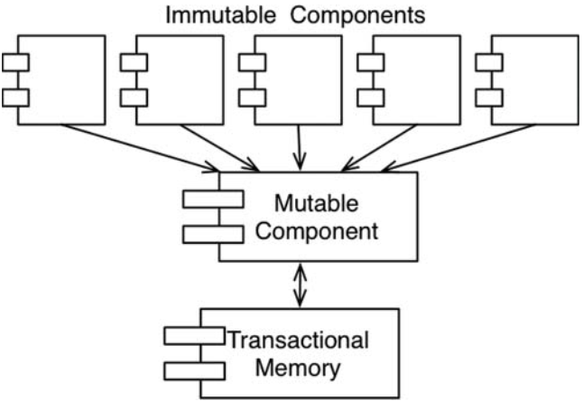
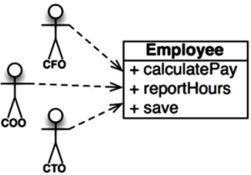
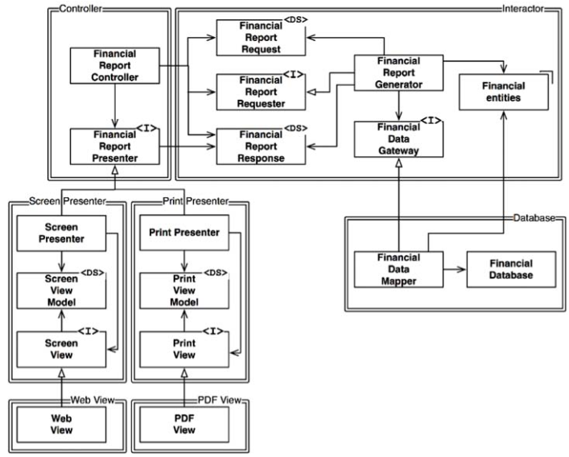
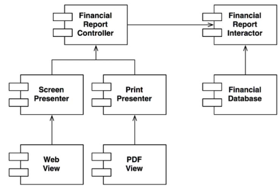

# Clean Architecture

notes taken from reading the _Clean Architecture_ book by Robert C.Martin.

## Preface

- the rules of software architecture are the same, they are independent of every other variable:
    - programming language
    - hardware
    - domain
    - application type.
    - ...

## Introduction

- getting some code to work is not that rhard, get it right is  another matter entirely.
- when you get a software right:
    - don't need hordes of programmers to keep it working
    - don't need a massive requirements doc and huge issue tracking systems.
    - require a fraction of human resources to maintain, efforts are minimized, functionality and flexibility are maximized.

## 1. What is design and architecture

- the word __architecture__ is often used in the context of something at a _high level_ that is divorced from the low-level details, whereas __design__ more often seems to imply structures and decisions at a _low level_.
- the low-level details and the high-level structure are all part of the same whole, they form a continuous fabric that defines the shape of the system. You can't have one without the other; indeed __no clear deviding__ lines separates them.
- the measure of __design quality__ is simply the measure of the __effort required__ to meet the needs if the customer.
- developers buy into a familir lie:
    - we can __clean it up later__; we just need to get to __market first__ but things never do get cleaned up later because market pressures never abate.
    - making __messy code__ makes them go __fast__ in the short term and just slows them down in the long term.
- a fact is that making messes is _always_ slower then staying clean, no matter which time scale you are using.
- developers may think that the answer is to start over __from scratch__ and redesign the whole system but that could be another mistake due to their __overconfidence__.

## 2. A tale of two values

- every software system provides two different values to the stakeholders:.
    - __behavior__ or __function__: program should work and behave in a way that makes or saves money for the stakeholders.
    - __architecture__: software system should be easy to change.
- both business managers and developers would tend more to advocate function over architecture, but it is the __wrong__ attitude.
- Business managers and developers fail to separate those features that __urgent__ but __not important__, from those features that truly are __urgent and important__. This failure leads to ignoring the important architecture of the system in favor of the unimportant features of the system.
- If __architecture__ comes last, then the system will become ever __more costly__ to develop, and eventually __change__ wil become practically impossible for part or for all of the system. If that is allowed to happen, it means the software development team did not fight hard enough for what they knew was necessery.

## 3. Paradigm overview

- __structured programming__:
    - shows that the use of __unrestrained__ jumps (`goto` statements) is __harmful__ to program structure.
    - replaced those jumps with more familiar `if/then/else` and `do/while/until` constructs.
    - _Structured programming imposes discipline on direct transfer of control_.
- __object orionted programming__:
    - engineers noticed that the function call stack frame in the ALGOL language could be moved to a heap, thereby allowing local variables declared by a function to exist long after the function returned.
    - the function became a constructor for a class, the local variables became instance variables, and the nested functions became methods. This led inevitably to the discovery of polymorphism through the disciplined use of function pointers.
    - _Object-oriented programming imposes discipline on indirect transfer of control_.
- __functional programming__:
    - only recently begun to be adopted, was the first to be invented.
    - a foundational notion of lambda calculus is immutability—that is, the notion that the values of symbols do not change => __no assignment statement__.
    - most functional languages do, in fact, have some means to alter the value of a variable, but only under very strict discipline.
    - _Functional programming imposes discipline upon assignment_.
- each of these paradigms __removes__ capabilities from the programmer, none of them adds new ones. Each imposes some kind of extra discipline that is negative in its intent. The paradigms tell us __what not to do__, more than they tell us __what to do__. They removed `goto` statements, function pointers, and assignement.

## 4. Structured Programming

-  _Dijkstra_ discovered that certain uses of `goto` statements prevent modules from being __decomposed recursively__ into smaller and smaller units, thereby preventing use of the __divide-and-conquer__ approach necessary for reasonable proofs.
- Other uses of `goto`, however, did not have this problem. Dijkstra realized that these “good” uses of goto corresponded to simple __selection__ and __iteration__ control structures such as `if/then/else` and `do/while`. Modules that used
only those kinds of control structures could be __recursively subdivided into provable units__.
- Nowadays we are all structured programmers, though not necessarily __by choice__. It’s just that our languages don’t give us the option to use __undisciplined direct transfer of control__.
- Some may point to named `breaks` in Java or exceptions as goto analogs. In fact, these structures are not the utterly unrestricted transfers of control that older languages like Fortran or COBOL once had. Indeed, even languages
that still support the `goto` keyword often restrict the target to within the __scope of the current function__.
- Structured programming allows modules to be recursively decomposed into __provable units__, which in turn means that modules can be __functionally decomposed__.
- That is, you can take a large-scale problem statement and decompose it into __highlevel functions__. Each of those functions can then be decomposed into __lower-level functions__, ad infinitum. Moreover, each of those decomposed functions can be represented using the restricted control structures of structured programming.
- Dijkstra once said, _“Testing shows the presence, not the absence, of bugs.”_ 
    - A program __can be proven incorrect__ by a test, but it __cannot be proven correct__.
    - All that tests can do, after sufficient testing effort, is allow us to deem a program to be correct enough for our purposes.
    - => Software development is not a mathematical endeavor, even though it seems to manipulate mathematical constructs.
    - => Rather, __software is like a science__. We show correctness by failing to prove incorrectness, despite our best efforts.
- Structured programming forces us to recursively decompose a program into a set of small provable functions. We can then use tests to try to prove those small provable functions incorrect. If such tests fail to prove incorrectness, then we deem the functions to be correct enough for our purposes.

## 5. Object-Oriented Programming

-  What is OO?
    - Combination of data and function.
        - :arrow_forward: __absurd__, because programmers were passing data structures into functions long before 1966, when Dahl and Nygaard moved the function call stack frame to the heap and invented OO.
    - A way to model the real world.
        - :arrow_forward: evasive answer at best. What does “modeling the real world” actually mean, and why is it something we would want to do? 
    - Proper admixture of these three things: __encapsulation__, __inheritance__, and __polymorphism__.

### Encapsulation?

-  is certainly __not unique__ to OO. Indeed, we had perfect encapsulation in C.
- `point.h`:
```C
struct Point;
struct Point* makePoint(double x, double y);
double distance (struct Point *p1, struct Point *p2);
```
- `point.c`:
```c
#include "point.h"
#include <stdlib.h>
#include <math.h>

struct Point {
    double x,y;
};
struct Point* makepoint(double x, double y) {
struct Point* p = malloc(sizeof(struct Point));
    p->x = x;
    p->y = y;
    return p;
}
double distance(struct Point* p1, struct Point* p2) {
    double dx = p1->x - p2->x;
    double dy = p1->y - p2->y;
    return sqrt(dx*dx+dy*dy);
}
```
- The users of `point.h` have no access whatsoever to the members of struct `Point`.
- But then came OO in the form of C++— and the perfect encapsulation of C was __broken__.
- The C++ compiler, for technical reasons (needs to know the size of the instances of each class.), needed the member variables of a class to be declared __in the header file of that class__. So our `Point` program
changed to look like this:
- `point.h`:
```c
class Point {
public:
    Point(double x, double y);
    double distance(const Point& p) const;
private:
    double x;
    double y;
};
```
- `point.cc`:
```c
#include "point.h"
#include <math.h>

Point::Point(double x, double y) : x(x), y(y) {}
double Point::distance(const Point& p) const {
    double dx = x-p.x;
    double dy = y-p.y;
    return sqrt(dx*dx + dy*dy);
}
```
- Clients of the header file `point.h` know about the member variables `x` and `y`! The compiler will prevent access to them, but the client still knows they exist.
- For example, if those member names are changed, the `point.cc` file must be recompiled! __Encapsulation has been broken__.
- Indeed, the way encapsulation is partially __repaired__ is by introducing the `public`, `private`, and `protected` keywords into the language. This, however, was a _hack_ necessitated by the technical need for the compiler to see those variables in the header file.
- For these reasons, it is difficult to accept that OO depends on __strong encapsulation__. Indeed, many OO languages have little or no enforced encapsulation.

### Inheritance?

- Inheritance is simply the __redeclaration__ of a group of variables and functions within an __enclosing scope__. This is something C programmers were able to do manually long before there was an OO languag.
- `namedPoint.h`:
```c
struct NamedPoint;
struct NamedPoint* makeNamedPoint(double x, double y, char* name);
void setName(struct NamedPoint* np, char* name);
char* getName(struct NamedPoint* np);
```
- `namedPoint.c`:
```c
#include "namedPoint.h"
#include <stdlib.h>

struct NamedPoint {
    double x,y;
    char* name;
};
struct NamedPoint* makeNamedPoint(double x, double y, char* name) {
    struct NamedPoint* p = malloc(sizeof(struct NamedPoint));
    p->x = x;
    p->y = y;
    p->name = name;
    return p;
}

void setName(struct NamedPoint* np, char* name) {
    np->name = name;
}

char* getName(struct NamedPoint* np) {
    return np->name;
}
```
- `main.c`:
```c
#include "point.h"
#include "namedPoint.h"
#include <stdio.h>

int main(int ac, char** av) {
    struct NamedPoint* origin = makeNamedPoint(0.0, 0.0, "origin");
    struct NamedPoint* upperRight = makeNamedPoint(1.0, 1.0, "upperRight");
    printf("distance=%f\n", distance( 
        (struct Point*) origin, (struct Point*) upperRight));
}
```
- If you look carefully at the `main` program, you’ll see that the `NamedPoint` data structure acts as though it is a derivative of the `Point` data structure.
- This is because the __order__ of the first two fields in `NamedPoint` is the __same__ as `Point`.
- We had a trick, but it’s not nearly as __convenient__ as __true inheritance__. Moreover, __multiple inheritance__ is a considerably more difficult to achieve by such trickery.
- To recap: We can award no point to OO for encapsulation, and perhaps a half-point for inheritance. So far, that’s not such a great score :stuck_out_tongue:.

### Polymorphism?

```c
#include <stdio.h>

void copy() {
    int c;
    while ((c=getchar()) != EOF)
        putchar(c);
}
```
- The function `getchar()` reads from `STDIN`. But which device is STDIN? 
- The `putchar()` function writes to `STDOUT`. But which device is that?
- These functions are polymorphic—their behavior depends on the type of `STDIN` and `STDOUT`.
- So how does the call to `getchar()` actually get delivered to the device driver that reads the character?
- The UNIX operating system __requires__ that every IO device driver provide five standard functions: `open, close, read, write, and seek`. The signatures of those functions must be __identical__ for every IO driver.
- The `FILE` data structure contains five pointers to functions. In our example, it might look like this:
```c
struct FILE {
    void (*open)(char* name, int mode);
    void (*close)();
    int (*read)();
    void (*write)(char);
    void (*seek)(long index, int mode);
};
```
- The IO driver for the console will define those functions and load up a `FILE` data structure with their addresses—something like this:
```c
#include "file.h"

void open(char* name, int mode) {/*...*/}
void close() {/*...*/};
int read() {int c;/*...*/ return c;}
void write(char c) {/*...*/}
void seek(long index, int mode) {/*...*/}

struct FILE console = {open, close, read, write, seek};
```
- Now if `STDIN` is defined as a `FILE*`, and if it points to the console data structure, then `getchar()` might be implemented this way:
```c
extern struct FILE* STDIN;

int getchar() {
    return STDIN->read();
}
```
- In other words, `getchar()` simply calls the function pointed to by the read pointer of the `FILE` data structure pointed to by `STDIN`.
- This simple trick is the basis for all polymorphism in OO. In C++, for example, every __virtual function__ within a class has a pointer in a table called a _vtable_, and all calls to virtual functions go through that table. Constructors of derivatives simply load their versions of those functions into the vtable of the object being created.
- The bottom line is that polymorphism is an __application of pointers to functions__.
- Programmers have been using pointers to functions to achieve polymorphic behavior since _Von Neumann_ architectures were first implemented in the late 1940s. 
- In other words, OO has provided nothing new. Ah, but that’s not quite correct. OO languages may not have given us polymorphism, but they have made it __much safer and much more convenient__.
- OO is the ability, through the use of polymorphism, to gain __absolute control__ over every __source code dependency__ in the system. It allows the architect to create a __plugin__ architecture, in which modules that contain __high-level policies__ are __independent__ of modules that contain __low-level details__. The low-level details are relegated to plugin modules that can be deployed and developed independently from the modules that contain __high-level policies__.

## Chapter 6: Functional Programming

- In many ways, the concepts of functional programming predate programming itself. This paradigm is strongly based on the __lambda-calculus__ invented by `Alonzo Church` in the 1930s.
- Variables in functional languages __do not vary__.
- Why ? All __race conditions__, __deadlock conditions__, and __concurrent update__ problems are due to mutable variables.
- __Immutability__ can be practicable, if certain compromises are made.
    - __Segregation of Mutability__: The immutable components perform their tasks in a purely functional way, without using any mutable variables. The immutable components communicate with one or more other components that are not purely functional, and allow for the state of variables to be mutated. <p align="center"></p>
        - Since mutating state exposes those components to all the problems of concurrency, it is common practice to use some kind of __transactional__ memory to protect the mutable variables from concurrent updates and race conditions. Transactional memory simply treats variables in memory the same way a database treats records on disk. It protects those variables with a transactionor retry-based scheme.
    - __Event Sourcing__: is a strategy wherein we store the __transactions, but not the state__. When state is required, we simply apply all the transactions from the beginning of time.
        - The more memory we have, and the faster our machines are, the less we need mutable state.
        - If we have enough storage and enough processor power, we can make our applications entirely immutable—and, therefore, entirely functional.

### Chapter 7 SRP: The Single Responsibility Principle

- :eyes: does not mean that every module should do just one thing.
- But means instead that _a module should be responsible to one, and only one, actor_.
- My favorite example is the `Employee` class from a payroll application. It has three methods: `calculatePay()`, `reportHours()`, and `save()`. <p align="center"></p>
- This class violates the SRP because those three methods are responsible to three very different actors.
    - The `calculatePay()` method is specified by the accounting department, which reports to the CFO.
    - The `reportHours()` method is specified and used by the human resources department, which reports to the COO.
    - The `save()` method is specified by the database administrators (DBAs), who report to the CTO.
- Many problems occur because we put code that __different actors__ depend on into __close proximity__. The SRP says to
separate the code that different actors depend on.

### Chapter 8 OCP: The Open-Closed Principle

- The Open-Closed Principle (OCP) was coined in 1988 by _Bertrand Meyer_. It says: _A software artifact should be open for extension but closed for modification_.
- In other words, the behavior of a software artifact ought to be extendible, without having to modify that artifact.

#### A Thought Experiment

- Imagine, for a moment, that we have a system that displays a financial summary on a web page. The data on the page is scrollable, and negative numbers are rendered in red.
- Now imagine that the stakeholders ask that this same information be turned into a report to be printed on a black-and-white printer. The report should be properly paginated, with appropriate page headers, page footers, and column labels. Negative numbers should be surrounded by parentheses.
- Clearly, some new code must be written. But how much old code will have to change?
- A good software architecture would reduce the amount of changed code to the barest minimum. __Ideally, zero__.
- The essential insight here is that generating the report involves __two separate responsibilities__:
    - the calculation of the reported data;
    - and the presentation of that data into a web and printer-friendly form. <p align="center"></p>
- Classes marked with `<I>` are __interfaces__; those marked with `<DS>` are __data structures__. Open arrowheads are using __relationships__. Closed arrowheads are implements or __inheritance__ relationships.
-  An arrow pointing from class `A` to class B means that the source code of class A mentions the name of class B, but class B mentions __nothing about__ class `A`. Thus, `FinancialDataMapper` knows about `FinancialDataGateway` through an implements relationship, but `FinancialGateway` knows nothing at all about `FinancialDataMapper`.
- The next thing to notice is that each double line is crossed in __one direction only__. This means that all component relationships are __unidirectional__.  These arrows point toward the components that we want to __protect from change__. <p align="center"></p>