# Clean Architecture

notes taken from reading the _Clean Architecture_ book by Robert C.Martin.

## Preface

- the rules of software architecture are the same, they are independent of every other variable:
    - programming language
    - hardware
    - domain
    - application type.
    - ...

## Introduction

- getting some code to work is not that rhard, get it right is  another matter entirely.
- when you get a software right:
    - don't need hordes of programmers to keep it working
    - don't need a massive requirements doc and huge issue tracking systems.
    - require a fraction of human resources to maintain, efforts are minimized, functionality and flexibility are maximized.

## Chapter 1. What is design and architecture

- the word __architecture__ is often used in the context of something at a _high level_ that is divorced from the low-level details, whereas __design__ more often seems to imply structures and decisions at a _low level_.
- the low-level details and the high-level structure are all part of the same whole, they form a continuous fabric that defines the shape of the system. You can't have one without the other; indeed __no clear dividing__ lines separates them.
- the measure of __design quality__ is simply the measure of the __effort required__ to meet the needs if the customer.
- developers buy into a familiar lie:
    - we can __clean it up later__; we just need to get to __market first__ but things never do get cleaned up later because market pressures never abate.
    - making __messy code__ makes them go __fast__ in the short term and just slows them down in the long term.
- a fact is that making messes is _always_ slower then staying clean, no matter which time scale you are using.
- developers may think that the answer is to start over __from scratch__ and redesign the whole system but that could be another mistake due to their __overconfidence__.

## Chapter 2. A tale of two values

- every software system provides two different values to the stakeholders:.
    - __behavior__ or __function__: program should work and behave in a way that makes or saves money for the stakeholders.
    - __architecture__: software system should be easy to change.
- both business managers and developers would tend more to advocate function over architecture, but it is the __wrong__ attitude.
- Business managers and developers fail to separate those features that __urgent__ but __not important__, from those features that truly are __urgent and important__. This failure leads to ignoring the important architecture of the system in favor of the unimportant features of the system.
- If __architecture__ comes last, then the system will become ever __more costly__ to develop, and eventually __change__ wil become practically impossible for part or for all of the system. If that is allowed to happen, it means the software development team did not fight hard enough for what they knew was necessery.

## Chapter 3. Paradigm overview

- __structured programming__:
    - shows that the use of __unrestrained__ jumps (`goto` statements) is __harmful__ to program structure.
    - replaced those jumps with more familiar `if/then/else` and `do/while/until` constructs.
    - _Structured programming imposes discipline on direct transfer of control_.
- __object orionted programming__:
    - engineers noticed that the function call stack frame in the ALGOL language could be moved to a heap, thereby allowing local variables declared by a function to exist long after the function returned.
    - the function became a constructor for a class, the local variables became instance variables, and the nested functions became methods. This led inevitably to the discovery of polymorphism through the disciplined use of function pointers.
    - _Object-oriented programming imposes discipline on indirect transfer of control_.
- __functional programming__:
    - only recently begun to be adopted, was the first to be invented.
    - a foundational notion of lambda calculus is immutability—that is, the notion that the values of symbols do not change => __no assignment statement__.
    - most functional languages do, in fact, have some means to alter the value of a variable, but only under very strict discipline.
    - _Functional programming imposes discipline upon assignment_.
- each of these paradigms __removes__ capabilities from the programmer, none of them adds new ones. Each imposes some kind of extra discipline that is negative in its intent. The paradigms tell us __what not to do__, more than they tell us __what to do__. They removed `goto` statements, function pointers, and assignement.

## Chapter 4. Structured Programming

-  _Dijkstra_ discovered that certain uses of `goto` statements prevent modules from being __decomposed recursively__ into smaller and smaller units, thereby preventing use of the __divide-and-conquer__ approach necessary for reasonable proofs.
- Other uses of `goto`, however, did not have this problem. Dijkstra realized that these “good” uses of goto corresponded to simple __selection__ and __iteration__ control structures such as `if/then/else` and `do/while`. Modules that used
only those kinds of control structures could be __recursively subdivided into provable units__.
- Nowadays we are all structured programmers, though not necessarily __by choice__. It’s just that our languages don’t give us the option to use __undisciplined direct transfer of control__.
- Some may point to named `breaks` in Java or exceptions as goto analogs. In fact, these structures are not the utterly unrestricted transfers of control that older languages like Fortran or COBOL once had. Indeed, even languages
that still support the `goto` keyword often restrict the target to within the __scope of the current function__.
- Structured programming allows modules to be recursively decomposed into __provable units__, which in turn means that modules can be __functionally decomposed__.
- That is, you can take a large-scale problem statement and decompose it into __highlevel functions__. Each of those functions can then be decomposed into __lower-level functions__, ad infinitum. Moreover, each of those decomposed functions can be represented using the restricted control structures of structured programming.
- Dijkstra once said, _“Testing shows the presence, not the absence, of bugs.”_
    - A program __can be proven incorrect__ by a test, but it __cannot be proven correct__.
    - All that tests can do, after sufficient testing effort, is allow us to deem a program to be correct enough for our purposes.
    - => Software development is not a mathematical endeavor, even though it seems to manipulate mathematical constructs.
    - => Rather, __software is like a science__. We show correctness by failing to prove incorrectness, despite our best efforts.
- Structured programming forces us to recursively decompose a program into a set of small provable functions. We can then use tests to try to prove those small provable functions incorrect. If such tests fail to prove incorrectness, then we deem the functions to be correct enough for our purposes.

## Chapter 5. Object-Oriented Programming

-  What is OO?
    - Combination of data and function.
        - :arrow_forward: __absurd__, because programmers were passing data structures into functions long before 1966, when Dahl and Nygaard moved the function call stack frame to the heap and invented OO.
    - A way to model the real world.
        - :arrow_forward: evasive answer at best. What does “modeling the real world” actually mean, and why is it something we would want to do?
    - Proper admixture of these three things: __encapsulation__, __inheritance__, and __polymorphism__.

### Encapsulation?

-  is certainly __not unique__ to OO. Indeed, we had perfect encapsulation in C.
- `point.h`:
```C
struct Point;
struct Point* makePoint(double x, double y);
double distance (struct Point *p1, struct Point *p2);
```
- `point.c`:
```c
#include "point.h"
#include <stdlib.h>
#include <math.h>

struct Point {
    double x,y;
};
struct Point* makepoint(double x, double y) {
struct Point* p = malloc(sizeof(struct Point));
    p->x = x;
    p->y = y;
    return p;
}
double distance(struct Point* p1, struct Point* p2) {
    double dx = p1->x - p2->x;
    double dy = p1->y - p2->y;
    return sqrt(dx*dx+dy*dy);
}
```
- The users of `point.h` have no access whatsoever to the members of struct `Point`.
- But then came OO in the form of C++— and the perfect encapsulation of C was __broken__.
- The C++ compiler, for technical reasons (needs to know the size of the instances of each class.), needed the member variables of a class to be declared __in the header file of that class__. So our `Point` program
changed to look like this:
- `point.h`:
```c
class Point {
public:
    Point(double x, double y);
    double distance(const Point& p) const;
private:
    double x;
    double y;
};
```
- `point.cc`:
```c
#include "point.h"
#include <math.h>

Point::Point(double x, double y) : x(x), y(y) {}
double Point::distance(const Point& p) const {
    double dx = x-p.x;
    double dy = y-p.y;
    return sqrt(dx*dx + dy*dy);
}
```
- Clients of the header file `point.h` know about the member variables `x` and `y`! The compiler will prevent access to them, but the client still knows they exist.
- For example, if those member names are changed, the `point.cc` file must be recompiled! __Encapsulation has been broken__.
- Indeed, the way encapsulation is partially __repaired__ is by introducing the `public`, `private`, and `protected` keywords into the language. This, however, was a _hack_ necessitated by the technical need for the compiler to see those variables in the header file.
- For these reasons, it is difficult to accept that OO depends on __strong encapsulation__. Indeed, many OO languages have little or no enforced encapsulation.

### Inheritance?

- Inheritance is simply the __redeclaration__ of a group of variables and functions within an __enclosing scope__. This is something C programmers were able to do manually long before there was an OO languag.
- `namedPoint.h`:
```c
struct NamedPoint;
struct NamedPoint* makeNamedPoint(double x, double y, char* name);
void setName(struct NamedPoint* np, char* name);
char* getName(struct NamedPoint* np);
```
- `namedPoint.c`:
```c
#include "namedPoint.h"
#include <stdlib.h>

struct NamedPoint {
    double x,y;
    char* name;
};
struct NamedPoint* makeNamedPoint(double x, double y, char* name) {
    struct NamedPoint* p = malloc(sizeof(struct NamedPoint));
    p->x = x;
    p->y = y;
    p->name = name;
    return p;
}

void setName(struct NamedPoint* np, char* name) {
    np->name = name;
}

char* getName(struct NamedPoint* np) {
    return np->name;
}
```
- `main.c`:
```c
#include "point.h"
#include "namedPoint.h"
#include <stdio.h>

int main(int ac, char** av) {
    struct NamedPoint* origin = makeNamedPoint(0.0, 0.0, "origin");
    struct NamedPoint* upperRight = makeNamedPoint(1.0, 1.0, "upperRight");
    printf("distance=%f\n", distance(
        (struct Point*) origin, (struct Point*) upperRight));
}
```
- If you look carefully at the `main` program, you’ll see that the `NamedPoint` data structure acts as though it is a derivative of the `Point` data structure.
- This is because the __order__ of the first two fields in `NamedPoint` is the __same__ as `Point`.
- We had a trick, but it’s not nearly as __convenient__ as __true inheritance__. Moreover, __multiple inheritance__ is a considerably more difficult to achieve by such trickery.
- To recap: We can award no point to OO for encapsulation, and perhaps a half-point for inheritance. So far, that’s not such a great score :stuck_out_tongue:.

### Polymorphism?

```c
#include <stdio.h>

void copy() {
    int c;
    while ((c=getchar()) != EOF)
        putchar(c);
}
```
- The function `getchar()` reads from `STDIN`. But which device is STDIN?
- The `putchar()` function writes to `STDOUT`. But which device is that?
- These functions are polymorphic—their behavior depends on the type of `STDIN` and `STDOUT`.
- So how does the call to `getchar()` actually get delivered to the device driver that reads the character?
- The UNIX operating system __requires__ that every IO device driver provide five standard functions: `open, close, read, write, and seek`. The signatures of those functions must be __identical__ for every IO driver.
- The `FILE` data structure contains five pointers to functions. In our example, it might look like this:
```c
struct FILE {
    void (*open)(char* name, int mode);
    void (*close)();
    int (*read)();
    void (*write)(char);
    void (*seek)(long index, int mode);
};
```
- The IO driver for the console will define those functions and load up a `FILE` data structure with their addresses—something like this:
```c
#include "file.h"

void open(char* name, int mode) {/*...*/}
void close() {/*...*/};
int read() {int c;/*...*/ return c;}
void write(char c) {/*...*/}
void seek(long index, int mode) {/*...*/}

struct FILE console = {open, close, read, write, seek};
```
- Now if `STDIN` is defined as a `FILE*`, and if it points to the console data structure, then `getchar()` might be implemented this way:
```c
extern struct FILE* STDIN;

int getchar() {
    return STDIN->read();
}
```
- In other words, `getchar()` simply calls the function pointed to by the read pointer of the `FILE` data structure pointed to by `STDIN`.
- This simple trick is the basis for all polymorphism in OO. In C++, for example, every __virtual function__ within a class has a pointer in a table called a _vtable_, and all calls to virtual functions go through that table. Constructors of derivatives simply load their versions of those functions into the vtable of the object being created.
- The bottom line is that polymorphism is an __application of pointers to functions__.
- Programmers have been using pointers to functions to achieve polymorphic behavior since _Von Neumann_ architectures were first implemented in the late 1940s.
- In other words, OO has provided nothing new. Ah, but that’s not quite correct. OO languages may not have given us polymorphism, but they have made it __much safer and much more convenient__.
- OO is the ability, through the use of polymorphism, to gain __absolute control__ over every __source code dependency__ in the system. It allows the architect to create a __plugin__ architecture, in which modules that contain __high-level policies__ are __independent__ of modules that contain __low-level details__. The low-level details are relegated to plugin modules that can be deployed and developed independently from the modules that contain __high-level policies__.

## Chapter 6: Functional Programming

- In many ways, the concepts of functional programming predate programming itself. This paradigm is strongly based on the __lambda-calculus__ invented by `Alonzo Church` in the 1930s.
- Variables in functional languages __do not vary__.
- Why ? All __race conditions__, __deadlock conditions__, and __concurrent update__ problems are due to mutable variables.
- __Immutability__ can be practicable, if certain compromises are made.
    - __Segregation of Mutability__: The immutable components perform their tasks in a purely functional way, without using any mutable variables. The immutable components communicate with one or more other components that are not purely functional, and allow for the state of variables to be mutated. <p align="center"></p>
        - Since mutating state exposes those components to all the problems of concurrency, it is common practice to use some kind of __transactional__ memory to protect the mutable variables from concurrent updates and race conditions. Transactional memory simply treats variables in memory the same way a database treats records on disk. It protects those variables with a transactionor retry-based scheme.
    - __Event Sourcing__: is a strategy wherein we store the __transactions, but not the state__. When state is required, we simply apply all the transactions from the beginning of time.
        - The more memory we have, and the faster our machines are, the less we need mutable state.
        - If we have enough storage and enough processor power, we can make our applications entirely immutable—and, therefore, entirely functional.

## Chapter 7 SRP: The Single Responsibility Principle

- :eyes: does not mean that every module should do just one thing.
- But means instead that _a module should be responsible to one, and only one, actor_.
- My favorite example is the `Employee` class from a payroll application. It has three methods: `calculatePay()`, `reportHours()`, and `save()`. <p align="center"></p>
- This class violates the SRP because those three methods are responsible to three very different actors.
    - The `calculatePay()` method is specified by the accounting department, which reports to the CFO.
    - The `reportHours()` method is specified and used by the human resources department, which reports to the COO.
    - The `save()` method is specified by the database administrators (DBAs), who report to the CTO.
- Many problems occur because we put code that __different actors__ depend on into __close proximity__. The SRP says to
separate the code that different actors depend on.

## Chapter 8 OCP: The Open-Closed Principle

- The Open-Closed Principle (OCP) was coined in 1988 by _Bertrand Meyer_. It says: _A software artifact should be open for extension but closed for modification_.
- In other words, the behavior of a software artifact ought to be extendible, without having to modify that artifact.

### A Thought Experiment

- Imagine, for a moment, that we have a system that displays a financial summary on a web page. The data on the page is scrollable, and negative numbers are rendered in red.
- Now imagine that the stakeholders ask that this same information be turned into a report to be printed on a black-and-white printer. The report should be properly paginated, with appropriate page headers, page footers, and column labels. Negative numbers should be surrounded by parentheses.
- Clearly, some new code must be written. But how much old code will have to change?
- A good software architecture would reduce the amount of changed code to the barest minimum. __Ideally, zero__.
- The essential insight here is that generating the report involves __two separate responsibilities__:
    - the calculation of the reported data;
    - and the presentation of that data into a web and printer-friendly form. <p align="center"></p>
- Classes marked with `<I>` are __interfaces__; those marked with `<DS>` are __data structures__.
- Open arrowheads are using __relationships__. Closed arrowheads are implements or __inheritance__ relationships.
- An arrow pointing from class `A` to class `B` means that the source code of class `A` mentions the name of class `B`, but class `B` mentions __nothing about__ class `A`. Thus, `FinancialDataMapper` knows about `FinancialDataGateway` through an implements relationship, but `FinancialGateway` knows nothing at all about `FinancialDataMapper`.
- The next thing to notice is that each double line is crossed in __one direction only__. This means that all component relationships are __unidirectional__. These arrows point toward the components that we want to __protect from change__. <p align="center"></p>
- We want to protect the _Controller_ from changes in the _Presenters_. We want to protect the _Presenters_ from changes in the _Views_. We want to protect the _Interactor_ from changes in—well, anything.
- The _Interactor_ is in the position that best conforms to the OCP. Changes to the Database, or the Controller, or the Presenters, or the Views, will have __no impact__ on the Interactor. Why should the _Interactor_ hold such a privileged position? Because it contains the __business rules__. The Interactor contains the __highest-level policies__ of the application. All the other components are dealing with peripheral concerns. The _Interactor_ deals with the __central concern__.
- This is how the OCP works at the architectural level. Architects separate functionality based on how, why, and when it changes, and then organize that separated functionality into a hierarchy of components. __Higher-level__ components in that hierarchy are __protected__ from the changes made to __lower-level__ components.

## Chapter 9 LSP: The Liskov Substitution Principle

- In 1988, Barbara Liskov wrote the following as a way of defining subtypes:
    - :bulb: _What is wanted here is something like the following substitution property: If for each object o1 of type S there is an object o2 of type T such that for all programs P defined in terms of T, the behavior of P is unchanged when o1 is substituted for o2 then S is a subtype of T_.
- Example: Imagine that we have a class named `License`. This class has a method named `calcFee()`, which is called by the `Billing` application. There are two “subtypes” of License: `PersonalLicense` and `BusinessLicense`. They use different algorithms to calculate the license fee. <p align="center">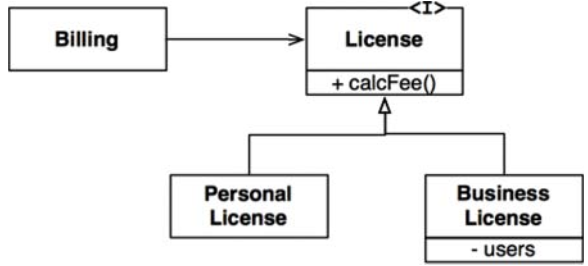</p>
- This design conforms to the LSP because the behavior of the `Billing` application does not depend, in any way, on which of the two subtypes it uses. Both of the subtypes are __substitutable__ for the `License` type.
- The canonical example of a violation of the LSP is the famed (or infamous, depending on your perspective) square/rectangle problem: <p align="center">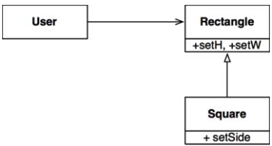</p>
- In this example, `Square` is not a proper __subtype__ of `Rectangle` because the height and width of the `Rectangle` are __independently mutable__; in contrast, the height and width of the `Square` must __change together__. Since the `User` believes it is communicating with a `Rectangle`, it could easily get confused.
- :arrow_forward: A simple violation of __substitutability__, can cause a system’s architecture to be polluted with a significant amount of extra mechanisms.

## Chapter 10 ISP: The Interface Segregation Principle

- The Interface Segregation Principle (ISP) derives its name from the diagram below: <p align="center">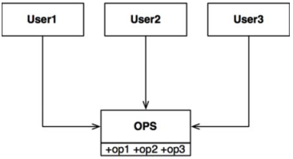</p>
- In the situation illustrated in above, there are several users who use the operations of the `OPS` class. Let’s assume that `User1` uses only `op1`, `User2` uses only `op2`, and `User3` uses only `op3`.
- Now imagine that `OPS` is a class written in a language like Java. Clearly, in that case, the source code of `User1` will __inadvertently depend__ on `op2` and `op3`, even though it doesn’t call them. This dependence means that a change to the source code of `op2` in `OPS` will force `User1` to be __recompiled and redeployed__, even though nothing that it cared about has actually changed.
- This problem can be resolved by __segregating the operations into interfaces__: <p align="center">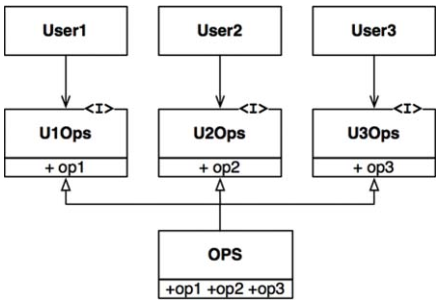</p>

### ISP and Language

- Clearly, the previously given description depends critically on language type. __Statically typed languages__ like Java force programmers to create declarations that users must `import`, or use, or otherwise `include`. It is these included
declarations in source code that create the source code dependencies that __force recompilation and redeployment__.
- In __dynamically typed__ languages like Ruby and Python, such declarations don’t exist in source code. Instead, they are inferred at __runtime__. Thus there are no source code dependencies to force recompilation and redeployment. This is
the primary reason that dynamically typed languages create systems that are __more flexible and less tightly coupled__ than statically typed languages.
- :arrow_forward: This fact could lead you to conclude that the ISP is a language issue, rather than an architecture issue.

### ISP and Architecture

- In general, it is __harmful__ to depend on modules that contain __more than you need__. This is obviously true for source code dependencies that can force unnecessary recompilation and redeployment—but it is also true at a much higher, __architectural level__.
- Consider, for example, an architect working on a system, S. He wants to include a certain framework, F, into the system. Now suppose that the authors of F have bound it to a particular database, D. So S depends on F. which depends on D. <p align="center">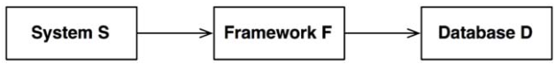</p>.
-  Now suppose that D contains features that F does not use and, therefore, that S does not care about. Changes to those features within D may well force the redeployment of F and, therefore, the redeployment of S. Even worse, a failure of one of the features within D may cause failures in F and S.

## Chapter 11 DIP: Dependency Inversion Principle

- The Dependency Inversion Principle (DIP) tells us that the most flexible systems are those in which source code dependencies refer only to __abstractions, not to concretions__.
- In a statically typed language, like Java, this means that the `use, import,` and `include` statements should __refer only to source modules containing interfaces, abstract classes__, or some kind of abstract declaration.
- The same rule apply for dynamically typed languages, like Ruby and Python. __Source code dependencies should not refer to concrete modules__. However, in these languages it is a bit harder to define what a concrete module is, in particular, it is any module which the functions being called are implemented.
- Clearly treating this idea as a rule is unrealistic, because software systems must depend on many concrete facilities.
    - We tend to ignore the __stable background of operating system__ and platform facilities because we know we can rely on them to not change.
    - Example: `String` class in Java is __very stable__.
- Is the the __volatile concrete__ elements of our system that we want to __avoid depending on__. Those are the modules that are actively developing, and that are undergoing frequent change.

### Stable Abstractions

- Every change to an abstract interface corresponds to a change to its concrete implementations. Conversely, changes to concrete implementations do not always, or even usually, require changes to the interface that they implement
    - :arrow_forward: Therefore interfaces are less volatile than implementations.
    - A good software architect work hard to __reduce the volatility of interfaces__ (stable abstract interfaces).
    - Coding practices:
        - :white_check_mark: Don’t refer to volatile concrete classes.
        - :white_check_mark: Don’t derive doom volatile concrete classes.
        - :white_check_mark: Don’t override concrete functions.

### Factories

- To comply with these rules, the creation of volatile concrete objects requires special handling. In most object-oriented languages, such a Java, we would use an *Abstract Factory* to manage this undesirable factory.
- The diagram below shows the structure:
    - The `Application` uses the `ConcreteImpl` though the `Service` interface.
    - However the `Application` must somehow create instances of the `ConcreteImpl`. To achieve this without creating a source code dependency on the `ConcreteImpl`, the `Application` calls the `makeSvc` method of the `ServiceFactory` interface. This method is implemented by the `ServiceFactoryImpl` class, which derives from `ServiceFactory`. The implementation instantiates the `ConcreteImpl` and returns it as a `Service`.
    - The curved line is an architectural boundary, it separates the abstract from the concrete.
    <p align="center">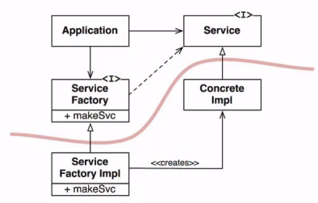</p>
- The way the dependencies cross that curved line in one direction, and toward more abstract entities, will become a new rule that we will call the **Dependency Rule**.

## Chapter 12 Components

- Components are the __unit of deployment__. The smallest entities that can be deployed as part of a system.
    - In Java, they are jar files. In Ruby, they are gem files. In .NET, they are DLLs.
- In the early days of software development, programmers controllers the memory locations and layout of their programs
    - *origin* statement tells the compiler to generate code that will be loaded at address 200.
    - Libraries where kept in source, not in a binary.
    - Devices were slow, memory was expensive and, therefore was limited.
    - :arrow_forward: Compilation took a long time.
    - To shorten compile times, the source code of the function library was separated from the apps.
        - Programmers compiled the function library separately and loaded the binary at a known address.
        - Memory layout looks like this: <p align="center">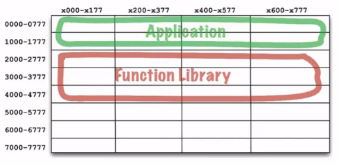</p>
    - This works fine as long as the app could fit between addresses 0000 and 1777. But soon apps grow to be larger than the space allocated for them

### Relocatability

- The compiler was changed to output binary code that could be relocated in memory by a smart loader.
- The loader would be told where to load the relocatable code (`.reloc` in PE files :smile: ).
- The relocatable code was instrumented with flags that told the loader which parts of the loaded data had to be altered to be loaded at the selected address.
- The compiler was also changed to emit the names of the functions as metadata in the relocatable binary. If a program called a library function, the compiler would emit that name as an __external reference__. If a program defined a library function, the compiler would emit that name as an __external definition__. Then the loader could link the external references to the external definitions once it had determined where it had loaded those definitions.
	- :cool: and the linking loader was born.

### Linkers

The linking loader allowed programmers to divide their programs up onto __separately compilable and loadable segments__. This worked well when relatively small programs were being linked with relatively small libraries.
- Eventually, the linking loaders were __too slow to tolerate__. They had to read dozens, if not hundreds, of binary libraries (stored on slow devices) to resolve the external references.
- As a result, the loading and the linking were separated into two phases. Programmers took the slow part — the part that did that linking — and put it into a separate application called the linker. The output of the linker was a linked relocatable that a relocating loader could load very quickly.
- Compiling each individual module was relatively fast, but compiling all the modules took a bit of time. The linker would then take even more time. Turnaround had gain grown to an hour or more in many cases.
- It seemed as if programmers were doomed to endlessly chase their tail :hushed:.
- By the mid-1990s, the time spent linking had begun to shrink faster than our
ambitions could make programs grow (__thanks to Moore’s law__). In many cases, link time decreased to a matter of seconds.

## Chapter 13: Component Cohesion

### The Reuse/Release Equivalence Principle

- REP is a principle that seems obvious, at least in hindsight. People who want to reuse software components cannot, and will not, do so unless those components are __tracked through a release process__ and are given __release numbers__.

### The Common Closure Principle

- Gather into components those classes that __change for the same reasons__ and at the __same times__. Separate into different components those classes that __change at different times__ and for __different reasons__.
- This is the Single Responsibility Principle restated for __components__.

### The Common Reuse Principle

- Don’t force users of a component to depend on things they don’t need.
- When we depend on a component, we want to make sure we depend __on every class__ in that component. Put another way, we want to make sure that the classes that we put into a component are __inseparable__ — that it is impossible to depend on some and not on the others. Otherwise, we will be redeploying more components than is necessary, and wasting significant effort.
- The CRP is the generic version of the ISP. The ISP advises us not to depend on classes that have __methods__ we don’t use. The CRP advises us not to depend on __components__ that have classes we don’t use.

### The Tension Diagram for Component Cohesion

- The edges of the diagram describe the __cost of abandoning__ the principle on the opposite vertex.
<p align="center">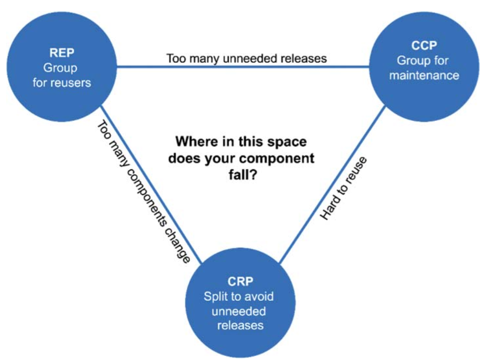</p>

## Chapter 14: Component Coupling

### The Acyclic Dependencies Principle

- The _morning after syndrome_ occurs in development environments where many developers are modifying the same source files. Some code that used to work are now no longer working because someone modified something you depends on.
- Two solutions to this problem have evolved: __The weekly build__ and the __Acyclic Dependencies Principle (ADP)__.

#### The Weekly Build

- Used to be common in medium-sized projects.
- All the developers ignore each other for the first four days of the week. Then, on Friday, they integrate all their changes and build the system.
- :white_check_mark: Allowing the developers to live in an isolated world for four days out of five.
- :thumbsdown: Large integration penalty that is paid on Friday.
- :arrow_forward: As the project size grows, integration and testing become increasingly harder to do.

#### Eliminating Dependency Cycles

- The solution to this problem is to __partition__ the development environment into __releasable components__.
- To make it work successfully, however, you must manage the __dependency structure__ of the components. There can be no cycles. If there are cycles in the dependency structure, then the _morning after syndrome_ cannot be avoided.

<p align="center">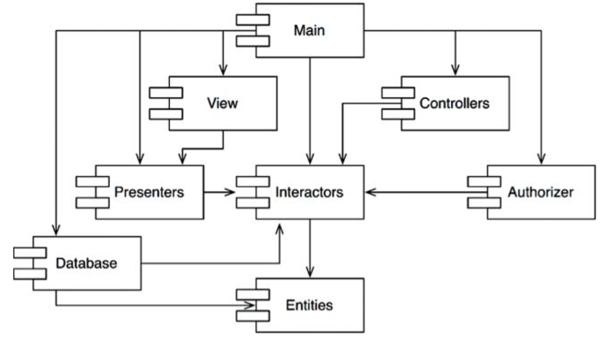</p>

- Regardless of which component you begin at, it is impossible to follow the dependency relationships and wind up back at that component. This structure has no cycles. It is a __directed acyclic graph (DAG)__.
- When it is time to release the whole system, the process proceeds from the bottom up. First the `Entities` component is compiled, tested, and released. Then the same is done for `Database` and `Interactors`. These components are followed by `Presenters`, `View,` `Controllers`, and then `Authorizer`. `Main` goes last. This process is very clear and easy to deal with. We know how to build the system because we understand the dependencies between its parts.

#### The Effect of a Cycle in the Component Dependency Graph

- For example, let’s say that the `User` class in `Entities` uses the `Permissions` class in `Authorizer`. This creates a __dependency cycle__. When such cycles in the dependency graph are created:
 - :bangbang: All of the developers working on any of those components will experience the dreaded _morning after syndrome_.
 - :bangbang: Unit testing and releasing become very difficult and error prone.

#### Breaking the Cycle

- There are two primary mechanisms for doing so:
  - Apply the Dependency Inversion Principle (DIP).
  - Create a new component that both `Entities` and `Authorizer` depend on. Move the class(es) that they both depend on into that new component.

#### The “Jitters”

- The second solution implies that the component structure is __volatile__ in the presence of changing requirements.
  - As the app grow, the component dependency structure __jitters and grows__. Thus the dependency structure must always be monitored for cycles.
  - When cycles occur, they must be __broken__ somehow. Sometimes this will mean creating new components, making the dependency structure grow.

### Top-Down Design

The component structure cannot be designed from the __top down__.
- As more and more modules accumulate in the early stages of implementation and design:
    - :+1: Keep changes as __localized__ as possible, so we start paying attention to the __SRP__ and __CCP__ and collocate classes that are likely to change together.
    - :+1: Isolate volatile components. We don’t want components that change frequently and for capricious reasons to affect components that otherwise ought to be stable.
- The component dependency structure grows and evolves with the logical design of the system.

### The Stable Dependencies Principle

- Designs cannot be completely __static__. Some volatility is necessary if the design is to be maintained.
- Any component that we expect to be __volatile__ should not be depended on by a component that is difficult to change. Otherwise, the volatile component will also be difficult to change.

#### Stability

- One sure way to make a software component difficult to change, is to make lots of other software components depend on it. A component with lots of incoming __dependencies__ is __very stable__ because it requires a great deal of work to reconcile any changes with all the dependent components.
- _X_, is a __stable__ component. Three components depend on _X_, so it has three good reasons __not to change__.
- We say that _X_ is __responsible__ to those three components.
- Conversely, _X_ depends on nothing, so it has no external influence to make it change. We say it is __independent__.
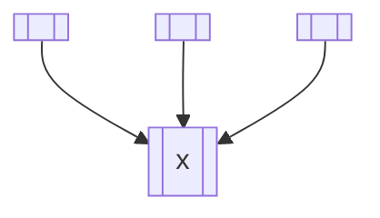
- _Y_, is a very __unstable__ component. No other components depend on _Y_, so we say that it is __irresponsible__.
- _Y_ also has three components that it depends on, so changes may come from three external sources. We say that _Y_ is __dependent__.

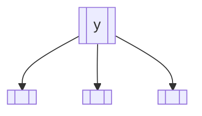

#### Stability Metrics

:question: How can we measure the stability of a component? Count the number of dependencies that enter and leave that component.
- __Fan-in__: Incoming dependencies. This metric identifies the number of classes outside this component that depend on classes within the component.
- __Fan-out__: Outgoing dependencies. This metric identifies the number of classes inside this component that depend on classes outside the component.
- __I__: Instability: `I = Fan-out % (Fan-in + Fan-out)`. This metric has the range [0, 1]. I = 0 indicates a maximally stable component. I = 1 indicates a maximally unstable component.
>  The SDP says that the I metric of a component should be larger than the I metrics of the components that it depends on. That is, I metrics should decrease in the direction of dependency.

#### Not All Components Should Be Stable

- `Flexible` is a component that we have designed to be easy to change. We want `Flexible` to be unstable.
- However, some developer, working in the component named `Stable`, has hung a dependency on `Flexible`.
- :bangbang: This violates the SDP because the I metric for `Stable` is much smaller than the I metric for `Flexible`.
- :arrow_forward: `Flexible` will no longer be easy to change. A change to `Flexible` will force us to deal with Stable and all its
dependents. <p align="center">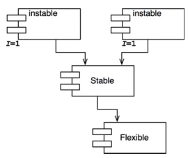</p>.
- To fix this problem, we somehow have to __break__ the dependence of `Stable` on `Flexible` (DIP for the win).

### The Stable Abstractions Principle

> A component should be as abstract as it is stable.

#### Where Do We Put the High-Level Policy?

- Some software in the system should not change very often. This software represents **high-level architecture and policy decisions**. We don’t want these business and architectural decisions to be **volatile**.
- However, if the high-level policies are placed into stable components, then the source code that represents those policies will be **difficult to change**.
:arrow_forward: This could make the overall architecture inflexible. How can a component that is maximally stable (I = 0) be flexible enough to withstand change :question: ==> The answer is found in the OCP.

#### Introducing the Stable Abstractions Principle

- The Stable Abstractions Principle (SAP) sets up a relationship between **stability** and **abstractness**.
- On the one hand, it says that a **stable** component should also be **abstract** so that its stability does not prevent it from being **extended**.
- On the other hand, it says that an **unstable** component should be **concrete** since it its instability allows the concrete code within it to be easily changed.
- :arrow_forward: If a component is to be stable, it should consist of interfaces and abstract classes so that it can be extended.
- The SAP and the SDP combined amount to the DIP for components. This is true because the SDP says that dependencies should run in the direction of stability, and the SAP says that stability implies abstraction. Thus _dependencies run in the direction of abstraction_.

#### Measuring Abstraction

- The `A` metric is a measure of the abstractness of a component. Its value is simply the ratio of interfaces and abstract classes in a component to the total number of classes in the component.
- The A metric ranges from 0 to 1. A value of 0 implies that the component has no abstract classes at all. A value of 1 implies that the component contains nothing but abstract classes.

#### The Main Sequence

- We are now in a position to define the relationship between stability (I) and abstractness (A).
- If we plot the two “good” kinds of components on this graph, we will find the components that are maximally stable and abstract at the upper left at (0, 1). The components that are maximally unstable and concrete are at the lower right at (1, 0). <p align="center">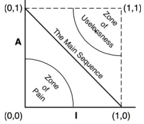</p>.
- :+1: Strive to be close to the **main sequence** and far from the **zones of exclusion**.

#### The Zone of Pain

- Consider a component in the area of (0, 0). This is a highly stable and concrete component. Such a component is not desirable because it is rigid. It cannot be extended because it is not abstract, and it is very difficult to change because of its stability.
- :arrow_forward: An example of that would be a database schema.

#### The Zone of Uselessness

- Consider a component near (1, 1). This location is undesirable because it is maximally abstract, yet has no dependents.
- :-1: Such components are useless.
- :arrow_forward: An example of that are leftover abstract classes that no one ever implemented. We find them in systems from time to time, sitting in the code base, unused.

## Chapter 15 What Is Architecture?

- The architecture of a software system is the shape given to that system by those who build it. The form of that shape is in the division of that system into components, the arrangement of those components, and the ways in which those components communicate with each other.
- :+1: Good architecture makes the system easy to **understand**, easy to **develop**, easy to **maintain**, and easy to **deploy**. The ultimate goal is to minimize the lifetime **cost** of the system and to maximize programmer **productivity**.

### Development

- ‼️ A software system that is hard to develop is not likely to have a long and healthy lifetime. So the architecture of a system should make that system easy to develop, for the team(s) who develop it.

### Deployment

- ‼️ Unfortunately, deployment strategy is seldom considered during initial development. This leads to architectures that may make the system easy to develop, but leave it very difficult to deploy.

### Operation

- 🛸 The fact that **hardware is cheap** and **people are expensive** means that architectures that impede operation are not
as costly as architectures that impede development, deployment, and maintenance.

### Maintenance

- ‼️ Of all the aspects of a software system, **maintenance** is the most **costly**. The never-ending parade of new features and the inevitable trail of defects and corrections consume vast amounts of human resources.
- The primary cost of maintenance is in **spelunking** and risk. Spelunking is the cost of digging through the existing software, trying to determine the best place and the best strategy to add a new feature or to repair a defect. While
making such changes, the likelihood of creating inadvertent defects is always there, adding to the cost of risk.

### Keeping Options Open

- The way you keep software soft is to **leave as many options open as possible**, for as long as possible. What are the options that we need to leave open? ▶️ They are the details that don’t matter.
All software systems can be decomposed into two major elements: **policy** and **details**.
 - The policy element embodies all the business rules and procedures.  The policy is where the true value of the system lives.
 - The details are those things that are necessary to enable humans, other systems, and programmers to communicate with the policy, but that do not impact the behavior of the policy at all. They include IO devices, databases, web systems, servers, frameworks, communication protocols, and so forth.
- The goal of the architect is to create a shape for the system that recognizes policy as the most essential element of the system while **making the details irrelevant to that policy**. This allows decisions about those details to be delayed and deferred. The longer you wait to make those decisions, the more information you have with which to make them properly.
- The longer you leave options open, the more experiments you can run, the more things you can try, and the more information you will have when you reach the point at which those decisions can no longer be deferred.

## Chapter 16 Independence

### Decoupling Layers

- Example of layers we can decouple:
    - **User interfaces** change for reasons that have nothing to do with **business rules**.
    - **Business rules** themselves may be closely tied to the application, or they may be more general.
    - **The database**, the **query language**, and even the **schema** are technical details that have nothing to do with the business rules or the UI.

### Decoupling Use Cases

- The use case for _adding an order_ to an order entry system almost certainly will change at a different rate, and for different reasons, than the use case that *deletes an order* from the system.
- Each use case uses some UI, some application-specific business rules, some application-independent business rules, and some database functionality. Thus, as we are dividing the system in to **horizontal layers**, we are also dividing the system into **thin vertical** use cases that cut through those layers.

### Decoupling Mode

- If the different aspects of the use cases are separated, then those that must run at a high throughput are likely already separated from those that must run at a low throughput.
- If the UI and the database have been separated from the business rules, then they can run in different servers. Those that require higher bandwidth can be replicated in many servers.
- ▶️ In short, the decoupling that we did for the sake of the use cases also helps with operations.
- The point being made here is that sometimes we have to separate our components all the way to the **service level**.

### Independent Develop-ability

▶️ So long as the layers and use cases are decoupled, the architecture of the system will support the organization of the teams, irrespective of whether they are organized as **feature** teams, **component** teams, **layer** teams, or some other variation.

### Independent Deployability

▶️ The decoupling of the use cases and layers also affords a high degree of flexibility in deployment.

### Duplication

- There are different kinds of duplication:
    - **True duplication**, in which every change to one instance necessitates the same change to every duplicate of that instance.
    - **False or accidental duplication**: If two apparently duplicated sections of code evolve along different paths—if they change at different rates, and for different reasons—then they are not true duplicates.
- When you are **vertically separating** use cases from one another, you will run into this issue, and your temptation will be to couple the use cases because they have similar screen structures, or similar algorithms, or similar database queries and/or schemas. ‼️ Be careful. Resist the temptation to commit the sin of knee-jerk elimination of duplication. Make sure the duplication is real.
- By the same token, when you are separating **layers horizontally**, you might notice that the data structure of a particular database record is very similar to the data structure of a particular screen view. You may be tempted to simply pass the database record up to the UI, rather than to create a view model that looks the same and copy the elements across. Be careful: ‼️ This duplication is almost certainly accidental.

### Decoupling Modes (Again)

- Back to modes. There are many ways to decouple layers and use cases.:
    - **Source level**. We can control the dependencies between source code modules so that changes to one module do not force changes or recompilation of others (e.g., Ruby Gems).
    -  **Deployment level**. We can control the dependencies between deployable units such as jar files, DLLs, or shared libraries, so that changes to the source code in one module do not force others to be rebuilt and redeployed.
    - **Service level**. We can reduce the dependencies down to the level of data structures, and communicate solely through network packets such that every execution unit is entirely independent of source and binary changes to others (e.g., services or micro-services).

What is the best mode to use ❓

> A good architecture will allow a system to be born as a monolith, deployed in a single file, but then to grow into a set of independently deployable units, and then all the way to independent services and/or micro-services. Later, as things change, it should allow for reversing that progression and sliding all the way back down into a monolith.
