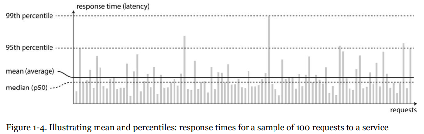
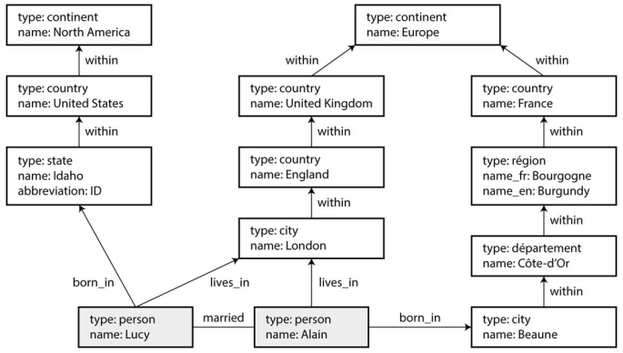

# Designing Data Intensive Applications

notes taken from reading the _Designing Data Intensive Applications_ book by Martin Kleppmann.

## Chapter 1. Reliable, Scalable and Maintainable Applications

- A data-intensive application is typically built from standard building blocks which provide commonly needed functionality.
  - Store data so that they, or another application, can find it again later (**databases**),
  - Remember the result of an expensive operation, to speed up reads (**caches**),
  - Allow users to search data by keyword or filter it in various ways (**search indexes**),
  - Send a message to another process, to be handled asynchronously (**message queues**),
  - Observe what is happening, and act on events as they occur (**stream processing**),
  - Periodically crunch a large amount of accumulated data (**batch processing**).

### Thinking About Data Systems

- Even though each category of these systems serves a specific purpose, many new tools for data storage and processing have emerged that are optimized for a variety of different use cases:
  - For example, there are data stores that are also used as **message queues (Redis)**,
  - and there are **message queues with database-like durability guarantees (Kafka)**,
  - => the boundaries between the categories are becoming **blurred**.
- If you are designing a data system or service, a lot of tricky questions arise:
  - How do you ensure that the data remains correct and complete, even when things go wrong internally?
  - How do you provide consistently good performance to clients, even when parts of your system are degraded?
  - How do you scale to handle an increase in load? What does a good API for the service look like?
- We focus on three concerns that are important in most software systems:
  - Reliability
  - Scalability
  - Maintainability

### Reliability

- We understand reliability as meaning, roughly: _continuing to work correctly, even when things go wrong_.
- The things that can go wrong are called **faults**, and systems that anticipate faults and can cope with them are called **fault-tolerant**.
- Note that a fault is not the same as a **failure** for an overview of the terminology. A **fault** is usually defined as **one** component of the system **deviating from its spec**, whereas a **failure** is when the system as a **whole** stops providing the required service to the user.

#### Hardware fauls

- Hard disks crash, RAM becomes faulty, the power grid has a blackout, someone unplugs the wrong network cable. Anyone who has worked with **large data centers** can tell you that these things happen **all the time** when you have a lot of machines.
- Hard disks are reported as having a **mean time to failure (MTTF)** of about 10 to 50 years. Thus, on a storage cluster with 10,000 disks, we should expect on average **one disk to die per day** :smiley:
- There is a move towards systems that can tolerate the **loss of entire machines**, by using software fault-tolerance techniques in preference to hardware redundancy. Such systems also have operational advantages:
  - A single-server system requires planned downtime if you need to reboot the machine (to apply security patches, for example).
  - Whereas a system that can tolerate machine failure can be patched one node at a time, without downtime of the entire system.

#### Software errors

- Harder to anticipate because they are correlated across nodes, they tend to cause many more system failures than uncorrelated hardware faults. Examples include: - A software bug that causes every instance of an application server to crash when given a particular bad
  input. For example, consider the leap second on _June 30, 2012_ that caused many applications to hang simultaneously, due to a **bug in the Linux kernel**. - A runaway process uses up some shared resource—CPU time, memory, disk space or network bandwidth. - A service that the system depends on slows down, becomes unresponsive or starts returning corrupted responses. - Cascading failures, where a small fault in one component triggers a fault in another component, which in turn triggers further faults.

### Human errors

- How do we make our system reliable, in spite of unreliable humans?:
  - Design systems in a way that **minimizes opportunities for error**. For example, **well-designed abstractions, APIs and admin interfaces** make it easy to do “the right thing”, and discourage “the wrong thing”.
  - Provide fully-featured **non-production** sandbox environments where people can explore and experiment safely, using real data, without affecting real users.
  - Test thoroughly at all levels, from **unit tests** to whole-system **integration tests** and **manual tests**.
  - Allow quick and easy recovery from human errors, to minimize the impact in the case of a failure. For example, make it **fast to roll back** configuration changes, **roll out new code gradually** (so that any unexpected bugs affect only a small subset of users), and provide tools to recompute data (in case it turns out that the old computation was incorrect).
  - Set up **detailed and clear monitoring and telemetry**, such as performance metrics and error rates.
- How important is reliability? Bugs in business applications cause **lost productivity** (and legal risks if figures are reported incorrectly), and outages of e-commerce sites can have **huge costs** in terms of lost revenue and reputation.

### Scalability

- Scalability is the term we use to describe a system’s ability to **adapt to increased load**.

#### Describing load

- Load can be described with a few numbers which we call **load parameters**. Examples:
  - it’s requests per second;
  - ratio of reads to write;
  - the number of simultaneously active users;
  - number of messages in the queue ...

#### Describing performance

- In a batch-processing system such as _Hadoop_, we usually care about **throughput**: the number of records we can process per second, or the total time it takes to run a job on a dataset of a certain size.
- In online systems, **latency** is usually more important—the time it takes to serve a request, also known as _response time_.
- In practice, in a system handling a variety of requests, the latency per request can **vary a lot**. We therefore need to think of latency not as a **single number**, but as a **probability distribution**.
- Even in a scenario where you’d think all requests should take the same time, you get variation: random additional latency could be introduced by:
  - a context switch to a background process;
  - the loss of a network packet and TCP retransmission;
  - a garbage collection pause, a page fault forcing a read from disk, or many other things.
- It’s common to see the **average** response time of a service reported (arithmetic mean).
- However, the mean is not a very good metric if you want to know your “typical” response time, because it is easily **biased by outliers**.
- Usually it is better to use **percentiles**. If you take your list of response times and sort it, from fastest to slowest, then the median is the half-way point: for example, if your median response time is 200 ms, that means half your requests return in less than 200 ms, and half your requests take longer than that.
- This makes the median a **good metric** if you want to know how long users typically have to wait. The median is also known as **50th percentile**, and sometimes abbreviated as **p50**.
    <p align="center"></p>

#### Approaches for coping with load

- good architectures usually involve a pragmatic mixture of approaches (vertical scaling and horizental scaling).
- there is no such a thing as **magic scaling sauce**. The problem may be:
  - the volume of reads, the volume of writes, the volume of data to store;
  - the complexity of the data, the latency requirements, the access patterns;
  - or (usually) some mixture of all of these plus many more issues.
- In an **early-stage startup** or an unproven product it’s usually more important to be able to **iterate quickly** on product features, than it is to scale to some **hypothetical future load**.

### Maintainability

- It is well-known that the majority of the cost of software is not in its initial development, but in its ongoing maintenance.
- We will pay particular attention to three design principles for software systems:
  - **Operability**: Make it easy for operations teams to keep the system running smoothly
  - **Simplicity**: Make it easy for new engineers to understand the system, by removing as much complexity as possible from the system.
  - **Plasticity**: Make it easy for engineers in future to make changes to the system, adapting it for unanticipated use cases as requirements change. Also known as extensibility, modifiability or malleability.

#### Operability: making life easy for operations

- _Good operations can often work around the limitations of bad (or incomplete) software, but good software cannot run reliably with bad operations._

### Simplicity: managing complexity

- Moseley and Marks define complexity as _accidental_ if it is not inherent in the problem that the software solves (as seen by the users), but arises only from the implementation.
- One of the best tools we have for removing accidental complexity is **abstraction**. A good abstraction can hide a great deal of implementation detail behind a clean, simple-to-understand
  façade. - high-level programming languages are abstractions that hide machine code, CPU registers and syscalls. - SQL is an abstraction that hides complex on-disk and in-memory data structures, concurrent requests from other clients, and inconsistencies after crashes.

### Plasticity: making change easy

- In terms of organizational processes, _agile_ working patterns provide a framework for adapting to change. The agile community has also developed technical tools and patterns that are helpful when developing software in a frequently-changing environment, such as **test-driven development (TDD)** and **refactoring**.

## Chapter 2. The Battle of the Data Models

- Data models are perhaps the most important part of developing software, because they have such a profound effect: not only on how the software is written, but also how we think about the problem that we are solving.
- Most applications are built by layering one data model on top of another, each layer hides the complexity of the layers below it by providing a clean data model.

### Rivals of the Relational Model

- The best-known data model today is probably that of _SQL_, based on the relational model proposed by _Edgar Codd_ in 1970.
- Data is organized into **relations** (in SQL: tables), where each relation is an unordered collection of **tuples** (rows).
- The goal of the relational model was to **hide the implementation detail** behind a cleaner interface.
- There are several driving forces behind the adoption of _NoSQL_ databases, including:
  - A need for **greater scalability** than relational databases can easily achieve, including very large datasets or very high write throughput;
  - **Specialized query operations** that are not well supported by the relational model;
  - Frustration with the restrictiveness of relational schemas, and a desire for a **more dynamic and expressive** data model.

### The object-relational mismatch

- Most application development today is done in OOP languages, which leads to a common criticism of the SQL data model:
  - if data is stored in relational tables, an **awkward translation layer** is required between the objects in the application code and the database model of tables, rows and columns.
  - The disconnect between the models is sometimes called an _impedance mismatch_.
- The JSON representation also has better _locality_: in the relational model, if you want to fetch a profile, you need to either perform **multiple queries** (query each table by `user_id`) or perform a messy multi-way join between the users table and its subordinate tables.
- In the JSON representation, all the relevant information is in once place, and one simple query is sufficient.

### Many-to-one and many-to-many relationships

- A database in which entities like region and industry are referred to by ID is called **normalized**, whereas a database that duplicates the names and properties of entities on each document is **denormalized**.
- In document databases, joins are **not needed** for one-to-many tree structures, and support for joins is often **weak**.
- The debate concerning how to best represent many to many relationships and joins is much older than NoSQL, it goes back to the very earliest computerised database systems. The most popular one was IBM’s _information Management System (IMS)_.
- The design of IMS used a fairly simple data model called the **hierarchical model**, which has some remarkable similarities to the JSON model used by document databases.
- Like document databases, IMS worked well for one-to-many relationships, but it made many-to-many relationships difficult and it didn’t support joins.
- Various solutions were proposed to solve the limitations of the hierarchical model. The two most prominent were the **relational** model (which became SQL, and took over the world), and the **network model** (which initially had a large following but eventually faded into obscurity).

### The network model

- also known as the _CODASYL_ model. The CODASYL model is a generalization of the hierarchical model.
- In the tree structure of the hierarchical model, every record has exactly one parent; in the network model, a record can have multiple parents.
- The links between records in the network model are not foreign keys, but more like **pointers** in a programming language (while still being stored on disk). The only way of accessing a record was to follow a path from a root record along these chains of links (Like traversing a linked list). This was called an **access path**.
- With both the hierarchical and the network model, if you didn’t have a path to the data you wanted, you were in a **difficult** situation. You could change the access paths, but then you had to go through a lot of **hand-written** database query code and rewrite it to handle the new access paths. It was difficult to make changes to an application’s data model.

### The relational model

- What the relational model did, by contrast, was to lay out all the data in the open: a relation (table) is simply a collection of tuples (rows), and that’s it.
- There are no labyrinthine nested structures, no **complicated access paths** to follow if you want to look at the data. You can read any or all of the rows in a table, selecting those that match an arbitrary condition.
- The **query optimizer automatically** decides which parts of the query to execute in which order, and which indexes to use.
  Query optimizers for relational databases are complicated beasts, and they have consumed many years of research and development effort.

### Relational vs. document databases today

- The main arguments in favor of the document data model are: simpler application code, schema flexibility, and better performance due to locality.
- If your application does use many-to-many relationships, the document model becomes **less appealing**. It’s possible to reduce the need for joins by **denormalizing**, but then the application code needs to do additional work to keep the denormalized data consistent. Joins can be emulated in application code by making multiple requests to the database, but that also moves complexity into the application.
- Schema changes have a **bad reputation** of being **slow and requiring downtime**.
- If your application often needs to access the entire document (for example, to render it on a web page), there is a performance advantage to this storage **locality**. If data is split across multiple tables, multiple index lookups are required to retrieve it all, which may require **more disk seeks** and take more time.
- The locality advantage only applies if you need large parts of the document at the same time. The database typically needs to load the entire document, even if you access only a **small portion** of it, which can be **wasteful** on large documents. On updates to a document, the entire document usually needs to be re-written—only modifications that don’t change the encoded size of a document can easily be performed in-place. For these reasons, it is generally recommended that you keep documents fairly **small**.
- It seems that relational and document databases are becoming more similar over time (JSON support in PostgreSQL), MongoDB drivers automatically resolve database references (effectively performing a client-side join) .

### Query languages for data

- When the relational model was introduced, it included a new way of querying data: it used a **declarative** query language, whereas IMS and CODASYL queried the database using **imperative** code. What does that mean?
- An imperative language tells the computer to perform certain operations in a **certain order**. You can imagine stepping through the code, line by line, evaluating conditions, updating variables, and deciding whether to go around the loop one more time.
- Declarative querying means that you just specify the pattern of the data you want—what conditions the results must meet, and how you want it to be transformed (e.g. sorted, grouped and aggregated), but not how to achieve that goal. It is up to the database system’s query optimizer to decide which indexes and which join methods to use, and in which order to execute various parts of the query.
- A declarative query language is attractive because it is typically more **concise and easier** to work with than an imperative API. But more importantly, it also **hides implementation details** of the database engine, which makes it possible for the database system to introduce performance improvements without requiring any changes to queries.
- The fact that SQL is more limited in functionality gives the database much more room for automatic optimizations.
- Imperative code is very **hard to parallelize** across multiple cores and multiple machines, but declarative languages have a chance of getting faster.
- In a web browser, declarative CSS styling is much better than manipulating styles imperatively in JavaScript. Similarly, in databases, declarative query languages like SQL turned out to be much better than imperative query APIs

### MapReduce querying

- _MapReduce_ is a programming model for processing large amounts of data in bulk across many machines, popularized by Google.
- It is based on the _map_ (also known as collect) and _reduce_ (also known as fold or inject) functions that exist in many functional programming languages.
- The MapReduce model is best explained by example. Imagine you are a marine biologist, and you add an observation record to your database every time you see animals in the ocean. Now you want to generate a report saying how many sharks have been sighted per month.

```sql
SELECT date_trunc('month', observation_timestamp) AS observation_month,
  sum(num_animals) AS total_animals
FROM observations
WHERE family = 'Lamniformes'
GROUP BY observation_month;
```

- The same can be expressed with MongoDB’s MapReduce feature as follows:

```js
db.observations.mapReduce(
  function map() {
    var year = this.observationTimestamp.getFullYear();
    var month = this.observationTimestamp.getMonth() + 1;
    emit(year + "-" + month, this.numAnimals);
  },

  function reduce(key, values) {
    return Array.sum(values);
  },
  {
    query: {
      family: "Lamniformes",
    },
    out: "monthlySharkReport",
  }
);
```

- The map function emits a key (a string consisting of year and month, such as "2013-12" or "2014-1") and a value (the number of animals in that observation).
- The key-value pairs emitted by map are grouped by key. For all key-value pairs with the same key (i.e. the same month and year), the reduce function is called once.
- The reduce function adds up the number of animals from all observations in a particular month.

```js
{
    observationTimestamp: Date.parse("Mon, 25 Dec 1995 12:34:56 GMT"), family: "Lamniformes",
    species: "Carcharodon carcharias",
    numAnimals: 3
} ,
{
    observationTimestamp: Date.parse("Tue, 12 Dec 1995 16:17:18 GMT"), family: "Lamniformes",
    species: "Carcharias taurus",
    numAnimals: 4
}
```

- The map function would called **once for each document**, resulting in emit("1995-12", 3) and emit("1995-12", 4). Subsequently, the reduce function would be called with reduce("1995-12", [3, 4]), returning 7.
- The map and reduce function are somewhat **restricted** in what they are allowed to do. They must be **pure functions**, which means: they only use the data that is passed to them as input, they cannot perform additional database queries and they must not have any side-effects. They are nevertheless powerful: they can parse strings, call library functions, perform calculations and more.
- Being able to use JavaScript code in the middle of a query is a great feature for advanced queries, and it’s not limited to MapReduce—SQL databases can be extended with JavaScript functions too. This means that MongoDB’s MapReduce and SQL are roughly equivalent in terms of the kinds of queries you can express.
- The difference is that with MapReduce, you have to write two carefully coordinated JavaScript functions, even for simple queries. This makes it **harder to use than SQL**, without significant advantages. So why was MapReduce chosen in the first place? Probably because it is easier to implement than a declarative query language, and perhaps because the term MapReduce sounds like high scalability, due to its association with Google :anguished:
- The MongoDB team realized this too, and added a declarative query language called aggregation pipeline to MongoDB 2.2. The kinds of queries you can write with it are very similar to SQL. Because it is declarative, it is able to perform automatic optimizations that are not possible with MapReduce. The same query looks like this:

```js
db.observations.aggregate([
  { $match: { family: "Lamniformes" } },
  {
    $group: {
      _id: {
        year: { $year: "$observationTimestamp" },
        month: { $month: "$observationTimestamp" },
      },
      totalAnimals: { $sum: "$numAnimals" },
    },
  },
]);
```

- SQL is often criticized for its cumbersome syntax, but it’s debatable whether this is any better.

### Graph-like Data Models

- If your application has mostly **one-to-many relationships** (tree-structured data) or **no relationships between records**, the document model is appropriate.
- But what if many-to-many relationships are very common in your data? The relational model can handle simple cases of many-to-many relationships, but as the connections within your data become more complex, it becomes more natural to start modeling your data as a **graph**.
- A graph consists of two kinds of object: **vertices** (also known as nodes or entities) and **edges** (also known as relationships). Many kinds of data can be modeled as a graph. Typical examples include:
  - Social graphs: Vertices are people, edges indicate which people know each other.
  - The web graph: Vertices are web pages, edges indicate HTML links to other pages.
  - Road or rail networks: Vertices are junctions, and edges represent the roads or railway lines between them.
- Graphs are not limited to represent onlys _homogeneous_ data: an equally powerful use of graphs is to provide a consistent way of storing completely different types of object in a single data store. For example, Facebook maintains a single graph with many different types of vertex and edge: vertices represent people, locations, events, checkins and comments made by users; edges indicate which people are friends with each other, which checkin happened in which location, who commented on which post, who attended which event, etc.
- There are several different, but related, ways of structuring and querying data in graphs. In this section we will discuss the property graph model (implemented by Neo4j, Titan, InfiniteGraph) and the triple-store model (implemented by Datomic, AllegroGraph and others). We will look at three declarative query languages for graphs: _Cypher_, _SPARQL_, and _Datalog_. <p align="center"></p>

### Property graphs

- In the property graph model, each vertex consists of:
  - a unique identifier,
  - a set of outgoing edges,
  - a set of incoming edges, and
  - a collection of properties (key-value pairs).
- Each edge consists of:
  - a unique identifier,
  - the vertex at which the edge starts (the tail vertex),
  - the vertex at which the edge ends (the head vertex),
  - a label to describe the type of relationship between the two vertices, and
  - a collection of properties (key-value pairs).
- Some important aspects of this model are:
  - Any vertex can have an edge connecting it with any other vertex. There is **no schema** that restricts which kinds of things can or cannot be associated.
  - Given any vertex, you can efficiently find both its incoming and its outgoing edges, and thus traverse the graph—follow a path through a chain of vertices—both forwards and backwards.
  - By using different labels for different kinds of relationship, you can store several different kinds of information in a single graph, while still maintaining a clean data model.
- Graphs are good for **plasticity**: as you add features to your application, a graph can easily be extended to accommodate changes in your application’s data structures.

### The Cypher query language

- Cypher is a declarative query language for property graphs, created for the _Neo4j_ graph database.
- Example below shows the Cypher query to insert the left-hand portion of Figure 2-6 into a graph database.

```js
CREATE
(NAmerica:Location {name:'North America', type:'continent'}),
(USA:Location
(Idaho:Location
(Lucy:Person
(Idaho) -[:WITHIN]-> (USA) -[:WITHIN]-> (NAmerica), (Lucy) -[:BORN_IN]-> (Idaho)
{name:'United States', type:'country' }),
{name:'Idaho', type:'state' {name:'Lucy' }),
}),
```

- Cypher query to find people who emigrated from the US to Europe.

```js
MATCH
(person) -[:BORN_IN]-> () -[:WITHIN*0..]-> (us:Location {name:'United States'}),
(person) -[:LIVES_IN]-> () -[:WITHIN*0..]-> (eu:Location {name:'Europe'}) RETURN person.name
```

- The query can be read as follows: “Find any vertex (call it person) that meets both of the following conditions:
  - `person` has an outgoing `BORN_IN` edge to some vertex. From that vertex, you can follow a chain of outgoing `WITHIN` edges until eventually you reach a vertex of type `Location`, whose name property is equal to “United States”.
  - That same `perso`n vertex also has an outgoing `LIVES_IN` edge. Following that edge, and then a chain of outgoing `WITHIN` edges, you eventually reach a vertex of type Location, whose name property is equal to “Europe”.

### Graph queries in SQL

- The `LIVES_IN` edge may point directly at the location vertex you’re looking for, or it may be several levels removed in the location hierarchy.
- In Cypher, `:WITHIN*0..` expresses that fact very concisely: it means “follow a WITHIN edge, zero or more times”. It is like the \* operator in a regular expression.
- This idea of **variable-length traversal paths** in a query can be expressed since `SQL:1999` using something called **recursive common table expressions** (the `WITH RECURSIVE` syntax).
- Example Below shows the same query—finding the names of people who emigrated from the US to Europe—expressed in SQL using this technique. However, the syntax is very clumsy by comparison to Cypher.

```sql
 WITH RECURSIVE
-- in_usa is the set of vertex IDs of all locations within the United States in_usa(vertex_id) AS (
SELECT vertex_id FROM vertices WHERE properties->>'name' = 'United States' UNION
SELECT edges.tail_vertex FROM edges

JOIN in_usa ON edges.head_vertex = in_usa.vertex_id
WHERE edges.type = 'within' ),
-- in_europe is the set of vertex IDs of all locations within Europe in_europe(vertex_id) AS (
SELECT vertex_id FROM vertices WHERE properties->>'name' = 'Europe'

UNION SELECT edges.tail_vertex FROM edges
JOIN in_europe ON edges.head_vertex = in_europe.vertex_id
WHERE edges.type = 'within' ),
-- born_in_usa is the set of vertex IDs of all people born in the US born_in_usa(vertex_id) AS (

SELECT edges.tail_vertex FROM edges
JOIN in_usa ON edges.head_vertex = in_usa.vertex_id
WHERE edges.type = 'born_in' ),
-- lives_in_europe is the set of vertex IDs of all people living in Europe lives_in_europe(vertex_id) AS (

SELECT edges.tail_vertex FROM edges

JOIN in_europe ON edges.head_vertex = in_europe.vertex_id
WHERE type = 'lives_in' )
SELECT vertices.properties->>'name'
FROM vertices
-- join to find those people who were both born in the US *and* live in Europe
JOIN born_in_usa ON vertices.vertex_id = born_in_usa.vertex_id
JOIN lives_in_europe ON vertices.vertex_id = lives_in_europe.vertex_id;
```

### Triple-stores and SPARQL

- The triple-store model is mostly equivalent to the property graph model, using different words to describe the same ideas.
- In a triple-store, all information is stored in the form of very simple three-part statements: **(subject, predicate, object)**. - For example, in the triple (Jim, likes, bananas), _Jim_ is the **subject**, _likes_ is the **predicate** (verb), and _bananas_ is the **object**.
- The subject of a triple is equivalent to a vertex in a graph. The object is one of two things:
  - The object can be a value in a primitive datatype, such as a string or a number. In that case, the predicate and object of the triple are equivalent to the key and value of a property on the subject vertex. For example, `(lucy, age, 33)` is like a vertex lucy with properties `{"age":33}`.
  - The object can be another vertex in the graph. In that case, the predicate is an edge in the graph, the subject is the tail vertex and the object is the head vertex. For example, in `(lucy, marriedTo, alain)` the subject and object lucy and alain are both vertices, and the predicate marriedTo is the label of the edge that connects them.
- The equivalent query written as triples in a format called _Turtle_, a subset of Notation3 (N3).

```js
_:lucy a :Person; :name "Lucy"; :bornIn _:idaho.
_:idaho a :Location; :name "Idaho"; :type "state"; :within _:usa.
_:usa a :Location; :name "United States"; :type "country"; :within _:namerica.
_:namerica a :Location; :name "North America"; :type "continent".
```

### The SPARQL query language

- SPARQL is a query language for triple-stores using the _RDF_ data model. (It is an acronym for SPARQL Protocol and RDF Query Language, and pronounced “sparkle”.) It predates Cypher, and since Cypher’s pattern-matching is borrowed from SPARQL, they look quite similar.
- The same query as before—finding people who moved from the US to Europe—is even more concise in SPARQL than it is in Cypher:

```js
PREFIX : <urn:x-example:>

SELECT ?personName WHERE {
    ?person :name ?personName.
    ?person :bornIn / :within* / :name "United States".
    ?person :livesIn / :within* / :name "Europe".
}
```

### The foundation: Datalog

- Datalog is a much older language than SPARQL or Cypher, having been studied extensively by academics in the 1980s.
- Datalog’s data model is similar to the triple-store model, generalized a bit. Instead of writing a triple as `(subject, predicate, object)`, we write it as `predicate(subject, object)`.
- Example below shows how to write the data from our example in Datalog.

```js
name(namerica, 'North America').
type(namerica, continent).
name(usa, 'United States'). type(usa, country). within(usa, namerica).
name(idaho, 'Idaho'). type(idaho, state). within(idaho, usa).
name(lucy, 'Lucy'). born_in(lucy, idaho).
```

- Now that we have defined the data, we can write the same query as before, as shown in Example above. It looks a bit different from the equivalent in Cypher or SPARQL, but don’t let that put you off. Datalog is a subset of Prolog, which you might have seen before if you studied computer science.

```js
within_recursive(Location, Name) :- name(Location, Name). /_ Rule 1 _/
within_recursive(Location, Name) :- within(Location, Via), /_ Rule 2 _/
within_recursive(Via, Name).
migrated(Name, BornIn, LivingIn) :- name(Person, Name), /_ Rule 3 _/
born_in(Person, BornLoc),
within_recursive(BornLoc, BornIn),
lives_in(Person, LivingLoc),
within_recursive(LivingLoc, LivingIn).
?- migrated(Who, 'United States', 'Europe').
/_ Who = 'Lucy'. _/
```

- The Datalog approach requires a different kind of thinking to the other query languages discussed in this chapter, but it’s a very powerful approach, because rules can be combined and reused in different queries. It’s less convenient for simple one-off queries, but it can cope better if your data is complex.
