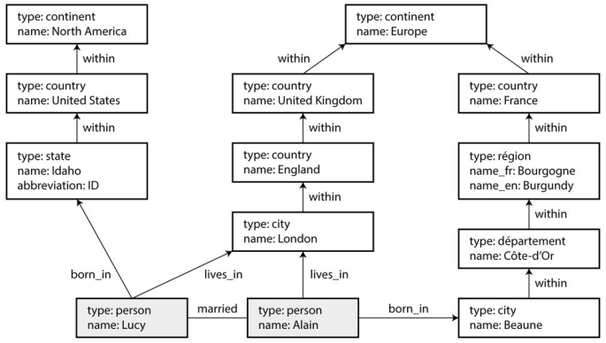

# Chapter 2. The Battle of the Data Models

- Data models are perhaps the most important part of developing software, because they have such a profound effect: not only on how the software is written, but also how we think about the problem that we are solving.
- Most applications are built by layering one data model on top of another, each layer hides the complexity of the layers below it by providing a clean data model.

## Rivals of the Relational Model

- The best-known data model today is probably that of _SQL_, based on the relational model proposed by _Edgar Codd_ in 1970.
- Data is organized into **relations** (in SQL: tables), where each relation is an unordered collection of **tuples** (rows).
- The goal of the relational model was to **hide the implementation detail** behind a cleaner interface.
- There are several driving forces behind the adoption of _NoSQL_ databases, including:
  - A need for **greater scalability** than relational databases can easily achieve, including very large datasets or very high write throughput;
  - **Specialized query operations** that are not well supported by the relational model;
  - Frustration with the restrictiveness of relational schemas, and a desire for a **more dynamic and expressive** data model.

### The object-relational mismatch

- Most application development today is done in OOP languages, which leads to a common criticism of the SQL data model:
  - if data is stored in relational tables, an **awkward translation layer** is required between the objects in the application code and the database model of tables, rows and columns.
  - The disconnect between the models is sometimes called an _impedance mismatch_.
- The JSON representation also has better _locality_: in the relational model, if you want to fetch a profile, you need to either perform **multiple queries** (query each table by `user_id`) or perform a messy multi-way join between the users table and its subordinate tables.
- In the JSON representation, all the relevant information is in once place, and one simple query is sufficient.

### Many-to-one and many-to-many relationships

- A database in which entities like region and industry are referred to by ID is called **normalized**, whereas a database that duplicates the names and properties of entities on each document is **denormalized**.
- In document databases, joins are **not needed** for one-to-many tree structures, and support for joins is often **weak**.

### Are Document Databases Repeating History?

- The debate concerning how to best represent many to many relationships and joins is much older than NoSQL, it goes back to the very earliest computerized database systems. The most popular one was IBM’s _information Management System (IMS)_.
- The design of IMS used a fairly simple data model called the **hierarchical model**, which has some remarkable similarities to the JSON model used by document databases.
- Like document databases, IMS worked well for one-to-many relationships, but it made many-to-many relationships difficult and it didn’t support joins.
- Various solutions were proposed to solve the limitations of the hierarchical model. The two most prominent were the **relational** model (which became SQL, and took over the world), and the **network model** (which initially had a large following but eventually faded into obscurity).

#### The network model

- also known as the _CODASYL_ model. The CODASYL model is a generalization of the hierarchical model.
- In the tree structure of the hierarchical model, every record has exactly one parent; in the network model, a record can have multiple parents.
- The links between records in the network model are not foreign keys, but more like **pointers** in a programming language (while still being stored on disk). The only way of accessing a record was to follow a path from a root record along these chains of links (Like traversing a linked list). This was called an **access path**.
- With both the hierarchical and the network model, if you didn’t have a path to the data you wanted, you were in a **difficult** situation. You could change the access paths, but then you had to go through a lot of **hand-written** database query code and rewrite it to handle the new access paths. ▶️ It was difficult to make changes to an application’s data model.

#### The relational model

- What the relational model did, by contrast, was to lay out all the data in the open: a relation (table) is simply a collection of tuples (rows), and that’s it.
- There are no labyrinthine nested structures, no **complicated access paths** to follow if you want to look at the data. You can read any or all of the rows in a table, selecting those that match an arbitrary condition.
- The **query optimizer automatically** decides which parts of the query to execute in which order, and which indexes to use.
- Query optimizers for relational databases are complicated beasts, and they have consumed many years of research and development effort.

### Relational vs. document databases today

- The main arguments in favor of the document data model are: **simpler application code**, **schema flexibility**, and better **performance** due to locality.
- If your application does use many-to-many relationships, the document model becomes **less appealing**. It’s possible to reduce the need for joins by **denormalizing**, but then the application code needs to do additional work to keep the denormalized data consistent. Joins can be emulated in application code by making multiple requests to the database, but that also moves complexity into the application.
- Schema changes have a **bad reputation** of being **slow and requiring downtime**.
- If your application often needs to access the entire document, there is a performance advantage to this storage **locality**. If data is split across multiple tables, multiple index lookups are required to retrieve it all, which may require **more disk seeks** and take more time.
- The locality advantage only applies if you need large parts of the document at the same time. The database typically needs to load the **entire document**, even if you access only a **small portion** of it, which can be **wasteful** on large documents. On updates to a document, the entire document usually needs to be re-written—only modifications that don’t change the encoded size of a document can easily be performed in-place. For these reasons, it is generally recommended that you keep documents fairly **small**.
- 🤷 It seems that relational and document databases are becoming more similar over time (JSON support in PostgreSQL), MongoDB drivers automatically resolve database references (effectively performing a client-side join).

## Query languages for data

- When the relational model was introduced, it included a new way of querying data: it used a **declarative** query language, whereas IMS and CODASYL queried the database using **imperative** code. What does that mean?
- An **imperative** language tells the computer to perform certain operations in a **certain order**. You can imagine stepping through the code, line by line, evaluating conditions, updating variables, and deciding whether to go around the loop one more time.
- **Declarative** querying means that you just specify the pattern of the data you want—what conditions the results must meet, and how you want it to be transformed (e.g. sorted, grouped and aggregated), but not *how to achieve that goal*. It is up to the database system’s query optimizer to decide which indexes and which join methods to use, and in which order to execute various parts of the query.
- A declarative query language is attractive because it is typically more **concise and easier** to work with than an imperative API. But more importantly, it also **hides implementation details** of the database engine, which makes it possible for the database system to introduce performance improvements without requiring any changes to queries.
- The fact that SQL is more limited in functionality gives the database much more room for automatic optimizations.
- Imperative code is very **hard to parallelize** across multiple cores and multiple machines, but declarative languages have a chance of getting faster.

### Declarative Queries on the Web

- In a web browser, declarative CSS styling is much better than manipulating styles imperatively in JavaScript. Similarly, in databases, declarative query languages like SQL turned out to be much better than imperative query APIs.

### MapReduce querying

- _MapReduce_ is a programming model for processing large amounts of data in bulk across many machines, popularized by Google.
- It is based on the _map_ (also known as collect) and _reduce_ (also known as fold or inject) functions that exist in many functional programming languages.
- The MapReduce model is best explained by example. Imagine you are a marine biologist, and you add an observation record to your database every time you see animals in the ocean. Now you want to generate a report saying how many sharks have been sighted per month.

```sql
SELECT date_trunc('month', observation_timestamp) AS observation_month,
  sum(num_animals) AS total_animals
FROM observations
WHERE family = 'Sharks'
GROUP BY observation_month;
```

- The same can be expressed with MongoDB’s MapReduce feature as follows:

```js
db.observations.mapReduce(
  function map() {
    var year = this.observationTimestamp.getFullYear();
    var month = this.observationTimestamp.getMonth() + 1;
    emit(year + "-" + month, this.numAnimals);
  },

  function reduce(key, values) {
    return Array.sum(values);
  },
  {
    query: {
      family: "Sharks",
    },
    out: "monthlySharkReport",
  }
);
```

- The map function emits a key (a string consisting of year and month, such as "2013-12" or "2014-1") and a value (the number of animals in that observation).
- The key-value pairs emitted by map are grouped by key. For all key-value pairs with the same key (i.e. the same month and year), the reduce function is called once.
- The reduce function adds up the number of animals from all observations in a particular month.

```js
{
    observationTimestamp: Date.parse("Mon, 25 Dec 1995 12:34:56 GMT"),
    family: "Sharks",
    species: "Carcharodon carcharias",
    numAnimals: 3
} ,
{
    observationTimestamp: Date.parse("Tue, 12 Dec 1995 16:17:18 GMT"),
    family: "Sharks",
    species: "Carcharias taurus",
    numAnimals: 4
}
```

- The map function would called **once for each document**, resulting in `emit("1995-12", 3)` and `emit("1995-12", 4)`. Subsequently, the reduce function would be called with `reduce("1995-12", [3, 4])`, returning 7.
- The map and reduce function are somewhat **restricted** in what they are allowed to do. They must be **pure functions**, which means: they only use the data that is passed to them as input, they cannot perform additional database queries and they must not have any side-effects. They are nevertheless powerful: they can **parse** strings, **call library** functions, perform **calculations** and more.
- Being able to use **JavaScript** code in the middle of a query is a great feature for advanced queries, and it’s not limited to MapReduce—SQL databases can be extended with JavaScript functions too. This means that MongoDB’s MapReduce and SQL are roughly equivalent in terms of the kinds of queries you can express.
- The difference is that with MapReduce, you have to write two carefully coordinated JavaScript functions, even for simple queries. This makes it **harder to use than SQL**, without significant advantages. So why was MapReduce chosen in the first place? Probably because it is easier to implement than a declarative query language, and perhaps because the term MapReduce sounds like high scalability, due to its association with Google :anguished:
- The MongoDB team realized this too, and added a declarative query language called aggregation pipeline to MongoDB 2.2. The kinds of queries you can write with it are very similar to SQL. Because it is declarative, it is able to perform automatic optimizations that are not possible with MapReduce. The same query looks like this:

```js
db.observations.aggregate([
  { $match: { family: "Sharks" } },
  {
    $group: {
      _id: {
        year: { $year: "$observationTimestamp" },
        month: { $month: "$observationTimestamp" },
      },
      totalAnimals: { $sum: "$numAnimals" },
    },
  },
]);
```

## Graph-like Data Models

- If your application has mostly **one-to-many relationships**  or **no relationships between records**, the document model is appropriate.
- But what if many-to-many relationships are very common in your data? The relational model can handle simple cases of many-to-many relationships, but as the connections within your data become more complex, it becomes more natural to start modeling your data as a **graph**.
- A graph consists of two kinds of object: **vertices** (also known as **nodes** or **entities**) and **edges** (also known as relationships). Many kinds of data can be modeled as a graph. Typical examples include:
  - Social graphs: Vertices are people, edges indicate which people know each other.
  - The web graph: Vertices are web pages, edges indicate HTML links to other pages.
  - Road or rail networks: Vertices are junctions, and edges represent the roads or railway lines between them.
- Graphs are not limited to represent only _homogeneous_ data: an equally powerful use of graphs is to provide a consistent way of storing completely **different types** of object in a single data store. For example, Facebook maintains a single graph with many different types of vertex and edge: vertices represent people, locations, events, checkins and comments made by users; edges indicate which people are friends with each other, which checkin happened in which location, who commented on which post, who attended which event, etc.
- There are several different, but related, ways of structuring and querying data in graphs. In this section we will discuss the property graph model (implemented by *Neo4j*, *Titan*, *InfiniteGraph*) and the triple-store model (implemented by *Datomic*, *AllegroGraph* and others). We will look at three declarative query languages for graphs: _Cypher_, _SPARQL_, and _Datalog_. <p align="center"></p>

### Property graphs

- In the property graph model, each **vertex** consists of:
  - a unique identifier,
  - a set of outgoing edges,
  - a set of incoming edges,
  - a collection of properties (key-value pairs).
- Each **edge** consists of:
  - a unique identifier,
  - the vertex at which the edge starts (the tail vertex),
  - the vertex at which the edge ends (the head vertex),
  - a label to describe the type of relationship between the two vertices, and
  - a collection of properties (key-value pairs).
- Some important aspects of this model are:
  - Any vertex can have an edge connecting it with any other vertex. There is **no schema** that restricts which kinds of things can or cannot be associated.
  - Given any vertex, you can efficiently find both its incoming and its outgoing edges, and thus traverse the graph—follow a path through a chain of vertices—both forwards and backwards.
  - By using different labels for different kinds of relationship, you can store several different kinds of information in a single graph, while still maintaining a clean data model.
- Graphs are good for **plasticity**: as you add features to your application, a graph can easily be extended to accommodate changes in your application’s data structures.

### The Cypher query language

- Cypher is a declarative query language for property graphs, created for the _Neo4j_ graph database.
- Example below shows a subset of the data in Figure 2-5, represented as a Cypher query:

```js
CREATE
  (NAmerica:Location {name:'North America', type:'continent'}),
  (USA:Location {name:'United States', type:'country' }),
  (Idaho:Location {name:'Idaho', type:'state' }),
  (Lucy:Person {name:'Lucy' }),
  (Idaho) -[:WITHIN]-> (USA) -[:WITHIN]-> (NAmerica),
  (Lucy) -[:BORN_IN]-> (Idaho)
```

- Cypher query to find people who emigrated from the US to Europe.

```js
MATCH
  (person) -[:BORN_IN]-> () -[:WITHIN*0..]-> (us:Location {name:'United States'}),
  (person) -[:LIVES_IN]-> () -[:WITHIN*0..]-> (eu:Location {name:'Europe'})
RETURN person.name
```

- The query can be read as follows: “Find any vertex (call it person) that meets both of the following conditions:
  - `person` has an outgoing `BORN_IN` edge to some vertex. From that vertex, you can follow a chain of outgoing `WITHIN` edges until eventually you reach a vertex of type `Location`, whose name property is equal to “United States”.
  - That same `person` vertex also has an outgoing `LIVES_IN` edge. Following that edge, and then a chain of outgoing `WITHIN` edges, you eventually reach a vertex of type Location, whose name property is equal to “Europe”.

## Graph queries in SQL

- The `LIVES_IN` edge may point directly at the location vertex you’re looking for, or it may be several levels removed in the location hierarchy.
- In Cypher, `:WITHIN*0..` expresses that fact very concisely: it means “follow a WITHIN edge, zero or more times”. It is like the \* operator in a regular expression.
- This idea of **variable-length traversal paths** in a query can be expressed since `SQL:1999` using something called **recursive common table expressions** (the `WITH RECURSIVE` syntax).
- Example Below shows the same query—finding the names of people who emigrated from the US to Europe—expressed in SQL using this technique. However, the syntax is very clumsy by comparison to Cypher.

```sql
WITH RECURSIVE
-- in_usa is the set of vertex IDs of all locations within the United States
in_usa(vertex_id) AS (
    SELECT vertex_id FROM vertices WHERE properties->>'name' = 'United States'
  UNION
    SELECT edges.tail_vertex FROM edges
      JOIN in_usa ON edges.head_vertex = in_usa.vertex_id
      WHERE edges.label = 'within'
),

-- in_europe is the set of vertex IDs of all locations within Europe
in_europe(vertex_id) AS (
    SELECT vertex_id FROM vertices WHERE properties->>'name' = 'Europe'
  UNION
    SELECT edges.tail_vertex FROM edges
      JOIN in_europe ON edges.head_vertex = in_europe.vertex_id
      WHERE edges.label = 'within'
),

-- born_in_usa is the set of vertex IDs of all people born in the US
born_in_usa(vertex_id) AS (
  SELECT edges.tail_vertex FROM edges
    JOIN in_usa ON edges.head_vertex = in_usa.vertex_id
    WHERE edges.label = 'born_in'
),

-- lives_in_europe is the set of vertex IDs of all people living in Europe
lives_in_europe(vertex_id) AS (
  SELECT edges.tail_vertex FROM edges
    JOIN in_europe ON edges.head_vertex = in_europe.vertex_id
    WHERE edges.label = 'lives_in'
)

SELECT vertices.properties->>'name'
FROM vertices
-- join to find those people who were both born in the US *and* live in Europe
JOIN born_in_usa ON vertices.vertex_id = born_in_usa.vertex_id
JOIN lives_in_europe ON vertices.vertex_id = lives_in_europe.vertex_id
```

### Triple-stores and SPARQL

- The triple-store model is mostly equivalent to the property graph model, using different words to describe the same ideas.
- In a triple-store, all information is stored in the form of very simple three-part statements: **(subject, predicate, object)**.
- For example, in the triple (Jim, likes, bananas), _Jim_ is the **subject**, _likes_ is the **predicate** (verb), and _bananas_ is the **object**.
  - The subject of a triple is equivalent to a vertex in a graph. The object is one of two things:
  - The object can be a value in a primitive datatype, such as a string or a number. In that case, the predicate and object of the triple are equivalent to the key and value of a property on the subject vertex. For example, `(lucy, age, 33)` is like a vertex `lucy` with properties `{"age":33}`.
  - The object can be another vertex in the graph. In that case, the predicate is an edge in the graph, the subject is the tail vertex and the object is the head vertex. For example, in `(lucy, marriedTo, alain)` the subject and object `lucy` and `alain` are both vertices, and the predicate `marriedTo` is the label of the edge that connects them.
- The equivalent query written as triples in a format called _Turtle_, a subset of Notation3 (N3).

```js
_:lucy a :Person; :name "Lucy"; :bornIn _:idaho.
_:idaho a :Location; :name "Idaho"; :type "state"; :within _:usa.
_:usa a :Location; :name "United States"; :type "country"; :within _:namerica.
_:namerica a :Location; :name "North America"; :type "continent".
```

#### The SPARQL query language

- SPARQL is a query language for triple-stores using the _RDF_ data model. (It is an acronym for SPARQL Protocol and RDF Query Language, and pronounced “sparkle”.) It predates Cypher, and since Cypher’s pattern-matching is borrowed from SPARQL, they look quite similar.
- The same query as before—finding people who moved from the US to Europe—is even more concise in SPARQL than it is in Cypher:

```js
PREFIX : <urn:x-example:>

SELECT ?personName WHERE {
    ?person :name ?personName.
    ?person :bornIn / :within* / :name "United States".
    ?person :livesIn / :within* / :name "Europe".
}
```

### The foundation: Datalog

- Datalog is a much older language than SPARQL or Cypher, having been studied extensively by academics in the 1980s.
- Datalog’s data model is similar to the triple-store model, generalized a bit. Instead of writing a triple as `(subject, predicate, object)`, we write it as `predicate(subject, object)`.
- Example below shows how to write the data from our example in Datalog.

```js
name(namerica, 'North America').
type(namerica, continent).

name(usa, 'United States').
type(usa, country).
within(usa, namerica).

name(idaho, 'Idaho').
type(idaho, state).
within(idaho, usa).

name(lucy, 'Lucy').
born_in(lucy, idaho).
```

- Now that we have defined the data, we can write the same query as before, as shown in Example above. It looks a bit different from the equivalent in Cypher or SPARQL, but don’t let that put you off. Datalog is a subset of Prolog, which you might have seen before if you studied computer science.

```js
within_recursive(Location, Name) :- name(Location, Name). /_ Rule 1 _/
within_recursive(Location, Name) :- within(Location, Via), /_ Rule 2 _/
                                    within_recursive(Via, Name).
migrated(Name, BornIn, LivingIn) :- name(Person, Name), /_ Rule 3 _/
                                    born_in(Person, BornLoc),
                                    within_recursive(BornLoc, BornIn),
                                    lives_in(Person, LivingLoc),
                                    within_recursive(LivingLoc, LivingIn).
?- migrated(Who, 'United States', 'Europe').
/_ Who = 'Lucy'. _/
```
- The Datalog approach requires a different kind of thinking to the other query languages discussed in this chapter, but it’s a very powerful approach, because rules can be combined and reused in different queries. It’s less convenient for simple one-off queries, but it can cope better if your data is complex.

🔶 Summary

- Document databases target use cases where data comes in **self-contained** documents and **relationships** between one document and another are **rare**.
- Graph databases go in the opposite direction, targeting use cases where **anything** is potentially **related** to **everything**.
- One thing that document and graph databases have in common is that they typically **don’t enforce a schema** for the data they store, which can make it easier to adapt applications to changing requirements. However, your application most likely still assumes that data has a certain structure; it’s just a question of whether the schema is **explicit** (enforced on **write**) or **implicit** (handled on **read**) :man_shrugging:.