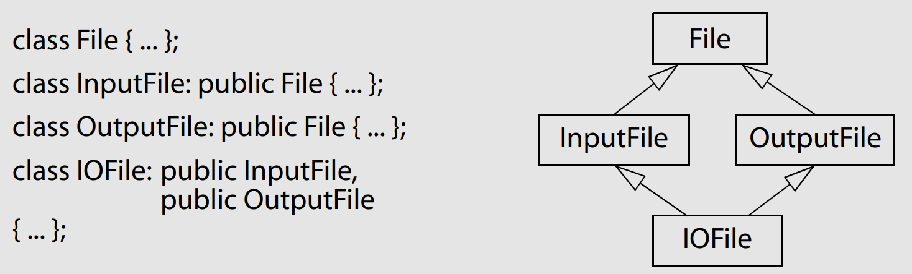
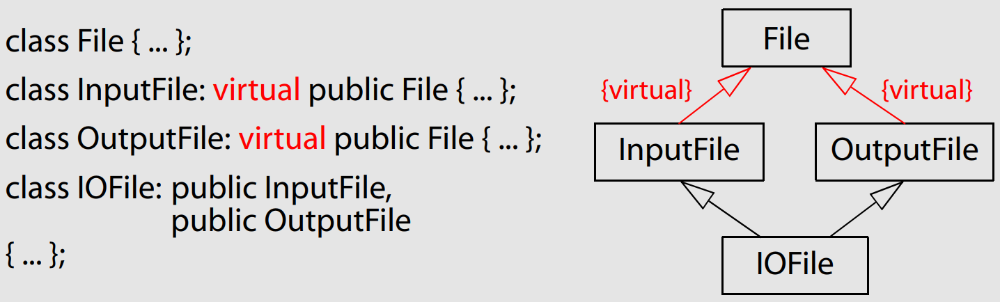

# Effective Cpp

notes taken from reading the *Effective C++ Third Edition* by Scott Meyers.

## Introduction

- This book is not an introduction to C++ or a complete reference for it, but a guidance on how to develop better designs,
- Constructors declared **explicit** are usually preferable to non-explicit ones, because they prevent compilers from performing unexpected (often unintended) **type conversions**.

```cpp
class C {
    public:
        explicit C(int x); // not a default constructor
};
```

- Read carefully when you see what appears to be an assignment, because the “=” syntax can also be used to call the copy constructor:
`Widget w3 = w2; // invoke copy constructor!`.

```cpp
class Widget {
public:
    Widget(); // default constructor
    Widget(const Widget& rhs); // copy constructor
    Widget& operator=(const Widget& rhs); // copy assignment operator
};

Widget w1; // invoke default constructor
Widget w2(w1); // invoke copy constructor
w1 = w2; // invoke copy assignment operator
```

- If a new object is being defined (such as w3 in the statement above), a constructor **has to be called**; it can’t be an assignment. - If no new object is being defined (such as in the `w1 = w2` statement above), no constructor can be involved, so it’s an **assignment**.
- For example, consider this:
```cpp
bool hasAcceptableQuality(Widget w);
Widget aWidget;
if (hasAcceptableQuality(aWidget)) ...
```

- The parameter `w` is passed to `hasAcceptableQuality` by **value**, so in the call above, `aWidget` is copied into `w`. The copying is done by `Widget’s` copy constructor.
  -  ➡️ Pass-by-value means “call the copy constructor.”.

## Chapter 1: Accustoming Yourself to C++

### Item 1: View C++ as a federation of languages

- Today’s C++ is a multi-paradigm programming language, one supporting a combination of **procedural**, **object-oriented**, **functional**, **generic**, and **meta-programming** features.
- Rules for effective C++ programming vary, depending on the part of C++ you are using: **C**, **Object-Oriented C++**, **Template C++** and The **STL**.
> For example, pass-by-value is generally more efficient than pass-by-reference for built-in (i.e., C-like) types, but when you move from the C part of C++ to Object-Oriented C++, the existence of user-defined constructors and destructors means that pass-by-reference-to-const is usually better. This is especially the case when working in Template C++, because there, you don’t even know the type of object you’re dealing with. When you cross into the STL, however, you know that iterators and function objects are modeled on pointers in C, so for iterators and function objects in the STL, the old C pass-by-value rule applies again.

### Item 2: Prefer consts, enums, and inlines to #defines

```cpp
#define authorName "Scott Meyers"; // bad
const char * const authorName = "Scott Meyers"; // better
const std::string authorName("Scott Meyers"); // best
```

- C++ requires that you provide a **definition** for anything you use, but **class-specific constants** that are static and of integral type (e.g., integers, chars, bools) are an exception.
- To limit the scope of a constant to a **class**, you must make it a member, and to ensure there’s at most one **copy** of the constant, you must make it a **static** member.

```cpp
class GamePlayer {
private:
    // As long as you don’t take their address,
    // you can declare them and use them without providing a definition
    static const int NumTurns = 5; // constant declaration
    int scores[NumTurns]; // use of constant
...

// Otherwise you should define them in an implementation file:
const int GamePlayer::NumTurns; // definition of NumTurns;
};
```

- ⚠️ `#defines` don’t respect **scope**. Once a macro is defined, it’s in force for the rest of the compilation (until `#undef`).
  - ▶️ `#defines `can't be used for class-specific constants, they also can’t be used to provide any kind of **encapsulation**.
- 🌟 If you don’t want to let people get a pointer or reference to one of your integral constants, an **enum** is a good way to enforce that constraint.
- Macros like this have so many drawbacks, just thinking about them is painful:
```cpp
#define CALL_WITH_MAX(a, b) f((a) > (b) ? (a) : (b))
```
- ⚠️ Whenever you write this kind of macro, you have to remember to **parenthesize** all the arguments in the macro body. Otherwise you can run into trouble when somebody calls the macro with an **expression**.
- You can get all the efficiency of a macro plus all the predictable behavior and type safety of a regular function by using a **template** for an **inline** function.
```cpp
- template<typename T> // because we don’t know what T is, we pass by reference-to const
inline void callWithMax(const T& a, const T& b) {
    f(a > b ? a : b);
}
```

📆 Things to Remember:
- For simple constants, prefer const objects or enums to `#defines`.
- For function-like macros, prefer inline functions to `#defines`.

### Item 3: : Use const whenever possible

- Some programmers list const before the type. Others list it after the type but before the **asterisk**. There is no difference in meaning, so the following functions take the same parameter type:
```cpp
void f1(const Widget *pw); // f1 takes a pointer to a constant Widget object
void f2(Widget const *pw); // so does f2
```
- STL iterators are modeled on **pointers**, so an iterator acts much like a _T* pointer_.
- If you want an iterator that points to something that can’t be modified (i.e., the STL analogue of a const T* pointer), you want a *const_iterator*:
```cpp
...std::vector<int> vec;
const std::vector<int>::iterator iter = // iter acts like a T* const
vec.begin();
*iter = 10; // OK, changes what iter points to
++iter; // error! iter is const
std::vector<int>::const_iterator cIter = // cIter acts like a const T*
vec.begin();
*cIter = 10; // error! *cIter is const
++cIter; // fine, changes cIter
```
- 😲 Many people overlook the fact that member functions differing only in their **constness** can be **overloaded**, but this is an important feature of C++.
- It’s never **legal** to modify the return value of a function that returns a **built-in** type. Even if it were legal, the fact that C++ returns objects by value would mean that a copy of `tb.text[0]` would be modified, not `tb.text[0]` itself, and that’s not the behavior you want.
-  C++’s definition of **member function constness** in a member function is `const` if and only if it doesn’t modify any of the object’s data members (excluding those that are static).
   - :facepalm: Unfortunately, many member functions that don’t act very `const` pass this test !
   - Example: function returns a reference to the object’s internal data.
   - ▶️ a `const` member function might modify some of the bits in the object on which it’s invoked, but only in ways that clients cannot detect.

📆 Things to Remember
   - Declaring something `const` helps compilers detect usage errors. `const` can be applied to objects at any scope, to function parameters and return types, and to member functions as a whole.
   - Compilers enforce **bitwise constness**, but you should program using **logical constness**.
   - When `const` and `non-const` member functions have essentially identical implementations, code duplication can be avoided by having the non-const version call the const version.

### Item 4: Make sure that objects are initialized before they’re used

- There are rules that describe when object initialization is guaranteed to take place and when it isn’t.
- Unfortunately, the rules are **complicated** — too complicated to be worth memorizing.
- ⚠️ it’s important not to confuse **assignment** with **initialization**.
```cpp
ABEntry::ABEntry(const std::string& name, const std::string& address, const std::list<PhoneNumber>& phones)
  // these are now all initializations
  : theName(name), theAddress(address), thePhones(phones), numTimesConsulted(0)
{} // the ctor body is now empty
```
- In this case, for example `theName` is copy-constructed from `name`. For most types, a single call to a **copy constructor** is more efficient —
sometimes much more efficient — than a call to the **default constructor** followed by a call to the **copy assignment operator**.
- **Base classes** are always initialized before **derived** classes, and within a class, **data members** are initialized in the order in which they are **declared** ( true even if they are listed in a different order on the member initialization list 😲!)
- ⚠️the relative order of initialization of **non-local static objects** defined in different translation units is **undefined**.

📆 Things to Remember:
- Manually initialize objects of built-in type, because C++ only sometimes initializes them itself.
- In a constructor, prefer use of the **member initialization** list to assignment inside the body of the constructor. List data members in the initialization list in the **same order** they’re declared in the class.
- Avoid initialization order problems across translation units by replacing non-local static objects with local static objects.

## Chapter 2: Constructors, Destructors, and Assignment Operators

### Item 5: Know what functions C++ silently writes and calls.

- When is an empty class not an empty class? When C++ gets through with it. If you don’t declare them yourself, compilers will declare their own versions of a copy constructor, a copy assignment operator, and a destructor. Furthermore, if you declare no constructors at all, compilers will also declare a default constructor for you.
-  As a result, if you write `class Empty{};`, it’s essentially the same as if you’d written this:
```cpp
class Empty {
public:
  Empty() { ... } // default constructor
  Empty(const Empty& rhs) { ... } // copy constructor
  ~Empty() { ... } // destructor
  Empty& operator=(const Empty& rhs) { ... } // copy assignment operator
};
```
- ⚠️ If you’ve carefully engineered a class to require constructor arguments, you don’t have to worry about compilers **overriding** your decision by blithely adding a constructor that takes no arguments.
- Compilers will refuse to generate an implicit `operator=` for your class if the resulting code has a reasonable chance of making sense, for example:
  - classes containing **references** members
  - classes containing **const** members
  - **derived** classes that inherit from base classes declaring the **copy** assignment operator **private**.

📆 Things to Remember
- Compilers may implicitly generate a class’s **default** constructor, **copy** constructor, **copy assignment** operator, and **destructor**.

### Item 6: Explicitly disallow the use of compiler-generated functions you do not want

- By declaring a member function **explicitly**, you prevent compilers from generating their own version, and by making the function `private`, you keep people from calling it.
```cpp
class HomeForSale {
public:
  ...
private:
  // declarations only
  HomeForSale(const HomeForSale&);
  HomeForSale& operator=(const HomeForSale&);
};
```
- It’s possible to move the **link-time** error up to **compile time** (👍 always a good thing — earlier error detection is better than later) by declaring the copy **constructor** and copy **assignment** operator **private** not in `HomeForSale` itself, but in a **base** class specifically designed to prevent copying.
- The base class is simplicity itself:
```cpp
class Uncopyable {
protected:
// allow construction and destruction of derived objects...
  Uncopyable() {}
  ~Uncopyable() {}
private: // ...but prevent copying
  Uncopyable(const Uncopyable&);
  Uncopyable& operator=(const Uncopyable&);
};
```
- To keep `HomeForSale` objects from being copied, all we have to do now is inherit from `Uncopyable`:
```cpp
class HomeForSale: private Uncopyable {
// class no longer declares copy ctor or copy assignment operator
...
};
```

📆 Things to Remember
- To disallow functionality automatically provided by compilers, declare the corresponding member functions **private** and give no implementations. Using a base class like `Uncopyable` is one way to do this.

### Item 7: Declare destructors virtual in polymorphic base classes

- C++ specifies that when a **derived** class object is **deleted** through a pointer to a **base** class with a non-virtual destructor, results are **undefined**.
```cpp
class TimeKeeper {
public:
  TimeKeeper();
  virtual ~TimeKeeper();
...
};

TimeKeeper *ptk = getTimeKeeper();
...
delete ptk; // now behaves correctly
```
- If a class does not contain virtual functions, that often indicates it is not meant to be used as a base class. When a class is not intended to be a base class, making the destructor virtual is usually a bad idea.
```cpp
class SpecialString: public std::string { // bad idea! std::string has a non-virtual destructor
};
```
- The same analysis applies to any class lacking a virtual destructor, including all the *STL* container types (e.g., `vector`, `list`, `set`, `tr1::unordered_map`, etc.).

📆 Things to Remember
- **Polymorphic** base classes should declare **virtual destructors**. If a class has any virtual functions, it should have a virtual destructor.
- Classes not designed to be base classes (such as STL container types) or not designed to be used polymorphically should not declare virtual destructors.

### Item 8: Prevent exceptions from leaving destructors

- C++ does not like destructors that emit exceptions! ⚠️ yields undefined behavior or premature program termination.
- If an operation may fail by throwing an exception and there may be a need to handle that exception, the exception has to come from some **non-destructor** function:
```cpp
class DBConn {
public:
  void close() {   // create an opportunity to react to problems that may arise:
    db.close();    // giving clients a chance to handle exceptions arising from
    closed = true; // that operation.
  }
  ~DBConn() {
    if (!closed) {
      try {
        db.close(); // close the connection if the client didn’t
      }
      catch (...) { // if closing fails, note that and terminate or swallow
      // make log entry that call to close failed;
      }
    }
  }
}
private:
  DBConnection db;
  bool closed;
};
```

📆 Things to Remember
- Destructors should **never** emit **exceptions**. If functions called in a destructor may throw, the destructor should catch any exceptions, then swallow them or terminate the program.
- If class clients need to be able to react to exceptions thrown during an operation, the class should provide a regular (i.e., non-destructor) function that performs the operation.

### Item 9: Never call virtual functions during construction or destruction

- During base class construction, **virtual** functions never **go down** into **derived** classes. Instead, the object behaves as if it were of the base type.
- ▶️ An object doesn’t become a derived class object until execution of a derived class constructor begins.
- 👨‍🏫 The same reasoning applies during **destruction**.
- There are different ways to approach this problem. One is to turn `logTransaction` into a **non-virtual** function in `Transaction`, then require that derived class constructors pass the necessary log information to the `Transaction` constructor.

📆 Things to Remember
- Don’t call virtual functions during construction or destruction, because such calls will never go to a more derived class than that of the currently executing constructor or destructor.

### Item 10: Item 10: Have assignment operators return a reference to *this

```cpp
class Widget {
public:
  ...
  // return type is a reference to the current class
  Widget& operator=(const Widget& rhs) {
  ...
  return *this; // return the left-hand object
}
...
};
```

- This convention applies to all **assignment** operators, not just the standard form shown above. Hence:
```cpp
class Widget {
  public:
  ...
  Widget& operator+=(const Widget& rhs) // the convention applies to
  {                                     // +=, -=, *=, etc.
    ...
    return *this;
}

  Widget& operator=(int rhs) // it applies even if the
  {                          // operator’s parameter type
  ...                        // is unconventional
  return *this;
  }
...
};
```

📆 Things to Remember
- Have assignment operators return a reference to `*this.`

### Item 11: Handle assignment to self in operator=

- Example of assignment to self:
```cpp
a[i] = a[j]; // assignment to self if i and j have the same value
*px = *py; // assignment to self if px and py happen to point to the same thing
```
- ‼️ In general, code that operates on references or pointers to **multiple objects** of the **same type** needs to consider that the objects might be the same.
- Here’s an implementation of `operator=` that looks reasonable on the surface but is **unsafe** in the presence of assignment to self.

```cpp
Widget&
Widget::operator=(const Widget& rhs) // unsafe impl. of operator=
{
  delete pb; // stop using current bitmap
  pb = new Bitmap(*rhs.pb); // start using a copy of rhs’s bitmap
  return *this; // see Item 10
}
```
- The self-assignment problem here is that inside `operator=`, `*this`  and `rhs` could be the same object.
  - ▶️ At the end of the function, the `Widget` — which should not have been changed by the assignment to self — finds itself holding a pointer to a deleted object!
- Solution:
  - Do an identity test at the top of operator=: `if (this == &rhs) return *this;`. This work, but it is still **exception-unsafe**.
  - A careful **ordering** of statements can yield exception-safe:
```cpp
Widget& Widget::operator=(const Widget& rhs)
{
  Bitmap *pOrig = pb; // remember original pb
  pb = new Bitmap(*rhs.pb); // point pb to a copy of rhs’s bitmap
  delete pOrig; // delete the original pb until we've copied what it points to
  return *this;
}
```
- An alternative to the implementation above that is both exception and self-assignment-safe is to use the technique known as **copy and swap**:
```cpp
class Widget {
...
void swap(Widget& rhs); // exchange *this’s and rhs’s data;
  ... // see Item 29 for details
};
Widget& Widget::operator=(const Widget& rhs)
{
  Widget temp(rhs); // make a copy of rhs’s data
  swap(temp); // swap *this’s data with the copy’s
  return *this;
}
```

📆 Things to Remember
- Make sure `operator=` is **well-behaved** when an object is assigned to itself.
  - Techniques include **comparing** addresses of source and target objects, careful statement ordering, and copy-and-swap.
- Make sure that any function operating on **more than one** object behaves correctly if two or more of the objects are the same.

### Item 12: Copy all parts of an object

- When you declare your own copying functions, and you **later add** a data **member** to the class, you need to make sure that you update the copying functions too.
- One of the most insidious ways this issue can arise is through inheritance:
```cpp
class PriorityCustomer : public Customer {
  public:
    PriorityCustomer(const PriorityCustomer& rhs);
    PriorityCustomer &operator=(const PriorityCustomer& rhs);
  private:
    int priority;
}

PriorityCustomer::PriorityCustomer(const PriorityCustomer& rhs)
    : Customer(rhs), // invoke base class copy ctor <- (might be forgotten)
    priority(rhs.priority) {
  logCall("PriorityCustomer copy constructor");
}

PriorityCustomer&
PriorityCustomer::operator=(const PriorityCustomer& rhs) {
  logCall("PriorityCustomer copy assignment operator");
  Customer::operator=(rhs); // assign base class parts <- (might be forgotten)
  priority = rhs.priority;
  return *this;
}
```

📆 Things to Remember
- Copying functions should be sure to **copy** all of an **object’s data members** and all of its **base class** parts.
- Don’t try to implement one of the copying functions in terms of the other. Instead, put **common functionality** in a third function that both call.

## Chapter 3: Resource Management

### Item 13: Use objects to manage resources

- Consider the function `f` below:
```cpp
void f() {
  Investment *pInv = createInvestment(); // call factory function
  ... // use pInv
  delete pInv; // release object
}
```
- Relying on `f` always getting to its `delete` statement simply isn’t viable because:
  - a premature return statement.
  - if the uses of `createInvestment` and `delete` were in a loop, and the loop was prematurely exited by a break or goto statement.
  - “...” might throw an exception.
  - think about how the code might change over time:
    - somebody might add a `return` or `continue` statement
    - the “...” part of `f` might call a function that never used to throw an exception but suddenly starts doing so after it has been “improved.”
- 👎 Regardless of how the `delete` were to be skipped, we’d **leak** not only the memory containing the investment object but also any **resources** **held** by that object.
- 👍 Solution is to put that resource inside an object whose destructor will **automatically release** the resource when control leaves `f` : `std::auto_ptr<Investment> pInv(createInvestment());`.

📆 Things to Remember
- To prevent resource leaks, use *RAII* (Resource acquisition is initialization) objects that acquire resources in their constructors and release them in their destructors.
- Two commonly useful RAII classes are `tr1::shared_ptr` and `auto_ptr`. `tr1::shared_ptr` is usually the better choice, because its behavior when copied is intuitive. Copying an `auto_ptr` sets it to null.

### Item 14: Think carefully about copying behavior in resource-managing classes.

- Every RAII class author must confront: *what should happen when an RAII object is copied?* Most of the time, you’ll want to choose one of the following possibilities:
  - **Prohibit copying**: likely to be true for a class like `Lock` (contains a mutex). When copying makes no sense for an RAII class, you
should prohibit it.
  - **Reference-count the underlying resource**: when needed, copying an RAII object should increment the count of the number of objects referring to the resource (using a `tr1::shared_ptr`). However, in the `Lock` example, when we’re done with a `Mutex`, we want to unlock it, not delete it (default behavior for `tr1::shared_ptr`).
  - **Copy the underlying resource**: In that case, copying the resource-managing object should also copy the resource it wraps. That is, copying a resource-managing object performs a **deep copy**, for example, when a string object is copied, a copy is made of both the pointer and the memory it points to.
  - **Transfer ownership of the underlying resource**: Sometimes you may wish to make sure that only **one** RAII object refers to a raw resource and that when the RAII object is copied, ownership of the resource is transferred from the copied object to the copying object (`auto_ptr`).

📆 Things to Remember
- Copying an RAII object entails copying the resource it manages, so the copying behavior of the resource determines the copying behavior of the RAII object.
- Common RAII class copying behaviors are disallowing copying and performing reference counting, but other behaviors are possible.

### Item 15: Provide access to raw resources in resource-managing classes.

- `tr1::shared_ptr` and `auto_ptr` both offer a `get()` to perform an **explicit** conversion, i.e., to return (a copy of) the raw pointer
inside the smart pointer object.
- Like virtually all smart pointer classes, `tr1::shared_ptr` and `auto_ptr` also **overload** the pointer dereferencing operators (operator-> and operator*), and this allows **implicit** conversion to the underlying raw pointers.
- Some programmers might find the need to **explicitly** request conversions **off-putting** enough to avoid using the class. That, in turn,
would increase the chances of leaking fonts 🤷. The alternative is to offer an implicit conversion function:
```cpp
class Font {
  public:
  ...
    operator FontHandle() const { // implicit conversion function
      return f;
    }
...
};
```
- That makes calling into the C API easy and natural, but can increase the chance of errors:
  - ▶️ For example, a client might accidentally create a `FontHandle` when a `Font` object was intended: `FontHandle f2 = f1;`.
- The best design is likely to make interfaces **easy** to use **correctly** and **hard** to use **incorrectly**.

📆 Things to Remember

- APIs often require access to raw resources, so each RAII class should offer a way to get at the resource it manages.
- Access may be via explicit conversion or implicit conversion. In general, **explicit** conversion is **safer**, but **implicit** conversion is more **convenient** for clients.

### Item 16: Use the same form in corresponding uses of new and delete.

- Does the pointer being deleted point to a **single** object or to an **array** of objects?
  - Why ? ▶️ the memory layout for single objects is generally different from the memory layout for arrays.
  - `delete []` includes the size of the array making it easy for `delete` to know **how many destructors** to call.
- Abstain from `typedefs` for array types
```cpp
typedef std::string AddressLines[4];    // a person’s address has 4 lines,
                                        // each of which is a string
  // Because AddressLines is an array, this use of new,
  std::string *pal = new AddressLines;  // note that “new AddressLines”
                                        // returns a string*, just like
                                        // “new string[4]” would
  // must be matched with the array form of delete:
  delete pal; // undefined!
  delete [] pal; // fine
```

📆 Things to Remember
- If you use `[]` in a `new` expression, you must use `[]` in the corresponding `delete` expression.
- If you don’t use `[]` in a new expression, you mustn’t use `[]` in the corresponding `delete` expression.

### Item 17: Store newed objects in smart pointers in standalone statements.

- Consider the following code to call the function `processWidget`:
```cpp
processWidget(std::tr1::shared_ptr<Widget>(new Widget), priority())
```
- ‼️ A **leak** in the call to `processWidget` can arise because an **exception** can intervene between the time a resource is created (via `new Widget`) and the time that resource is turned over to a resource-managing object.
- 👍 Use a separate statement to create the `Widget` and store it in a smart pointer, then pass the smart pointer to `processWidget`:
```cpp
std::tr1::shared_ptr<Widget> pw(new Widget); // store newed object in a smart pointer in a  standalone statement
processWidget(pw, priority()); // this call won’t leak
```

📆 Things to Remember
- Store newed objects in smart pointers in **standalone statements**.
- Failure to do this can lead to subtle resource **leaks** when exceptions are thrown.

## Chapter 4: Design and Declarations

### Item 18: Make interfaces easy to use correctly and hard to use incorrectly.

- Many client errors can be prevented by the introduction of **new types**. Indeed, the type system is your primary ally in preventing undesirable code from **compiling**.

```cpp
class Date {
  public:
    Date(const Month& m, const Day& d, const Year& y);
...
};
Date d(30, 3, 1995); // error! wrong types
Date d(Day(30), Month(3), Year(1995)); // error! wrong types
Date d(Month(3), Day(30), Year(1995)); // okay,
```
- Another way to prevent likely client errors is to **restrict** what can be done with a **type**.
  - ▶️ A common way to impose restrictions is to add **const**.
- Unless there’s a good reason not to, have your types behave **consistently** with the **built-in types**:
  - :100: Inconsistency imposes mental friction into a developer’s work that no IDE can fully remove !
- 👍 Any interface that requires that clients **remember** to do something is prone to **incorrect use**, because clients can forget to do it.
  - `std::tr1::shared_ptr<Investment> createInvestment();` essentially forces clients to store the return value in a `tr1::shared_ptr`, all but **eliminating** the possibility of **forgetting** to **delete** the underlying `Investment` object when it’s no longer being used.

📆 Things to Remember
- Good interfaces are easy to use correctly and hard to use incorrectly.
- Ways to facilitate correct use include consistency in interfaces and behavioral compatibility with built-in types.
- Ways to prevent errors include **creating new types**, **restricting** operations on types, **constraining** object values, and eliminating **client resource management** responsibilities.
- `tr1::shared_ptr` supports custom deleters. This prevents the *crossDLL* problem, can be used to automatically unlock mutexes.

### Item 19: Treat class design as type design.

- Virtually every class requires that you confront the following questions, the answers to which often lead to constraints on your design:
  - How should objects of your new type be **created** and **destroyed**?
  - How should object **initialization** differ from object **assignment**?
  - What does it mean for objects of your new type to **be passed by value**?
  - What are the **restrictions** on **legal values** for your new type?
  - Does your new type fit into an **inheritance** graph?
  - What kind of **type conversions** are **allowed** for your new type?
  - What **operators** and **functions** make sense for the new type?
  - What **standard functions** should be **disallowed**?
  - Who should have **access** to the **members** of your new type?
  - What is the *undeclared interface* of your new type?
  - How **general** is your new type?
  - Is a **new type** really what you **need**?

📆 Things to Remember
- **Class design is type design**. Before defining a new type, be sure to consider all the issues discussed in this Item.

### Item 20: Prefer pass-by-reference-to-const to pass-by-value.

- Consider the following code:
```cpp
class Person {
  public:
    Person(); // parameters omitted for simplicity
    virtual ~Person(); // see Item 7 for why this is virtual
...
  private:
    std::string name;
    std::string address;
};

class Student: public Person {
  public:
    Student(); // parameters again omitted
    virtual ~Student();
  ...
  private:
    std::string schoolName;
    std::string schoolAddress;
};
```
- Invoking such call `bool validateStudent(Student s);` will result on:
  - the `Student` copy constructor is called to initialize the parameter `s` from *plato*.
  - every time you construct a `Student` object you must also construct two string objects ‼️.
  - and every time you construct a `Student` object you must also construct a `Person` object, so each `Person` construction also entails two more string constructions.
  - `s` is destroyed when `validateStudent` returns.
- ▶️ When the copy of the `Student` object is **destroyed**, each constructor call is matched by a destructor call, so the overall cost of passing a `Student` by value is **six constructors** and **six destructors**! 🤷.
- The solution is to use `bool validateStudent(const Student& s);` but remember to declare it **const**, because otherwise callers would have to worry about `validateStudent` making changes to the `Student` they passed in.
- 👍 Passing parameters by reference also avoids the **slicing problem**. When a derived class object is passed (by value) as a base class object, the base class copy constructor is called, and the specialized features that make the object behave like a derived class object are “sliced” off.
- ⚠️ Just because an object is **small** doesn’t mean that calling its copy constructor is **inexpensive**. Many objects — most STL containers among them — contain little more than a pointer, but copying such objects entails **copying everything they point to**. That can be very expensive.
- ⚠️ Even when small objects have inexpensive copy constructors, some compilers refuse to put objects consisting of only a double into a register.
- ⚠️ Being user-defined, their size is subject to change. A type that’s small now may be bigger in a future release, because its internal implementation may change. Things can even change when you switch to a different C++ implementation 👁️.

📆 Things to Remember
- Prefer **pass-by-reference-to-const** over **pass-by-value**. It’s typically more efficient and it avoids the *slicing problem*.
- The rule doesn’t apply to **built-in** types and **STL** iterator and **function object** types. For them, **pass-by-value** is usually appropriate.

### Item 21: Don’t try to return a reference when you must return an object.

- Consider the following code:
```cpp
const Rational& operator*(const Rational& lhs, const Rational& rhs)
{
  Rational *result = new Rational(lhs.n * rhs.n, lhs.d * rhs.d);
  return *result;
}

Rational w, x, y, z;
w = x * y * z; // same as operator*(operator*(x, y), z)
```
- This is a guaranteed resource leak because of hidden pointers, i.e: `x * y`.
- If we use a static variable `static Rational result;` tot return the resulted object, it violates **thread safety**, plus expressions like this: `Rational a, b, c, d; if ((a * b) == (c * d))` will always evaluate to true :-1:.

📆 Things to Remember
- Never return a **pointer** or **reference** to a **local stack** object, a **reference** to a **heap-allocated** object, or a **pointer** or **reference** to a **local static** object if there is a chance that more than one such object will be needed.

### Item 22: Declare data members private.

- If data members aren’t public, the only way for clients to access an object is via **member functions** (▶️ uniform access).
- Hiding data members behind functional interfaces can offer all kinds of implementation **flexibility**.
  - notify other objects when data members are read or written
  - ensure that class invariants are always maintained
  - perform synchronization in threaded environments
  - 👍 reserve the right to change your implementation decisions later ...
- Protected data members are as **unencapsulated** as **public** ones, because in both cases, if the data members are changed, an unknowably large amount of client code is broken 🤷.

📆 Things to Remember
- Declare data members **private**. It gives clients syntactically **uniform access** to data, affords **fine-grained access control**, allows **invariants** to be **enforced**, and offers class authors implementation **flexibility**.
- **Protected** is no more **encapsulated** than public.

### Item 23: Prefer non-member non-friend functions to member functions.

- OO principles dictate that data and the functions that operate on them should be bundled together, and that suggests that the member function is the better choice. Unfortunately, this suggestion is incorrect 🤷.
- OO principles dictate that data should be as **encapsulated** as possible.
  - 👍 The more something is encapsulated, the **fewer** things can **see** it. The fewer things can see it, the greater **flexibility** we have to change it.
  - 👍 The **less** code that can see the data (i.e., access it), the more the data is **encapsulated**.
  - As a coarse-grained measure of how much code can see a piece of data, we can count the **number of functions** that can access that data: ▶️ the **more functions** that can access it, the **less encapsulated** the data !
- To solve this, we can:
  - make `clearBrowser` a static member function of some utility class, As long as it’s not part of (or a friend of) `WebBrowser`.
  - more natural approach would be to make `clearBrowser` a non-member function in the **same namespace** as `WebBrowser`:

```cpp
namespace WebBrowserStuff {
  class WebBrowser { ... };
  void clearBrowser(WebBrowser& wb);
...
}
```
- Namespaces, unlike classes, can be spread across multiple source files.
  - 👍 Putting all convenience functions in multiple header files

📆 Things to Remember
- Prefer non-member non-friend functions to member functions. Doing so increases encapsulation, packaging flexibility, and functional
extensibility.

### Item 24: Declare non-member functions when type conversions should apply to all parameters

- Consider the following example:
```cpp
class Rational {
  public:
    Rational(int numerator = 0, int denominator = 1); // ctor is deliberately not explicit;
                                                    // allows implicit int-to-Rational conversions
    int numerator() const;                          // accessors for numerator and
    int denominator() const;                        // denominator — see Item 22
    const Rational operator*(const Rational& rh) const;
private:
...
};
```
- This design lets you multiply rationals with the greatest of ease:
```cpp
Rational oneEighth(1, 8);
Rational oneHalf(1, 2);
Rational result = oneHalf * oneEighth;  // fine
result = oneHalf * 2;                   // fine
result = 2 * oneHalf                    // error!
```
- :triangular_flag_on_post: It turns out that parameters are eligible for **implicit type conversion** only if they are listed in the **parameter list**.
- The implicit parameter corresponding to the object on which the member function is invoked — the one `this` points to — is never eligible for implicit conversions.
- To support mixed-mode arithmetic, the way to do it is to make `operator*` a non-member function, thus allowing compilers to perform implicit type conversions on all arguments: `const Rational operator*(const Rational& lhs, const Rational& rhs)`
- Should `operator*` be made a friend of the Rational class?
  - 👎 No ! the opposite of a member function is a **non-member** function, not a **friend** function.

📆 Things to Remember
- If you need type conversions on all parameters to a function (including the one that would otherwise be pointed to by the this pointer),
the function must be a non-member.

### Item 25: Consider support for a non-throwing swap.

- When a user define types contains members such as vectors (also imagine if inheritance is used), it is inefficient to use the default `swap` algorithm:
  - Because you might want to only swap pointers instead of doing multiple copies.
  - ▶️ Solution is to **specialize** `std::swap` for our user defined type.
```cpp
class Widget {
public:
  ...
  void swap(Widget& other) {
    using std::swap; // the need for this declaration is explained later in this Item
    swap(pImpl, other.pImpl); // to swap Widgets, swap their pImpl pointers
  }
  ...
  };

namespace std {
  template<>                                  // revised specialization of
  void swap<Widget>(Widget& a,  Widget& b) {  // std::swap to swap Widgets,
    a.swap(b);                                // call their swap member function
  }
}
```
- Suppose, however, that `Widget` is a class **templates** instead of classes:
  - ⚠️ C++ allows **partial** specialization of class templates, it doesn’t allow it for function templates.
  - The usual approach is to simply add an overload. That would look like this:
  ```cpp
  namespace std {
    template<typename T> // an overloading of std::swap
    void swap(Widget<T>& a, Widget<T>& b) { // (note the lack of “<...>” after  “swap”),
      a.swap(b); // but see below for why this isn’t valid code
    }
  }
  ```
  - In general, **overloading** function templates is fine, but `std` is a special namespace!
  - It’s okay to totally specialize templates in `std`, but it’s not okay to **add** new templates (or classes or functions or anything else) to `std`.
  - The answer is simple. We still declare a non-member swap that calls the member swap, we just don’t declare the non-member to be a specialization or overloading of `std::swap`:
```cpp
  namespace WidgetStuff {
  ... // templatized WidgetImpl, etc.
  template<typename T>    // as before, including the swap
  class Widget { ... };   // member function
  ...
  template<typename T>                      // non-member swap function;
  void swap(Widget<T>& a,  Widget<T>& b) {  // not part of the std namespace
    a.swap(b);
    }
  }
```
- Why the member version of `swap` should never throw exceptions ?
  - one of the most useful applications of `swap` is to help classes (and class templates) offer the **strong exception-safety guarantee**.
  - highly efficient swaps are almost always based on operations on **built-in** types (such as the pointers underlying the `pimpl` idiom), and operations on built-in types never throw exceptions.


📆 Things to Remember
- Provide a `swap` **member function** when `std::swap` would be **inefficient** for your type. Make sure your `swap` doesn’t throw **exceptions**.
- If you offer a member `swap`, also offer a **non-member** `swap` that calls the member. For classes (not templates), specialize `std::swap`, too.
- When calling `swap`, employ a `using` declaration for `std::swap`, then call `swap` without namespace qualification.
- It’s fine to totally **specialize** `std` templates for user-defined types, but never try to **add** something completely new to `std`.

## Chapter 5: Implementations

### Item 26: Postpone variable definitions as long as possible

- The real meaning of *as long as possible* in this Item’s title is:
  - Not only should you **postpone** a variable’s definition until right before you have to use the variable, you should also try to postpone the definition until you have initialization arguments for it.
  - By doing so, you avoid **constructing** and **destructing** unneeded objects, and you avoid **unnecessary default constructions**.
- What about loops ?
```cpp
// Approach A: define outside loop
Widget w;
for (int i = 0; i < n; ++i) {
  w = some value dependent on i;
  ...
}

// Approach B: define inside loop
for (int i = 0; i < n; ++i) {
  Widget w(some value dependent on i)
  ...
}
```
- The costs of these two approaches are as follows:
  - Approach A: 1 constructor + 1 destructor + n assignments.
  - Approach B: n constructors + n destructors.
- For classes where an assignment costs less than a constructor-destructor pair, Approach `A` is generally more efficient. This is especially the case as `n` gets large.
- Otherwise, Approach `B` is probably better.
- Approach `A` makes the name `w` **visible** in a larger scope than Approach B, something that’s contrary to program **comprehensibility** and **maintainability**.
- ▶️ unless you know that (1) assignment is less expensive than a constructor-destructor pair and (2) you’re dealing with a performance-sensitive part of your code, you should default to using Approach B.

📆 Things to Remember
- Postpone variable definitions as long as possible. It increases program clarity and improves program efficiency.

### Item 27: Minimize casting.

- The old-style casts continue to be legal, but the new forms are **preferable**.
  - 👍 they’re much easier to identify in code (both for humans and for tools like grep).
  - 👍 the more **narrowly** specified **purpose** of each cast makes it possible for compilers to diagnose usage errors.
- ▶️ The only time I use an old-style cast is when I want to call an **explicit constructor** to pass an object to a function
- ⚠️ Many programmers believe that casts do nothing but tell compilers to treat one type as another, but this is **mistaken** !
  - Type conversions of any kind (either explicit via casts or implicit by compilers) often lead to code that is executed at **runtime**.
- Alternatives to `dynamic_casting` is using **type-safe containers** or moving virtual functions **up the hierarchy**.
- Avoid is designs that involve **cascading** `dynamic_casts` ▶️ generates code that’s big and slow, plus it’s brittle.

📆 Things to Remember
- Avoid casts whenever practical, especially `dynamic_casts` in performance-sensitive code. If a design requires casting, try to develop a **cast-free** alternative.
- When casting is necessary, try to hide it inside a function. Clients can then call the function instead of putting casts in their own code.
- Prefer C++-style casts to old-style casts. They are easier to see, and they are more specific about what they do.

### Item 28: Avoid returning “handles” to object internals.

- A data member is only as **encapsulated** as the most accessible function **returning a reference** to it.
- If a const member function **returns a reference** to data associated with an object that is stored outside the object itself, the caller of the function can **modify** that data ▶️ `Point& upperLeft() const { return pData->ulhc; }`.
- References, pointers, and iterators are all **handles** (ways to get at other objects), and returning a handle to an object’s internals always runs the **risk** of compromising an object’s **encapsulation**.
- You should never have a **member function** return a pointer to a less accessible member function !
  - 🤷 because clients will be able to get a pointer to the less accessible function, then call that function through the pointer.
- Both of the problems we’ve identified for those functions can be eliminated by simply applying `const` to their return types:
```cpp
class Rectangle {
public:
  ...
  const Point& upperLeft() const { return pData->ulhc; }
  const Point& lowerRight() const { return pData->lrhc; }
  ...
};
```
- Even so, `upperLeft` and `lowerRight` are still returning handles to an object’s internals, and that can be problematic in other ways.
  - In particular, it can lead to **dangling handles**: handles that refer to parts of objects that don’t exist any longer.
  - Most common source of such disappearing objects are function return **values**.
```cpp
const Point *pUpperLeft = &(boundingBox(*pgo).upperLeft()); // get a ptr to the upper left point of its bounding box
```
  - ⚠️ At the end of the statement, `boundingBox’s` return value — *temp* — will be **destroyed**, and that will indirectly lead to the destruction of *temp’s* `Points`. That, in turn, will leave `pUpperLeft` pointing to an object that no longer exists; `pUpperLeft` will dangle by the end of the statement that created it !
- Once a **handle** is being returned, you run the risk that the handle will **outlive** the object it refers to!

📆 Things to Remember
- Avoid returning handles (references, pointers, or iterators) to object internals. Not returning handles increases encapsulation, helps const member functions act const, and minimizes the creation of dangling handles.


### Item 29: Strive for exception-safe code.

- As a general rule, less code is better code, because there’s less to go wrong and less to misunderstand when making changes.
- Exception-safe functions offer one of three guarantees:
  - Functions offering the **basic guarantee** promise that if an exception is thrown, everything in the program remains in a valid state.
  - Functions offering the **strong guarantee** promise that if an exception is thrown, the state of the program is unchanged.
  - Functions offering the **nothrow guarantee** promise never to throw exceptions, because they always do what they promise to do.
- All "exception guarantees" characteristics are determined by the function’s **implementation**, not its **declaration**.
- 👍 It’s a good policy not to change the status of an object to indicate that something has happened until something actually has.
- *copy and swap* is a general design strategy that typically leads to the strong guarantee:
  - Make a **copy** of the object you want to modify, then make all needed changes to the copy.
  - If any of the modifying operations throws an **exception**, the original object remains **unchanged**.
  - After all the changes have been successfully completed, **swap** the modified object with the original in a nonthrowing operation.

📆 Things to Remember
- Exception-safe functions **leak no resources** and allow no data structures to become **corrupted**, even when exceptions are thrown. Such functions offer the basic, strong, or `nothrow` guarantees.
- The strong guarantee can often be implemented via **copy-and-swap**, but the strong guarantee is not practical for all functions.
- A function can usually offer a guarantee **no stronger** than the weakest guarantee of the functions it **calls**

### Item 30: Understand the ins and outs of inlining

- Inlining can be implicit or explicit:
  - The **implicit** way is to define a function inside a class definition:
  ```cpp
  class Person {
  public:
  ...
    int age() const { return theAge; } // an implicit inline request: age is
    ...                                // defined in a class definition
  private:
    int theAge;
  };
  ```
  - The **explicit** way is to use the `inline` keyword:
  ```cpp
  template<typename T>                              // an explicit inline
  inline const T& std::max(const T& a, const T& b)  // request: std::max is
  { return a < b ? b : a; }                         // preceded by “inline”
  ```
- Inlining is a **request** to the compiler, not a **command**.
  - Most compilers refuse to inline functions they deem too complicated (e.g., those that contain **loops** or are **recursive**),
  - Calls to **virtual functions** defy inlining.
- If your program takes the **address** of an inline function, compilers must typically generate an outlined function body for it.
```cpp
inline void f() {...} // assume compilers are willing to inline calls to f
void (*pf )() = f;    // pf points to f

f();  // this call will be inlined, because it’s a “normal” call
pf(); // this call probably won’t be, because it’s through a function pointer
```
- Library designers must evaluate the impact of declaring functions `inline`, because it’s impossible to provide binary upgrades to the client visible inline functions in a library.
  - ▶️ Cost of recompiling vs relinking.
- Most **debuggers** have trouble with inline functions:
  - some build environments manage to support debugging of inlined functions,
  -  many environments simply **disable** inlining for **debug** builds.
- 👍 Don’t forget the empirically determined rule of 80-20, which states that a typical program spends 80% of its time executing only 20% of its code. It’s an important rule, because it reminds you that your goal as a software developer is to identify the 20% of your code that can increase your program’s overall performance.

📆 Things to Remember
- Limit most inlining to small, frequently called functions. This facilitates debugging and binary upgradability, minimizes potential code bloat, and maximizes the chances of greater program speed.
- Don’t declare function templates inline just because they appear in header files.

### Item 31: Minimize compilation dependencies between files.

- **Forward declaration** can be used to minimize header dependencies, however some challenges might occur:
  - forward declaration of `std::string` is incorrect !
  - difficulty with forward-declaring everything has to do with the need for compilers to know the **size** of objects during compilation.
    - a workaround is to use the **pimpl idiom**: : *hide the object implementation behind a pointer*.
- the essence of minimizing compilation dependencies: make your header files **self-sufficient** whenever it’s practical, and when it’s not, depend on **declarations** in other files, not **definitions** Everything else flows from this simple design strategy. Hence:
  - 👍 Avoid using objects when object references and pointers will do.
  - 👍 Depend on class **declarations** instead of class **definitions** whenever you can.
  - 👍 Provide separate header files for declarations and definitions.
- Classes like `Person` that employ the *pimpl* idiom are often called **Handle** classes.
```cpp
#include "Person.h"     // we’re implementing the Person class, so we must #include its class definition
#include "PersonImpl.h" // we must also #include PersonImpl’s class definition, otherwise we couldn’t call
                        // its member functions; note that PersonImpl has exactly the same public  member
                        // functions as Person — their interfaces are identical
Person::Person(const std::string& name, const Date& birthday, const Address& addr)
: pImpl(new PersonImpl(name, birthday, addr)) {}

std::string Person::name() const {
  return pImpl->name();
}
```
- 💲 Cost:
  - member functions have to go through the implementation pointer to get to the object’s data ▶️ That adds one level of indirection per access.
  - the size of this implementation pointer to the amount of memory required to store each object.
  - incur the overhead inherent in dynamic memory allocation (and subsequent deallocation) and the possibility of encountering `bad_alloc` (out-of-memory) exceptions.
- An alternative to the *Handle* class approach is to make `Person` a special kind of abstract base class called an **Interface** class.
```cpp
class Person {
public:
  virtual ~Person();
  virtual std::string name() const = 0;
  virtual std::string birthDate() const = 0;
  virtual std::string address() const = 0;

// return a tr1::shared_ptr to a new Person initialized with the given params;
static std::tr1::shared_ptr<Person> create(const std::string& name, const Date& birthday, const Address& addr);

// Client use them like this:
std::string name;
Date dateOfBirth;
Address address;
...
// create an object supporting the Person interface
std::tr1::shared_ptr<Person> pp(Person::create(name, dateOfBirth, address));

// use the object via the  Person interface
std::cout << pp->name() << " was born on " << pp->birthDate() << " and now lives at " << pp->address();
};
```
- 💲 Cost:
  - every function call is virtual, so you pay the cost of an indirect jump each time you make a function call
  - objects derived from the Interface class must contain a virtual table pointer. This pointer may increase the amount of memory needed to store an object, depending on whether the Interface class is the exclusive source of virtual functions for the object.

📆 Things to Remember
- The general idea behind minimizing compilation dependencies is to depend on **declarations** instead of **definitions**. Two approaches based on this idea are **Handle classes** and **Interface classes**.
- Library header files should exist in full and declaration-only forms. This applies regardless of whether templates are involved.

## Chapter 6: Inheritance and Object-Oriented Design Object-Oriented Design

### Item 32: Make sure public inheritance models “is-a.”

- If you write that `class D` (“Derived”) publicly inherits from `class B` (“Base”), you are telling C++ compilers (as well as human readers of your code) that every object of type D is also an object of type B, but not **vice versa**.
- Any function that expects an argument of type `Person` (or pointer-to-Person or reference-to-Person) will also take a `Student` object (or pointer-to-Student or reference-to-Student).
- You’ll have to augment your intuition with new insights to guide you in inheritance’s proper application. In time, the notion of having `Penguin` inherit from `Bird` or `Square` inherit from `Rectangle` will give you the same funny feeling you probably get now when somebody shows you a function several pages long. It’s possibly the right way to approach things, it’s just not very likely 🤷.

📆 Things to Remember

- Public inheritance means “*is-a.*” Everything that applies to base classes must also apply to derived classes, because every derived class object is a base class object.

### Item 33: Avoid hiding inherited names.

- When compilers see the use of the name `mf2` here, they have to figure out what it refers to. They do that by searching scopes for a declaration of something named `mf2`:
  1. First they look in the **local scope** (that of `mf4`), but they find no declaration for anything called `mf2`.
  2. They then search the **containing scope**, that of the class `Derived`. They still find nothing named `mf2`,
  3. So they move on to the next **containing scope**, that of the **base** class. There they find something named `mf2`, so the search stops. If there were no `mf2` in `Base`, the search would continue,
  4. First to the **namespace(s)** containing `Derived`, if any, and finally to the **global** scope.
  ```cpp
  class Base {
  private:
    int x;
  public:
    virtual void mf1() = 0;
    virtual void mf1(int);
    virtual void mf2();
    void mf3();
    void mf3(double);
  ...
  };
  class Derived: public Base {
  public:
    virtual void mf1();
    void mf3();
    void mf4();
  ...
  }
  ```
- ⚠️ The scope-based name hiding rule hasn’t changed, so all functions named `mf1` and `mf3` in the **base** class are hidden by the functions named `mf1` and `mf3` in the **derived** class. From the perspective of name lookup, `Base::mf1` and `Base::mf3` are no longer **inherited** by `Derived`!
- As you can see, this applies even though the functions in the base and derived classes take **different parameter types**, and it also applies regardless of whether the functions are **virtual** or **non-virtual**.
- You’re using **public** inheritance and you don’t inherit the **overloads**, you’re violating the *is-a* relationship between base and derived classes which is fundamental to public inheritance 💁‍♂️.
- You’ll almost always want to override C++’s **default hiding of inherited names**. This can be solved with **using declarations**:
  ```cpp
  using Base::mf1; // make all things in Base named mf1 and mf3
  using Base::mf3; // visible (and public) in Derived’s scope
  ```

📆 Things to Remember
- Names in derived classes hide names in base classes. Under public inheritance, this is never desirable.
- To make hidden names visible again, employ using declarations or forwarding functions.

### Item 34: Differentiate between inheritance of interface and inheritance of implementation

- When you define a **pure** virtual function `draw()`, you're basically saying: you **must** provide a **draw** function, but I have no idea how you're going to implement it.
- For simple **impure** virtual function, the narrative changes a bit: you’ve got to support an `draw` function,
but if you don’t want to write your own, you can fall back on the **default** version. However, it turns out that it can be **dangerous** to allow simple virtual functions to specify both a function interface and a default implementation.
  - For example, `Airplane::fly` is declared virtual, the default flying behavior is provided as the body
of `Airplane::fly`, which both *ModelA* and *ModelB* inherit.
  - Now assumes we introduced a new *ModelC* which requires to be flown differently. And programmers forget  to redefine the `fly` function : 🤦.
  - Fortunately, it’s easy to offer default behavior to derived classes but **not give it to them** unless they ask for it. The trick is to sever the connection between the interface of the virtual function and its default implementation. Here’s one way to do it:
    ```cpp
    class Airplane {
    public:
      virtual void fly(const Airport& destination) = 0;
      ...
    protected:
      void defaultFly(const Airport& destination);
    };

    void Airplane::defaultFly(const Airport& destination) {
      // default code for flying an airplane to the given destination
    }
    ```
  - Some people object to the idea of having **separate** functions for providing interface and default implementation, such as `fly` and `defaultFly` above, because: it **pollutes** the class **namespace** with a proliferation of closely related function names.
  - To solve this, we can take advantage of the fact that pure virtual functions must be redeclared in concrete derived classes, but they may also have implementations of their own.
- With a **non-virtual** function, it specifies an *invariant over specialization*, because it identifies behavior that is **not** supposed to **change**, no matter how specialized a derived class becomes.
- ⚠️ The first mistake is to declare **all functions non-virtual**. That leaves no room for **specialization** in derived classes; non-virtual destructors are particularly problematic.
- ⚠️ The other common problem is to declare **all member functions virtual**. It serves no one to pretend
that your class can be all things to all people if they’ll just take the time to redefine all your functions 🤷.

📆 Things to Remember
- Inheritance of **interface** is different from inheritance of **implementation**. Under public inheritance, derived classes always inherit base class interfaces.
- **Pure** virtual functions specify inheritance of **interface only**.
- **Simple** (impure) virtual functions specify inheritance of **interface** plus inheritance of a **default implementation**.
- **Non-virtual** functions specify inheritance of **interface** plus inheritance of a **mandatory implementation**.

### Item 35: Consider alternatives to virtual functions.

- The fundamental advice of this Item is to consider **alternatives** to **virtual functions** when searching for a design for the problem you’re trying to solve. Here’s a quick recap of the alternatives we examined:
- Use the *non-virtual interface idiom* (NVI idiom), a form of the *Template Method* design pattern that **wraps public non-virtual** member functions around **less accessible** virtual functions.
```cpp
class GameCharacter {
  public:
    int healthValue() const // derived classes do not redefine this — see Item 36
    {
      ... // do “before” stuff — see below
      int retVal = doHealthValue(); // do the real work
      ... // do “after” stuff — see below
      return retVal;
    }
    ...
  private:
    virtual int doHealthValue() const // derived classes may redefine this
    {
    ... // default algorithm for calculating character’s health
    }
};
```
  - An advantage of the NVI idiom is suggested by the *do before* stuff and *do ‘after stuff* comments in the code.
  - Wrapper ensures that before a virtual function is called, the proper **context** is set up, and after the call is over, the context is cleaned up.
- Replace virtual functions with **function pointer** data members, a stripped-down manifestation of the *Strategy design* pattern.
  - Assert that calculating a character’s health is independent of the character’s type.
  - Require that each character’s **constructor** be passed a **pointer** to a health calculation function.
  ```cpp
  class GameCharacter; // forward declaration
  // function for the default health calculation algorithm
  int defaultHealthCalc(const GameCharacter& gc);

  class GameCharacter {
    public:
      typedef int (*HealthCalcFunc)(const GameCharacter&);
      explicit GameCharacter(HealthCalcFunc hcf = defaultHealthCalc) : healthFunc(hcf ) {}
      int healthValue() const {
        return healthFunc(*this)
      }
    ...
    private:
      HealthCalcFunc healthFunc;
  };
  ```
  - 👍 Different **instances** of the same character type can have different **health calculation** functions.
  - 👍 Health calculation functions for a particular character may be **changed** at **runtime**.
  - 👎 Works only as long as the health calculation function does not **requires non-public** information.
  - 🤷 Whether the advantages of using a function pointer instead of a virtual function offset the possible need to decrease `GameCharacter’s` encapsulation is something you must decide on a design-by-design basis.
- Replace virtual functions with `tr1::function` data members, thus allowing use of any callable entity with a signature compatible with what you need. This, too, is a form of the *Strategy design* pattern.
  - Compared to the last design we saw (where `GameCharacter` held a pointer to a function), this design is almost the same. The only difference is that `GameCharacter` now holds a `tr1::function` object — a **generalized** pointer to a function.
  ```cpp
  class GameCharacter; // as before
  int defaultHealthCalc(const GameCharacter& gc); // as before

  class GameCharacter {
    public:
      // HealthCalcFunc is any callable entity that can be called with
      // anything compatible with a GameCharacter and that returns anything
      // compatible with an int; see below for details
      typedef std::tr1::function<int (const GameCharacter&)> HealthCalcFunc;
      explicit GameCharacter(HealthCalcFunc hcf = defaultHealthCalc) : healthFunc(hcf ) {}
      int healthValue() const {
        return healthFunc(*this);
      }
      ...
    private:
      HealthCalcFunc healthFunc;
  };
  ```
  - Such objects may hold any **callable** entity (i.e., function pointer, function object, or member function pointer) whose signature is compatible with what is expected.
  - 👍 Clients now have staggeringly more **flexibility** in specifying health calculation functions:
  ```cpp
  short calcHealth(const GameCharacter&); // health calculation function; note non-int return type
  struct HealthCalculator { // class for health
    int operator()(const GameCharacter&) const // calculation function
    { ... } // objects
  };
  class GameLevel {
  public:
    float health(const GameCharacter&) const; // health calculation mem function; note non-int return type
  };
  class EvilBadGuy: public GameCharacter { // as before
    ...
  };
  class EyeCandyCharacter: public GameCharacter { // another character type; assume same constructor as EvilBadGuy
    ...
  };

  EvilBadGuy ebg1(calcHealth); // character using a health calculation function
  EyeCandyCharacter ecc1(HealthCalculator()); // character using a health calculation function object
  GameLevel currentLevel;
  ...
  // character using a health calculation member function see below for details;
  EvilBadGuy ebg2(std::tr1::bind(&GameLevel::health, currentLevel,_1));
  ```
- Replace virtual functions in **one hierarchy** with virtual functions in **another hierarchy**. This is the conventional implementation of the *Strategy design* pattern.
  ```cpp
  class GameCharacter; // forward declaration
  class HealthCalcFunc {
    public:
    ...
    virtual int calc(const GameCharacter& gc) const { ... }
    ...
  };
  HealthCalcFunc defaultHealthCalc;
  class GameCharacter {
  public:
    explicit GameCharacter(HealthCalcFunc *phcf = &defaultHealthCalc) : pHealthCalc(phcf) {}
    int healthValue() const {
      return pHealthCalc->calc(*this);
    }
  ...
  private:
    HealthCalcFunc *pHealthCalc;
  };
  ```
  - 👍 Has the appeal of being **quickly recognizable** to people familiar with the “*standard*” Strategy pattern implementation, plus it offers the possibility that an existing health calculation algorithm can be tweaked by adding a derived class to the `HealthCalcFunc` hierarchy.

📆 Things to Remember
- Alternatives to virtual functions include the **NVI idiom** and various forms of the **Strategy design** pattern. The NVI idiom is itself an example of the **Template Method** design pattern.
- A disadvantage of moving functionality from a member function to a function outside the class is that the non-member function **lacks access** to the class’s non-public members.
- `tr1::function` objects act like generalized function pointers. Such objects support all callable entities compatible with a given target signature.

### Item 36: Never redefine an inherited non-virtual function.

```cpp
class B {
  public:
    void mf();
};

class D: public B {
  public:
    void mf(); // hides B::mf; see Item 33
};
pB->mf(); // calls B::mf
pD->mf(); // calls D::mf
```
- **Non-virtual** functions like `B::mf` and `D::mf` are **statically** (early) bound, virtual functions, on the other hand, are **dynamically** (late) bound !
- If you are writing class `D` and you redefine a non-virtual function `mf` that you inherit from class `B`, `D` objects will likely exhibit **inconsistent behavior**. In particular, any given `D` object may act like **either** a `B` or a `D` when `mf` is called, and the determining factor will have nothing to do with the object itself, but with the declared **type of the pointer** that points to it. **References** exhibit the same baffling behavior as do pointers.
- When you redefine an inherited non-virtual function, you violates ⚠️:
  - Everything that applies to `B` objects also applies to `D` objects, because every `D` object *is-a* `B` object;
  - Classes derived from `B` must inherit both the **interface** and the **implementation** of `mf`, because `mf` is non-virtual in `B`.

📆 Things to Remember
- Never redefine an inherited non-virtual function !

### Item 37: Never redefine a function’s inherited default parameter value

- An object’s **static type** is the type you declare it to have in the program text: `Shape *pc = new Circle; // static type = Shape*`.
- Virtual functions are dynamically bound, but **default parameters are statically bound**.
  - ▶️ That means you may end up invoking a virtual function defined in a derived class but using a default parameter value from a base class: `pr->draw(); // calls Rectangle::draw(Shape::Red)!`.
- If you offer default parameter values to users of both base and derived classes ▶️ code duplication & if the default parameter value is changed in Shape, all derived classes that repeat it **must also be changed**.
- Solution 🌟 ? Consider alternative to virtual functions such as **NVI idiom**:
  ```cpp
  class Shape {
    public:
      enum ShapeColor { Red, Green, Blue };
      void draw(ShapeColor color = Red) { const // now non-virtual
        doDraw(color); // calls a virtual
      }
    private:
      virtual void doDraw(ShapeColor color) const = 0; // the actual work is done in this func
  };
  class Rectangle: public Shape {
    public:
      ...
    private:
      virtual void doDraw(ShapeColor color) const; // note lack of default param val.
  };
  ```

📆 Things to Remember
- Never **redefine an inherited default parameter value**, because default parameter values are statically bound, while virtual functions — the only functions you should be redefining — are dynamically bound.

### Item 38: Model “has-a” or “is-implemented-in-terms-of” through composition

- **Composition** is the relationship between types that arises when objects of one type contain objects of another type. Among programmers, the term composition has lots of synonyms: *layering*, *containment*, *aggregation*, and *embedding*.
- Some objects in your programs correspond to things in the world you are modeling, e.g., *people*, *vehicles*, *video frames*, etc. Such objects are part of the **application domain**.
- Other objects are purely implementation artifacts, e.g., *buffers*, *mutexes*, *search trees*, etc. These kinds of objects correspond to your software’s **implementation domain**.
- 🍎 A `Person` object has a *name*, an *address* (class), and voice and fax telephone numbers. You wouldn’t say that a person *is a* name or that a person *is an* address. You would say that a person *has a* name and *has an* address.
- For example, suppose you need a template for classes representing fairly small sets of objects, i.e., collections without duplicates:
  - One option is to use **linked lists**. You also know that the standard C++ library has a *list* template, so you decide to (re)use it (assuming *set* is out of option because it favors speed over space 🤓).
  - You decide to have your nascent `Set` template **inherit** from list. That is, `Set<T>` will inherit from `list<T>`. After all, in your implementation, a `Set` object will in fact be a list object. You thus declare your Set template like this:
    ```cpp
    template<typename T> // the wrong way to use list for Set
    class Set: public std::list<T> { ... };
    ```
  - Wrong ! It is untrue that a `Set` *is-a* list, because some of the things that are true for list objects are not true for `Set` objects (You can't have duplicates in a `Set`).
  - Because the relationship between these two classes isn’t *is-a*, public inheritance is the wrong way to model that relationship. The right way is to realize that a `Set` object can be *implemented in terms of* a list object:
    ```cpp
    template<class T> // the right way to use list for Set
    class Set {
      public:
        bool member(const T& item) const;
        void insert(const T& item);
        void remove(const T& item);
        std::size_t size() const;
      private:
        std::list<T> rep; // representation for Set data
    };
    ```
  - Set’s member functions can lean heavily on functionality already offered by list and other parts of the standard library:
    ```cpp
    template<typename T>
    bool Set<T>::member(const T& item) const {
      return std::find(rep.begin(), rep.end(), item) != rep.end();
    }
    template<typename T>
    void Set<T>::insert(const T& item) {
      if (!member(item)) rep.push_back(item);
    }
    template<typename T>
    void Set<T>::remove(const T& item) {
      // see Item 42 for info on “typename” here
      typename std::list<T>::iterator it = std::find(rep.begin(), rep.end(), item);
      if (it != rep.end()) rep.erase(it);
    }
    template<typename T>
    std::size_t Set<T>::size() const {
      return rep.size();
    }
    ```

📆 Things to Remember
- Composition has meanings completely different from that of public inheritance.
- In the **application** domain, composition means *has-a*. In the **implementation** domain, it means *is-implemented-in-terms-of*.

### Item 39: Use private inheritance judiciously.

- In contrast to public inheritance, compilers will generally not convert a derived class object (such as `Student`) into a base class object (such as `Person`) if the inheritance relationship between the classes is private.
- Members inherited from a private base class **become private** members of the derived class, even if they were **protected** or **public** in the base class.
- Private inheritance means *is-implemented-in-terms-of*:
  - If you make a class `D` privately inherit from a class `B`, you do so because you are interested in taking advantage of some of the features available in class `B`, not because there is any conceptual **relationship** between objects of types `B` and `D`.
  - ▶️ As such, private inheritance is purely an **implementation** technique.
- **Composition** can mean the same thing. How are you supposed to choose between them?
  - 🌳 Use composition whenever you can, and use private inheritance whenever you must !
- Example: Let's suppose we want to how often `Widget` member functions are called:
  ```cpp
  class Timer {
    public:
      explicit Timer(int tickFrequency);
      virtual void onTick() const; // automatically called for each tick
  };
  ```
    - **Public** inheritance is inappropriate in this case. It’s not true that a `Widget` *is-a* `Timer`.
    - We thus inherit **privately**:
      ```cpp
      class Widget: private Timer {
        private:
          virtual void onTick() const; // look at Widget usage data, etc.
      };
      ```
  - This is a nice design, but it’s worth noting that **private** inheritance isn’t strictly necessary. If we were determined to use **composition** instead, we could. We’d just declare a **private** **nested** class inside `Widget` that would **publicly** inherit from `Timer`, redefine `onTick` there, and put an object of that type inside `Widget`. Here’s a sketch of the approach:
    ```cpp
    class Widget {
      private:
        class WidgetTimer: public Timer {
          public:
            virtual void onTick() const;
        };
      WidgetTimer timer;
    }
    ```
- Two reasons why you might prefer public inheritance plus composition over private inheritance:
  1. You might want to design `Widget` to allow for derived classes, but you might also want to prevent derived classes from redefining `onTick`.
  2. You might want to minimize `Widget’s` compilation dependencies.
- C++’s edict against **zero-size freestanding** objects is typically satisfied by the silent insertion of a char into “empty” objects.
  - This constraint **doesn’t apply** to base class parts of **derived class** objects, because they’re not freestanding. If you inherit from `Empty` instead of containing an object of that type:
  ```cpp
  class HoldsAnInt: private Empty {
    private:
      int x;
  };
  ```
  - You’re almost sure to find that `sizeof(HoldsAnInt) == sizeof(int)`. This is known as the *empty base optimization (EBO)*.
  - EBO is generally viable only under single inheritance.
  - Examples from STL that benefits from EBO: `unary_function` and `binary_function`

📆 Things to Remember
- Private inheritance means *is-implemented-in-terms of*. It’s usually **inferior** to **composition**, but it makes sense when a derived class needs access to **protected base class members** or needs to redefine inherited virtual functions.
- Unlike composition, private inheritance can enable the **empty base optimization**. This can be important for library developers who strive to **minimize** object sizes.

### Item 40: Use multiple inheritance judiciously

- Multiple inheritance just means inheriting from more than one base class, but it is not uncommon for MI to be found in hierarchies that have higher-level base classes, too. That can lead to what is sometimes known as the “*deadly MI diamond*”: <p align="center"></p>
- Any time you have an inheritance hierarchy with more than one path between a base class and a derived class, you must confront the ❓ of whether you want the data members in the base class to be **replicated** for each of the paths.
- C++ takes no position on this debate. It happily supports both options, though its **default** is to perform the **replication**. If that’s not what you want, you must make the class with the data (i.e., File) a **virtual base class**. To do that, you have all classes that immediately inherit from it use virtual inheritance: <p align="center"></p>
- From the viewpoint of **correct behavior**, public inheritance should always be virtual. But it comes with a cost 🤷:
  - Objects created from classes using virtual inheritance are generally **larger**.
  - Access to data members in virtual base classes is also **slower**.
  - Rules governing the initialization of virtual base classes are more complicated and less intuitive than are those for non-virtual bases.
    - So ? try to avoid putting data in them.
- Below in one of reasonable applications of MI: combine public inheritance of an interface with private inheritance of an implementation:
  - `IPerson` is an C++ Interface class for modeling persons.
  - To create objects that can be manipulated as `IPerson` objects, clients of `IPerson` use **factory functions**  to instantiate concrete classes derived from `IPerson`. Suppose this class is called `CPerson`.
  - Also, 🤓 suppose an old database-specific class `PersonInfo` offers the essence of what `CPerson` needs. ▶️ Their relationship is thus *is-implemented-in-terms of*.
    ```cpp
    class IPerson { // this class specifies the
      public: // interface to be implemented
        virtual ~IPerson();
        virtual std::string name() const = 0;
        virtual std::string birthDate() const = 0;
    };

    class DatabaseID { ... }; // used below; details are unimportant

    // this class has functions useful in implementing the IPerson interface
    class PersonInfo {
      public:
        explicit PersonInfo(DatabaseID pid);
        virtual ~PersonInfo();
        virtual const char * theName() const;
        virtual const char * theBirthDate() const;
      ...
      private:
        virtual const char * valueDelimOpen() const;
        virtual const char * valueDelimClose() const;
      ...
    };

    class CPerson: public IPerson, private PersonInfo { // note use of MI
      public:
        explicit CPerson(DatabaseID pid): PersonInfo(pid) {}
        // implementations of the required IPerson member functions.
        virtual std::string name() const {
          return PersonInfo::theName();
        }
        virtual std::string birthDate() const {
          return PersonInfo::theBirthDate();
        }
      private:
        // redefinitions of inherited virtual delimiter functions.
        const char * valueDelimOpen() const { return ""; }
        const char * valueDelimClose() const { return ""; }
    };
    ```
- 👍 Compared to **single inheritance**, it’s typically more **complicated** to **use** and more complicated to **understand**, so if you’ve got an SI design that’s more or less equivalent to an MI design, the SI design is almost certainly preferable.
- There’s almost certainly some way to make SI work. At the same time, MI is sometimes the **clearest**, most **maintainable**, most reasonable way to get the job done. When that’s the case, don’t be afraid to use it. Just be sure to use it **judiciously**.

📆 Things to Remember
- Multiple inheritance is more complex than single inheritance. It can lead to new **ambiguity** issues and to the need for **virtual inheritance**.
- Virtual inheritance imposes **costs** in size, speed, and complexity of **initialization** and **assignment**. It’s most practical when virtual base classes have **no data**.
- Multiple inheritance does have legitimate uses. One scenario involves combining public inheritance from an Interface class with private inheritance from a class that helps with implementation.

## Chapter 7: Templates and Generic Programming

- The initial motivation for C++ templates was to make it possible to **create type-safe containers** like `vector`, `list`, and `map`.
- But the ability to write code that is independent of the types of objects being manipulated was even better ▶️ STL algorithms like `for_each`, `find`, and `merge` 🌝.
- It was discovered that the C++ template mechanism is itself *Turing-complete*. That led to **template meta-programming**: the creation of programs that execute inside C++ compilers and that stop running when compilation is complete 🚀.

### Item 41: Understand implicit interfaces and compile-time polymorphism.

- **Explicit interfaces** (**runtime** polymorphism. ie *virtual functions* and pointers/references):
  ```cpp
  class Widget {
  public:
    Widget();
    virtual ~Widget();
    virtual std::size_t size() const;
    virtual void normalize();
    void swap(Widget& other); // see Item 25
  };
  // and this (equally meaningless) function,
  void doProcessing(Widget& w) {
    if (w.size() > 10 && w != someNastyWidget) {
      Widget temp(w);
      temp.normalize();
      temp.swap(w);
    }
  }
  ```
- **Implicit interfaces** (**compile-time** polymorphism. ie. *templates*):
```cpp
template<typename T>
void doProcessing(T& w) {
  if (w.size() > 10 && w != someNastyWidget) {
    T temp(w);
    temp.normalize();
    temp.swap(w);
  }
}
```
- An implicit interface is quite different. It is not based on **function signatures**. Rather, it consists of **valid expressions**.
  - Looking again at the conditional at the beginning of the `doProcessing` template. The implicit interface for `T` (w’s type) appears to have these constraints:
    - It must offer a member function named `size` that returns an object of some type `X` such that there is an `operator>` that can be called with an object of type `X` and an `int`. In fact, it could take a parameter of type `Y`, and that would be okay as long as there were an **implicit** conversion from objects of type `X` to objects of type `Y` 😮‍💨 !
    - It must support an `operator!=` function that compares two objects of type `T`. (Here, we assume that `someNastyWidget` is of type `T`.).
    - The conditional part of an `if` statement must be a **boolean** expression, so regardless of the exact types involved, whatever “`w.size() > 10 && w != someNastyWidget`” yields, it must be compatible with bool.
  - The rest of the interface required by `doProcessing` is that calls to the **copy constructor**, to `normalize`, and to `swap` must be valid for objects of type `T`.

📆 Things to Remember
- Both classes and templates support interfaces and polymorphism.
- For classes, **interfaces** are **explicit** and centered on function **signatures**. Polymorphism occurs at **runtime** through **virtual functions**.
- For template parameters, interfaces are **implicit** and based on valid **expressions**. Polymorphism occurs during **compilation** through **template instantiation** and **function overloading resolution**.

### Item 42: Understand the two meanings of typename

- C++ doesn’t always view `class` and `typename` as equivalent, however. Sometimes you must use `typename`.
- Suppose we have a template for a function that takes an STL-compatible container holding objects that can be assigned to `ints`.
  ```cpp
  template<typename C> // print 2nd element in
  void print2nd(const C& container) { // this is not valid C++!
    if (container.size() >= 2) {
      C::const_iterator iter(container.begin()); // get iterator to 1st element
      ++iter; // move iter to 2nd element
      int value = *iter; // copy that element to an int
      std::cout << value; // print the int
    }
  }
  ```
- The type of *iter* is `C::const_iterator`, a type that depends on the template parameter C.
  - Names in a template that are dependent on a template parameter are called **dependent names**.
  - When a dependent name is nested inside a **class**, I call it a **nested dependent name**.
  - `C::const_iterator` is a nested dependent name. In fact, it’s a **nested dependent type name**, i.e., a nested dependent name that refers to a type.
- `value`, has type `int`. int is a name that does not depend on any template parameter. Such names are known as **non-dependent names**.
- Nested dependent names can lead to **parsing** difficulties.
  - Until `C` is known, there’s no way to know whether `C::const_iterator` is a type or isn’t, and when the template `print2nd` is parsed, `C` isn’t known 🤪.
  - C++ has a rule to resolve this ambiguity: if the parser encounters a **nested dependent name in a template**, it assumes that the name is not a type unless you tell it otherwise. By default, nested dependent
names are not types.
  - To rectify the situation, we have to tell C++ that `C::const_iterator` is a type. We do that by putting `typename` immediately in front of it: `typename C::const_iterator iter(container.begin());`.
- `typename` should be used to identify only nested dependent type names:
  ```cpp
  template<typename C> // typename allowed (as is “class”)
  void f(const C& container, // typename not allowed
  typename C::iterator iter); // typename require
  ```
- `C` is not a nested dependent type name (it’s not nested inside anything dependent on a template parameter), so it must not be preceded by `typename` when declaring container, but `C::iterator` is a nested dependent type name, so it’s required to be preceded by typename ‼️.
- The *exception* to the “*typename must precede nested dependent type names*” rule is that `typename` must not precede nested dependent type names in a **list of base classes** or as a **base class identifier in a member initialization list**:
  ```cpp
  template<typename T>
  class Derived: public Base<T>::Nested { // base class list: typename not allowed
  public:
    explicit Derived(int x) : Base<T>::Nested(x) { // base class identifier in mem. init. list: typename not allowed
      typename Base<T>::Nested temp; // typename required
    }
  };
  ```
- Suppose we’re writing a function template that takes an iterator, and we want to make a local copy, temp, of the object the iterator points to. We can do it like this:
```cpp
template<typename IterT>
void workWithIterator(IterT iter) {
  typename std::iterator_traits<IterT>::value_type temp(*iter);
}
```
- Because `std::iterator_traits<IterT>::value_type` is a nested dependent type name (`value_type` is nested inside iterator_traits<IterT>, and `IterT` is a template parameter), we must precede it by typename.

📆 Things to Remember
- When declaring template parameters, `class` and `typename` are **interchangeable**.
- Use `typename` to identify **nested dependent** type names, except in base class lists or as a base class identifier in a member initialization list.

### Item 43: Know how to access names in templatized base classes

- Assume the following classes:
  ```cpp
  class CompanyA {
  public:
    ...
    void sendCleartext(const std::string& msg);
    void sendEncrypted(const std::string& msg);
    ...
  };
  class CompanyB {
  public:
    ...
    void sendCleartext(const std::string& msg);
    void sendEncrypted(const std::string& msg);
    ...
  };
  ... // classes for other companies
  class MsgInfo { ... }; // class for holding information used to create a message
  ```
- Suppose we sometimes want to log some information each time we send a message. A derived class can easily add that capability, and this seems like a reasonable way to do it:
  ```cpp
  template<typename Company>
  class LoggingMsgSender: public MsgSender<Company> {
    public:
      ... // ctors, dtor, etc.
      void sendClearMsg(const MsgInfo& info)
      {
        write "before sending" info to the log;
        sendClear(info); // call base class function; this code will not compile!
        write "after sending" info to the log;
      }
      ...
  }
  ```
- Compilers will complain that `sendClear` doesn’t exist. We can see that `sendClear` is in the **base class**, but compilers won’t look for it there 🤷.
- The problem is that when compilers encounter the definition for the class template `LoggingMsgSender`, they don’t know what class it inherits from (until later when `LoggingMsgSender` is instantiated).
- Generally, C++ refuses to look in **templatized base classes** for **inherited** names. In some sense, when we cross from OO C++ to Template C++, inheritance stops working 😮‍💨.
- To solve that, we can use any of the approaches below to promise compilers that any subsequent specializations of the base class template will support the interface offered by the general template:
  - First, you can preface calls to base class functions with “`this->`”: `this->sendClear(info);`.
  - Second, you can employ a `using` declaration (which bring hidden base class names into a derived class’s scope): `using MsgSender<Company>::sendClear;` then `sendClear(info);`
  - A final way to get your code to compile is to **explicitly** specify that the function being called is in the base class: `MsgSender<Company>::sendClear(info);`.
    - This is generally the **least desirable** way to solve the problem, because if the function being called is **virtual**, explicit qualification turns off the virtual binding behavior.

📆 Things to Remember
- In derived class templates, refer to names in base class templates via a “`this->`” prefix, via `using` declarations, or via an **explicit** base class qualification.

### Item 44: Factor parameter-independent code out of templates