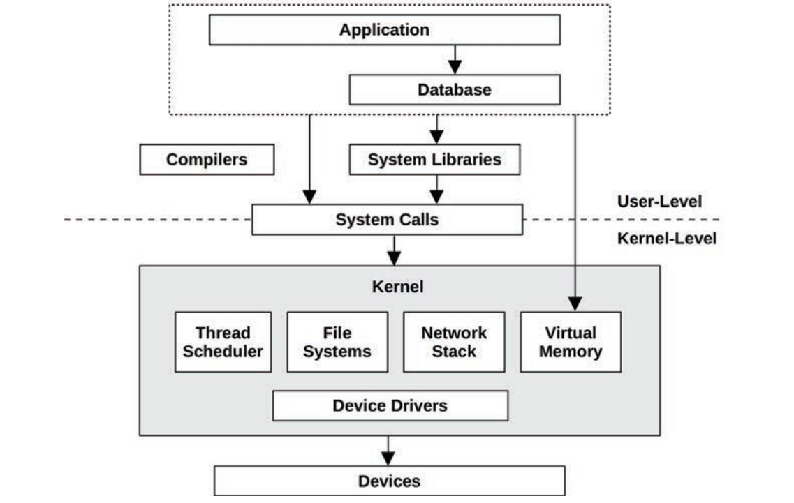

# Chapter 01: Introduction

## 1.1 Systems Performance

- Systems performance studies the performance of an entire computer system, including all major **software** and **hardware** components.
- Anything in the **data path**, from storage devices to application software, is included, because it can affect performance.
- Systems performance studies the full stack:

## 1.2 Roles

- Systems performance is done by a variety of job roles, including system administrators, SREs, app developers, network engineers, DB admins, web admins, and other support staff.
- For some performance issues, finding the root cause or contributing factors requires a cooperative effort from m**ore than one team**.
- Some companies employ **performance engineers**, whose primary activity is performance 🤸‍♀️.

## 1.3 Activities

- The first step should be to set objectives and create a performance model. However,
products are often developed without this step, **deferring** performance engineering work to a later time, after a **problem arises**.
- With each step of the development process it can become progressively harder to fix performance issues that arise due to architectural decisions made earlier.
- The term **capacity planning** can refer to a number of the preceding activities. During design, it includes studying the resource footprint of development software to see how well the design can **meet the target needs**. After deployment, it includes monitoring resource usage to predict problems before they occur.

## 1.4 Perspectives

- Apart from a focus on different activities, performance roles can be viewed from different perspectives. Two perspectives for performance analysis are possible: **workload analysis** and **resource analysis**, which approach the software stack from different directions.

## 1.5 Performance Is Challenging

- **Subjectivity**: Performance is often subjective. With performance issues, it can be unclear whether there is an issue to begin with, and if so, when it has been fixed. Example: *The average disk I/O response time is 1 ms.* 🤷
- Is this “good” or “bad”? To some degree, whether a given metric is “good” or “bad” may depend on the performance expectations of the **app developers** and **end users**.
- **Complexity**:  can be a challenging discipline due to the complexity of systems and the lack of an obvious **starting point** for analysis.
  - Issues may originate from complex **interactions** between subsystems that **perform well when analyzed in isolation**. This can occur due to a **cascading failure**, when one failed component causes performance issues in others.
  - Issues may also be caused by a complex characteristic of the **production workload**. These cases may never be **reproducible** in a lab environment, or only **intermittently** so.
- **Multiple causes**: Imagine a scenario where three normal events occur **simultaneously** and combine to cause a performance issue: each is a normal event that in isolation is not the root cause.
- **Multiple Performance Issues**: Finding a performance issue is usually not the problem; in complex software there are often many. To illustrate this.
  - The real task isn’t finding an issue; it’s identifying which issue or issues matter the most 👍.

## 1.6 Latency

- Latency is a measure of time spent **waiting**, and is an essential performance metric.
- Used broadly, it can mean the time for any operation to complete, such as an app request, a database query, a file system operation, and so forth.
- As a metric, latency can allow **maximum** speedup to be **estimated**, example: 5x faster.
- Such a calculation is not possible when using other metrics such as **IOPS**: there might be 5x fewer IOPS, but what if each of these I/O increased in size (bytes) by 10x ❓
- Throughout this book, the author uses **connection latency** (the time for a connection to be established but not the data transfer time) and **request latency** (the total duration of a connection, including the data transfer) for clarification.

## 1.7 Observability

- Observability refers to understanding a system through observation, and classifies the tools that accomplish this. This includes tools that use **counters**, **profiling**, and **tracing**.