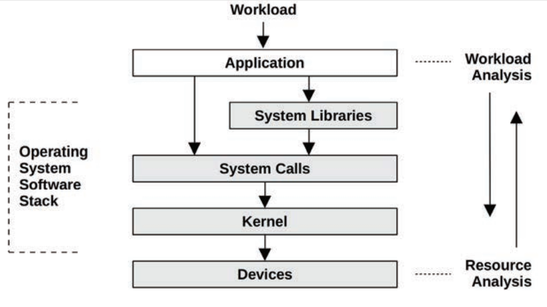

# Chapter 01: Introduction

## 1.1 Systems Performance

- Systems performance studies the performance of an entire computer system, including all major **software** and **hardware** components.
- Anything in the **data path**, from storage devices to application software, is included, because it can affect performance.
- Systems performance studies the full stack:

## 1.2 Roles

- Systems performance is done by a variety of job roles, including system administrators, SREs, app developers, network engineers, DB admins, web admins, and other support staff.
- For some performance issues, finding the root cause or contributing factors requires a cooperative effort from m**ore than one team**.
- Some companies employ **performance engineers**, whose primary activity is performance 🤸‍♀️.

## 1.3 Activities

- The first step should be to set objectives and create a performance model. However,
products are often developed without this step, **deferring** performance engineering work to a later time, after a **problem arises**.
- With each step of the development process it can become progressively harder to fix performance issues that arise due to architectural decisions made earlier.
- The term **capacity planning** can refer to a number of the preceding activities. During design, it includes studying the resource footprint of development software to see how well the design can **meet the target needs**. After deployment, it includes monitoring resource usage to predict problems before they occur.

## 1.4 Perspectives

- Apart from a focus on different activities, performance roles can be viewed from different perspectives. Two perspectives for performance analysis are possible: **workload analysis** and **resource analysis**, which approach the software stack from different directions.

## 1.5 Performance Is Challenging

- **Subjectivity**: Performance is often subjective. With performance issues, it can be unclear whether there is an issue to begin with, and if so, when it has been fixed. Example: *The average disk I/O response time is 1 ms.* 🤷
- Is this “good” or “bad”? To some degree, whether a given metric is “good” or “bad” may depend on the performance expectations of the **app developers** and **end users**.
- **Complexity**:  can be a challenging discipline due to the complexity of systems and the lack of an obvious **starting point** for analysis.
  - Issues may originate from complex **interactions** between subsystems that **perform well when analyzed in isolation**. This can occur due to a **cascading failure**, when one failed component causes performance issues in others.
  - Issues may also be caused by a complex characteristic of the **production workload**. These cases may never be **reproducible** in a lab environment, or only **intermittently** so.
- **Multiple causes**: Imagine a scenario where three normal events occur **simultaneously** and combine to cause a performance issue: each is a normal event that in isolation is not the root cause.
- **Multiple Performance Issues**: Finding a performance issue is usually not the problem; in complex software there are often many. To illustrate this.
  - The real task isn’t finding an issue; it’s identifying which issue or issues matter the most 👍.

## 1.6 Latency

- Latency is a measure of time spent **waiting**, and is an essential performance metric.
- Used broadly, it can mean the time for any operation to complete, such as an app request, a database query, a file system operation, and so forth.
- As a metric, latency can allow **maximum** speedup to be **estimated**, example: 5x faster.
- Such a calculation is not possible when using other metrics such as **IOPS**: there might be 5x fewer IOPS, but what if each of these I/O increased in size (bytes) by 10x ❓
- Throughout this book, the author uses **connection latency** (the time for a connection to be established but not the data transfer time) and **request latency** (the total duration of a connection, including the data transfer) for clarification.

## 1.7 Observability

- Observability refers to understanding a system through observation, and classifies the tools that accomplish this. This includes tools that use **counters**, **profiling**, and **tracing**.
- **Counters, Statistics, and Metrics**:
  - Apps and the kernel typically provide data on their state and activity: operation counts, byte counts, latency measurements, resource utilization, and error rates. They are typically implemented as integer variables called **counters** that are hard-coded in the software, some of which are cumulative and always increment.
  - These cumulative counters can be read at different times by performance tools for calculating **statistics**.
  - A **metric** is a statistic that has been selected to evaluate or monitor a target.
  

- **Profiling** usually refers to the use of tools that perform **sampling**: taking a subset (a sample) of measurements to paint a coarse picture of the target.
  - An effective visualization of CPU profiles is **flame graphs**. CPU flame graphs can help you find more performance wins than any other tool, after **metrics**. They reveal not only CPU issues, but other types of issues as well, found by the CPU footprints they leave behind. Issues of **lock contention** can be found by looking for CPU time in spin paths; memory issues can be analyzed by finding excessive CPU time in **memory allocation** functions (`malloc()`), along with the code paths that led to them; performance issues involving misconfigured networking may be discovered by seeing CPU time in slow or legacy codepaths; and so on.
  

- **Tracing**: is event-based recording, where event data is captured and saved for later analysis or consumed on-the-fly for custom summaries and other actions:
  - Special-purpose tracing tools for system calls (Linux `strace` ) and network packets (Linux `tcpdump`).
  - General-purpose tracing tools that can analyze the execution of all software and hardware events (Linux `Ftrace`, `BCC`, and `bpftrace`).
    - **Static instrumentation** describes **hard-coded** software instrumentation points added to the **source code**. There are hundreds of these points in the Linux kernel that instrument disk I/O, scheduler events, system calls, and more.
      - The Linux technology for kernel static instrumentation is called **tracepoints**.
      - There is also a static instrumentation technology for user-space software called **user statically defined tracing** (USDT). Example: `execsnoop`.
    - **Dynamic instrumentation** creates instrumentation points after the software is running, by modifying in-memory instructions to insert instrumentation routines.
      - Dynamic instrumentation is so different from traditional observation that it can be difficult, at first, to grasp its role. Consider an OS kernel: analyzing kernel internals can be like venturing into a dark room, with candles (system counters) placed where the kernel engineers thought they were needed. Dynamic instrumentation is like having a flashlight that you can point anywhere. Example: `DTrace`.
      - **BPF** which originally stood for *Berkeley Packet Filter*, is powering the latest dynamic tracing tools for Linux. BPF originated as a mini in-kernel virtual machine for speeding up the execution of `tcpdump` expressions.
          - Since 2013 it has been extended (hence is sometimes called eBPF3) to become a generic in-kernel execution environment, one that provides safety and fast access to resources.

## 1.8 Experimentation

- Experimentation tools - most of which are benchmarking tools - perform an experiment by applying a synthetic workload to the system and measuring its performance.
- There are **macro-benchmark** tools that simulate a **real-world workload** such as clients making app requests; and there are **micro-benchmark** tools that test a specific component, such
as CPUs, disks, or networks.
- :star: On production systems you should first try **observability** tools. However, there are so many observability tools that you might spend hours working through them when an experimental tool would lead to **quicker** results.

## 1.9 Cloud Computing

- Cloud decreased the need for rigorous capacity planning, as more capacity can be added from the cloud at short notice.
- In some cases it has also increased the desire for performance analysis, because using **fewer resources** can mean **fewer systems** ▶️ immediate **cost savings**.
- New difficulties caused by cloud computing and virtualization include the management of performance effects from **other tenants** (sometimes called performance isolation) and physical system observability from each tenant.

## 1.10 Methodologies

- Methodologies are a way to document the recommended steps for performing various tasks in systems performance.
- This is a Linux tool-based **checklist** that can be executed in the first **60 seconds** of a performance issue investigation 🧐, using traditional tools that should be available for most Linux distributions:
  | # | Tool | Check|
  |---|------|------|
  |1  | uptime | Load averages to identify if load is increasing or decreasing (compare 1-, 5-, and 15-minute averages).|
  |2  | dmesg -T | tail Kernel errors including OOM events.|
  |3  | vmstat -SM 1 | System-wide statistics: run queue length, swapping, overall CPU usage.|
  |4  | mpstat -P ALL 1 | Per-CPU balance: a single busy CPU can indicate poor thread scaling.|
  |5  | pidstat 1 | Per-process CPU usage: identify unexpected CPU consumers, and user/system CPU time for each process.|
  |6  | iostat -sxz 1 | Disk I/O statistics: IOPS and throughput, average wait time, percent busy.|
  |7  | free -m | Memory usage including the file system cache.|
  |8  | sar -n DEV 1 | Network device I/O: packets and throughput.|
  |9  | sar -n TCP,ETCP 1 | TCP statistics: connection rates, retransmits.|
  |10 | top | Check overview.|

## 1.11 Case Studies

### 1.11.1 Slow Disks

- *Sumit* is a system administrator at a medium-size company. The database team has filed a support ticket complaining of “slow disks” on one of their database servers.
> We have a log for queries slower than 1,000 milliseconds. These usually don’t happen, but during the past week they have been growing to dozens per hour. AcmeMon showed that the disks were busy.
- This confirms that there is a **real database issue**, but it also shows that the **disk hypothesis** is likely a guess.
- The historical data shows that disk utilization has been steadily increasing during
the past week, while CPU utilization has been steady. `AcmeMon` doesn’t provide **saturation** or **error statistics** for the disks, so to complete the USE method *Sumit* must log in to the server and run some commands.
- `AcmeMon` reported 80% utilization but uses a one-minute interval. At **one-second** granularity, `Sumit` can see that disk utilization fluctuates, often hitting **100%** and causing levels of saturation and increased disk I/O latency.
> Sumit relied: the disks appear to be acting
normally for the load. He asks if there is a simple explanation: did the database load increase?
- The database team responds that it did not, and that the rate of queries.
- He remembers that this disk I/O is largely caused by file **system cache** (page cache) **misses**.
- *Sumit* checks the file system cache hit ratio using `cachestat` and finds it is currently at 91%.
- A development project has a prototype application that is consuming a growing amount of memory, even though it isn’t under production load yet. This memory is taken from what is available for the file system cache, reducing its hit rate and causing more file system reads to become disk reads 😮‍💨.

### 1.11.2 Software Change

- The application developers have developed a new core feature and are unsure whether its introduction could hurt performance.
- Pamela decides to perform **non-regression** testing of the new app version, before it is deployed in production by **stress-testing** it.
- She plots the results, showing completed request rate versus load, to visually identify the scalability profile. Both appear to reach an **abrupt ceiling**.
- To investigate the client software she performs thread state analysis and finds that it is **single threaded**! That one thread is spending 100% of its time executing on-CPU. This convinces her that this is the limiter of the test.
